# ChronoPM 模块链路图

图例：实线=写事实源；虚线=只读/聚合；粗线=等项目经理裁定。

## G0 总览

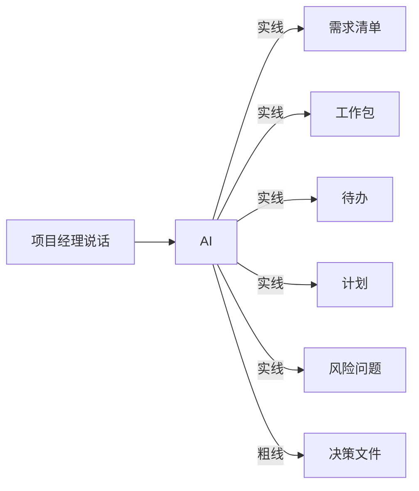

## G1 投喂源文件

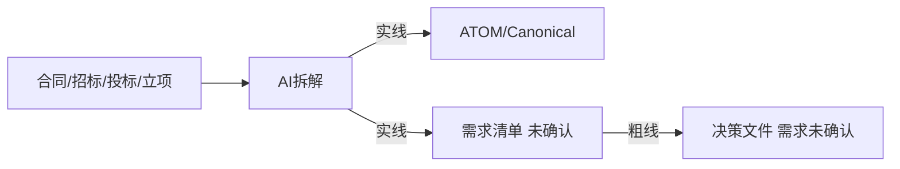

## G2 确认需求

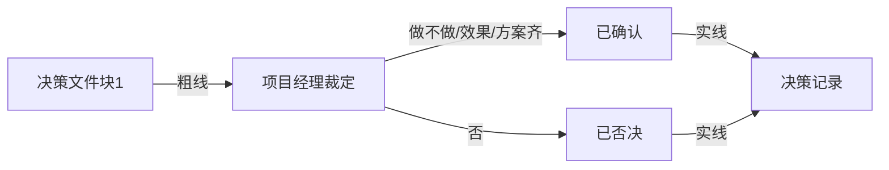

## G3 需求绑工作包

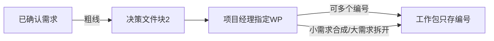

## G4 确认工作包再拆待办

## G5 计划

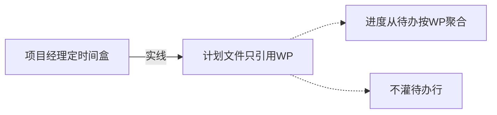

## G6 日报

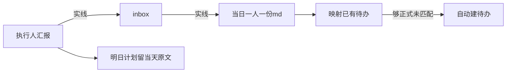

## G7 会议

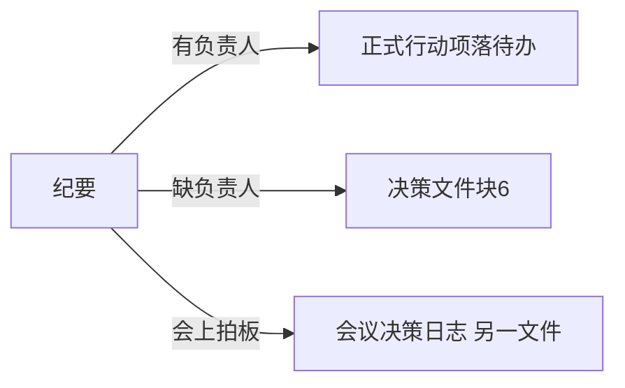

## G8 风险问题

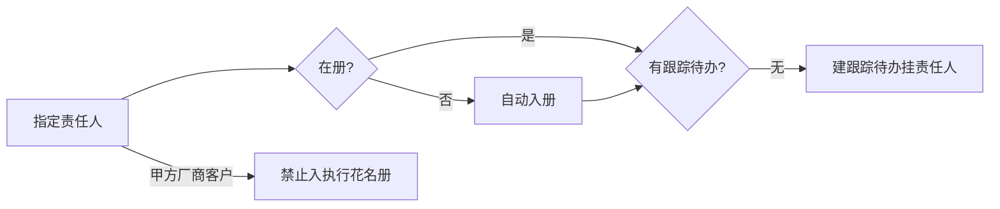

## G9 关联待办

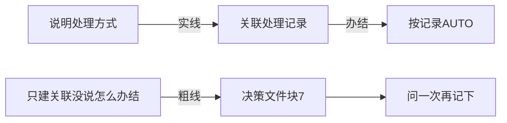

## G10 决策文件本身

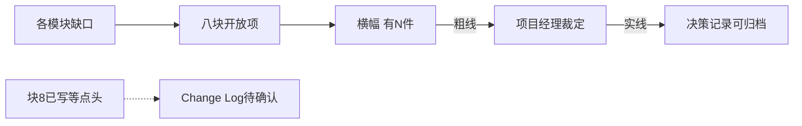

## G11 人员

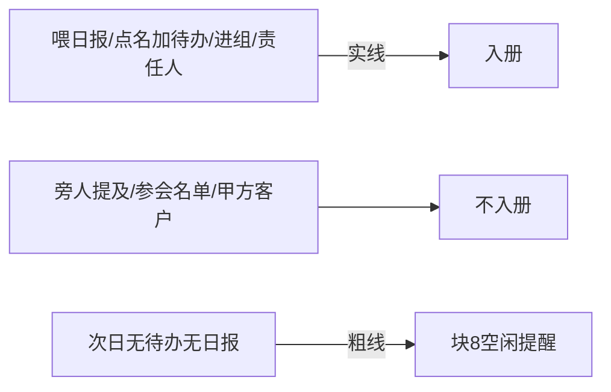

## G12 变更

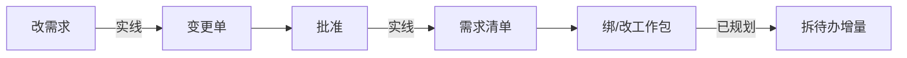

## G13 查询

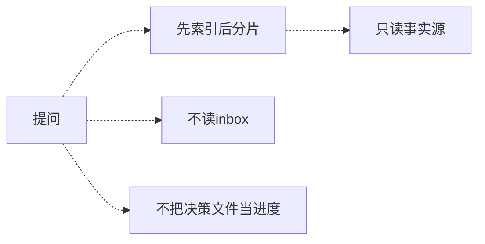

## G14 项目集

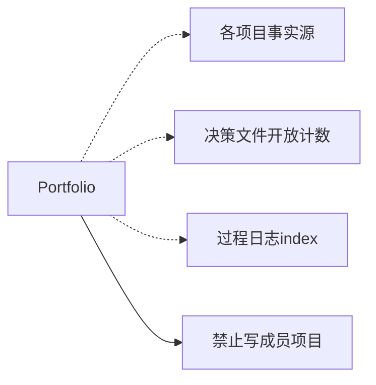

## G15 巡检

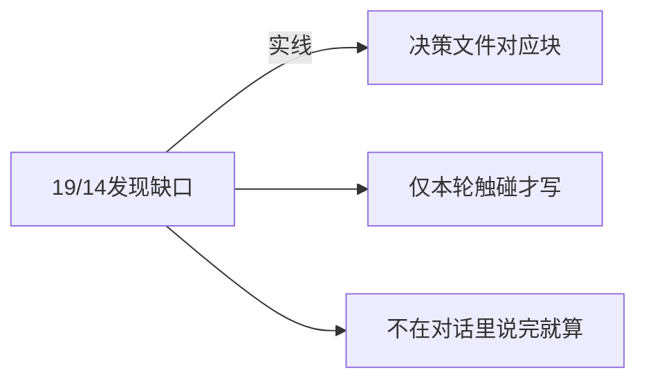
