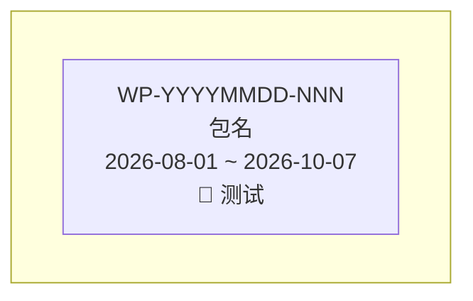
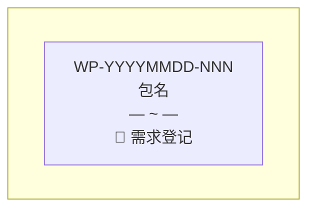

# 工作包总览图（派生视图）

> 非事实源、非生成物。真相 = 各 `wps/WP-*.md` 与 `wps/_index.md`。禁止把手改当真相；数据变则覆盖重写。
> 按正常计划分章节，每章一个 mermaid。废弃与已完成归档不入默认图。连线只认前置/后置且两端同章。

### PLAN-YYYYMMDD-NNN：{计划名称}

```mermaid
graph TD
  subgraph row1 [" "]
    direction LR
    WPxxx["WP-YYYYMMDD-NNN<br/>包名<br/>2026-08-01 ~ 2026-10-07<br/>🧪 测试"]
  end
```

### 未绑定计划

```mermaid
graph TD
  subgraph row1 [" "]
    direction LR
    WPyyy["WP-YYYYMMDD-NNN<br/>包名<br/>— ~ —<br/>🔄 需求登记"]
  end
```
