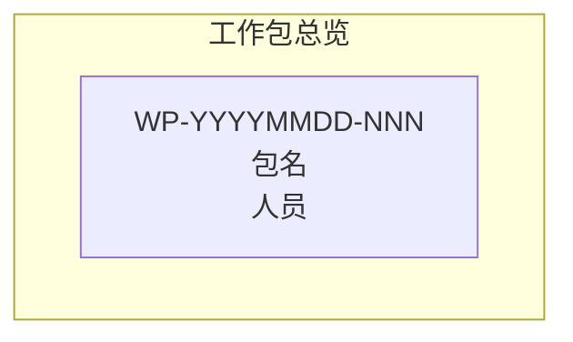

# 工作包总览图（派生视图）

> 非事实源、非生成物。真相 = 各 `wps/WP-*.md` 与 `wps/_index.md`。禁止把手改当真相；数据变则覆盖重写。
> 连线只认工作包前置/后置。未填关联则无连线。

```mermaid
graph TD
  subgraph 项目总览[工作包总览]
    WPxxx["WP-YYYYMMDD-NNN<br/>包名<br/>人员"]
  end
```
