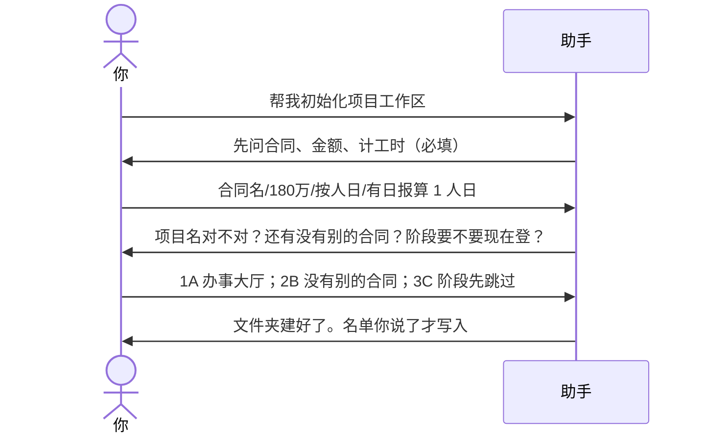
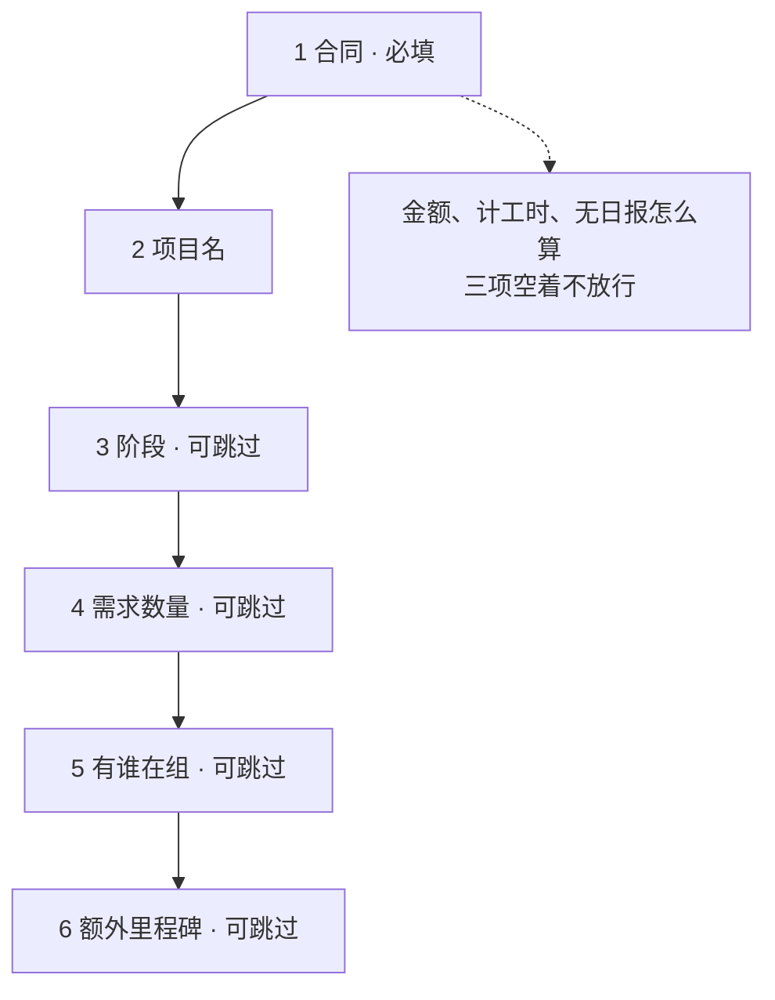

# 示例：初始化工作区

新项目还没有管理文件夹。开口让助手建，合同金额、怎么计工时这两项不填完，向导不放行。

> 假项目：星河市民服务平台 · 办事大厅。项目经理林夏。

---

## 全过程





### 第 1 轮 · 开口

**你**

> 帮我初始化项目工作区。

**助手**

> 还没有项目简报。从合同信息开始（带 * 的必填）。
>
> - * 合同名称
> - * 合同总额（万元）
> - * 立项时间、启动时间
> - * 人工怎么计（人日 / 人时 / 人月，按你们公司的算法）
> - * 没写日报的那天怎么算工时（有产出算 1 单位 / 不计 / 其他）
>
> 也可以直接丢合同文件，我先抽再补缺。

**你**

> 合同名称：星河市民服务平台建设。总额 180 万。立项 2026-01，启动 2026-02-06。按人日。有日报产出算 1 人日，没日报不计。计划完工 2026-10-01。

---

### 第 2 轮 · 项目名、多合同、能不能跳

**助手**

> 合同记下了。计工时按人日、没日报不计——后面能耗都按这个算。
>
> **请你拍板**
>
> 1. 本项目名称  
>    我建议：办事大厅（合同还覆盖市民端、信用窗，那两个要各自初始化，这里只建这一个）。  
>    A. 就叫办事大厅  
>    B. 改成别的名字（你说）  
>    C. 先放着
>
> 2. 还有没有补充协议 / 另一份合同  
>    A. 还有，我接着贴  
>    B. 没有了  
>    C. 先放着
>
> 3. 阶段、需求数量、在组名单、额外里程碑  
>    A. 现在一并填  
>    B. 只填在组名单：林夏、周启、陈默、苏晚  
>    C. 这几步都跳过，以后再说
>
> 回复模板：`1A；2B；3C`

**你**

> `1A；2B；3C`

---

### 第 3 轮 · 建好了

**助手**

```text
办事大厅/
└── ai/
    ├── context/     项目简报、怎么计工时
    ├── todos/       还是空的（跳过了名单）
    ├── requirements/ 合同登记了一条
    └── …模板和空壳
```

| 记下了 | 还空着 |
|---|---|
| 合同 180 万、人日、没日报不计 | 花名册（你选了先跳过） |
| 项目名：办事大厅 | 阶段、需求数量、里程碑 |
| 兄弟项目名：市民端、信用窗（只记名，不代建） | 那两个项目要各自开口初始化 |

> 市民端、信用窗请分别说「帮我初始化」。我不会在这一次对话里替它们建文件夹。

---

## 你可以照着说

```text
帮我初始化项目工作区。
```

有合同就直接丢文件。计工时不要让助手猜：

```text
按人日。有日报算 1 人日，没日报不计。
```
