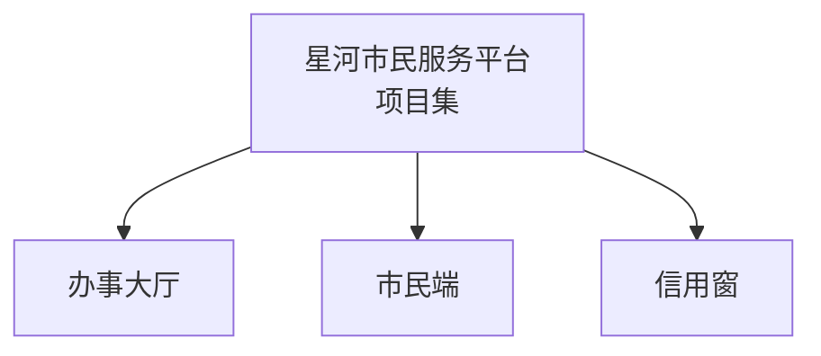
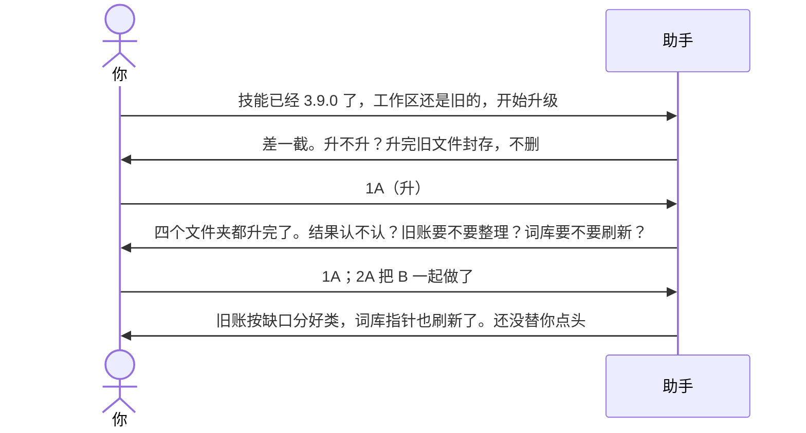
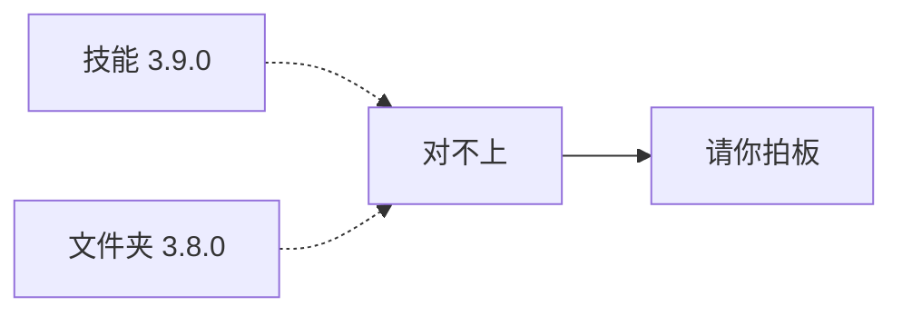
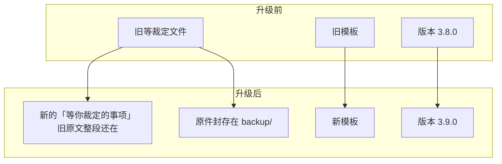
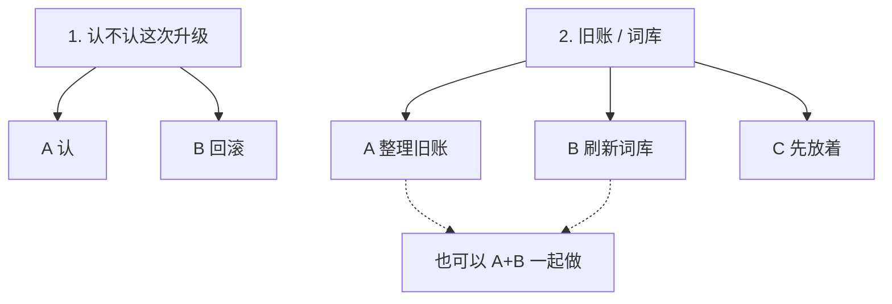
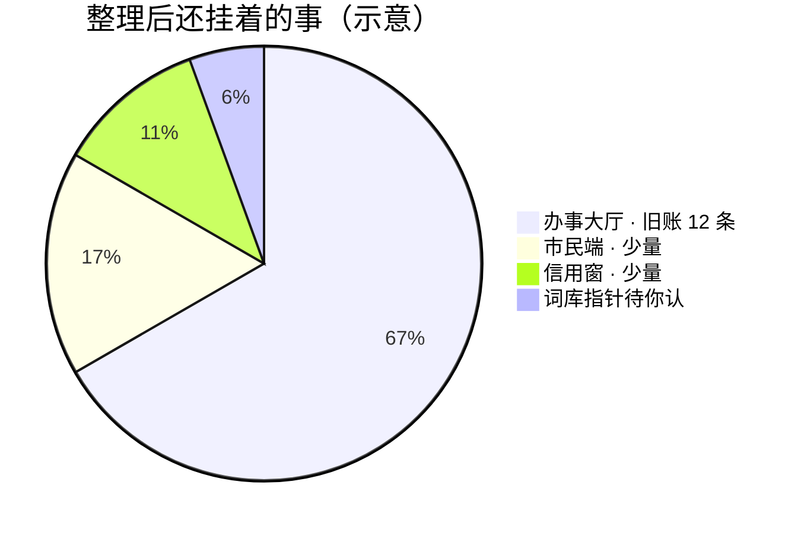

# 示例：升级工作区

技能已经是 **3.9.0**，项目文件夹还停在 **3.8.0**。开口让助手升，升完再决定要不要顺手收拾旧账。

> 下面的「星河市民服务平台」是假项目，用来代替真实环境。

---

## 项目长什么样



| | 升级前 | 技能现在 |
|---|---|---|
| 项目集 | 3.8.0 | 3.9.0 |
| 三个项目 | 3.8.0 | 3.9.0 |

差一截：旧的「等裁定」记法对不上新的分类；词库指针表也还没建。

---

## 全过程



### 第 1 轮 · 开口

**你**

> 我的技能已经升级到 3.9.0 了，但是工作空间还是旧的，现在开始升级。

**助手**（先对版本，再问，不擅自改）



> 四个文件夹都还是 3.8.0：项目集 + 办事大厅、市民端、信用窗。
>
> 升完会：覆盖现行模板、把旧「等裁定」整段搬进新文件、原件封存一份。不删你的待办和需求正文。
>
> **请你拍板**
>
> 1. 现在升不升  
>    A. 升，改完告诉你动了哪些文件  
>    B. 先不升，继续按旧结构用  
>    C. 先放着
>
> 回复模板：`1A`

**你**

> `1A`

---

### 第 2 轮 · 升完，认不认、要不要顺手收拾

**助手**（已经改完，把结果摊开）

| 对象 | 升级前 | 现在 |
|---|---|---|
| 项目集 | 3.8.0 | **3.9.0** |
| 办事大厅 / 市民端 / 信用窗 | 3.8.0 | **3.9.0** |

做了什么：

1. 三个项目 + 项目集都升到 3.9.0。
2. 旧「等裁定」全文搬进新文件，**一行没删**；原件封存。
3. 每个项目补了空的需求检索表（先建壳，碰到需求再填）。
4. 词库指针表建了空表，还没扫三个项目。



还没做（这次按规则不动）：

- 没有把旧原文拆进新的分类表
- 没有刷新词库指针
- 没有重做需求清单、没有改待办正文

> **请你拍板**
>
> 1. 升级结果认不认  
>    A. 认，按 3.9.0 用  
>    B. 不认，说明哪里要回滚
>
> 2. 下一步（不挡着用）  
>    A. 把旧「等裁定」原文按缺口整理进新表  
>    B. 先刷新词库指针  
>    C. 先放着，用到再说
>
> 回复模板：`1A；2C`

**决策怎么回**



**你**

> `1A；2A 把 B 一起做了`

含义：升级结果认了；旧账整理和新词库刷新一起做。

---

### 第 3 轮 · 助手按你的板干活

**助手**

旧原文按缺口归进 8 类（空类也留着，方便以后对）。词库从三个项目抽了已确认的词，写进项目集指针表。



| 类 | 人话 | 这回 |
|---|---|---|
| 1 | 需求还没确认 | 空（清单还没生成） |
| 2 | 需求还没绑工作包 | 空 |
| 3 | 工作包还没认 | 空 |
| 4 | 已规划的包还没拆待办 | 空 |
| 5 | 待办还没绑工作包 | 空 |
| 6 | 待办缺负责人 | 空 |
| 7 | 两条待办办结时要不要连着关 | 空 |
| 8 | 其他：已经写了等点头 / 还没写等准许 | **办事大厅 12 条**进了这里 |

词库指针（假数据）：

| 口头说法 | 标准说法 | 出现在 |
|---|---|---|
| 大厅 | 办事大厅 | 办事大厅、市民端 |
| 口令甲 | 口令甲 | 市民端 |
| 项目3简称 | 信用窗 | 信用窗 |

> 有 **12 件事等你裁定**，都在办事大厅。要现在处理，请看 [02-处理待确认事项.md](02-处理待确认事项.md)。

---

## 升级动了哪些地方

```text
星河市民服务平台/
└── ai/
    ├── .skill-version.json          ← 3.8.0 → 3.9.0
    ├── logs/（升级记录）
    ├── backup/                      ← 旧文件封存在这，没删
    ├── portfolio/
    │   ├── 等你裁定的事项            ← 新文件，旧原文整段还在
    │   └── context/（词库指针表）
    └── projects/
        ├── 办事大厅/ai/  …
        ├── 市民端/ai/    …          ← 三个项目同样升一版
        └── 信用窗/ai/    …
```

助手会列出改过的文件路径。不念内部章节号。

---

## 你可以照着说

```text
技能已经 3.9.0 了，工作区还是旧的，开始升级。
```

升完若问「旧账要不要整理、词库要不要刷新」：

```text
1A；2A 把 B 一起做了
```

不想现在收拾：

```text
1A；2C
```
