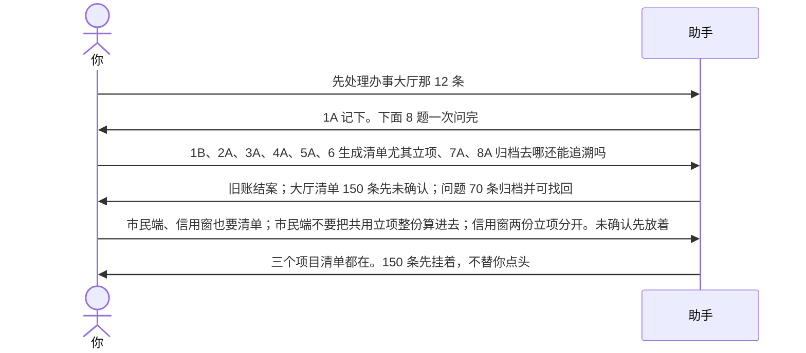
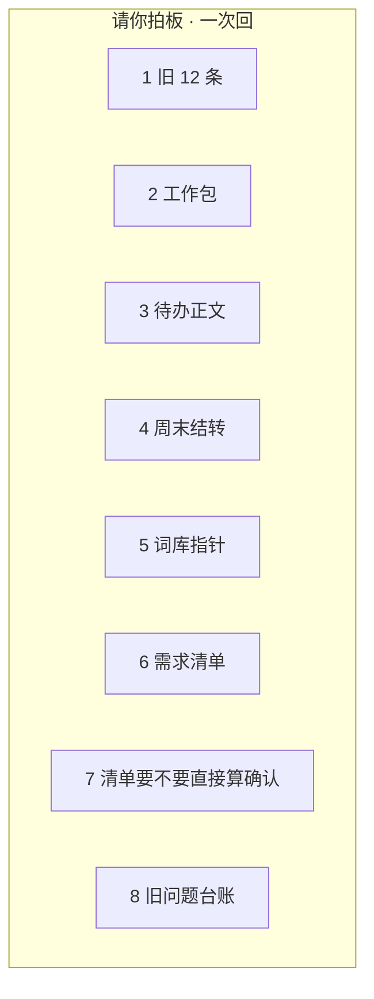
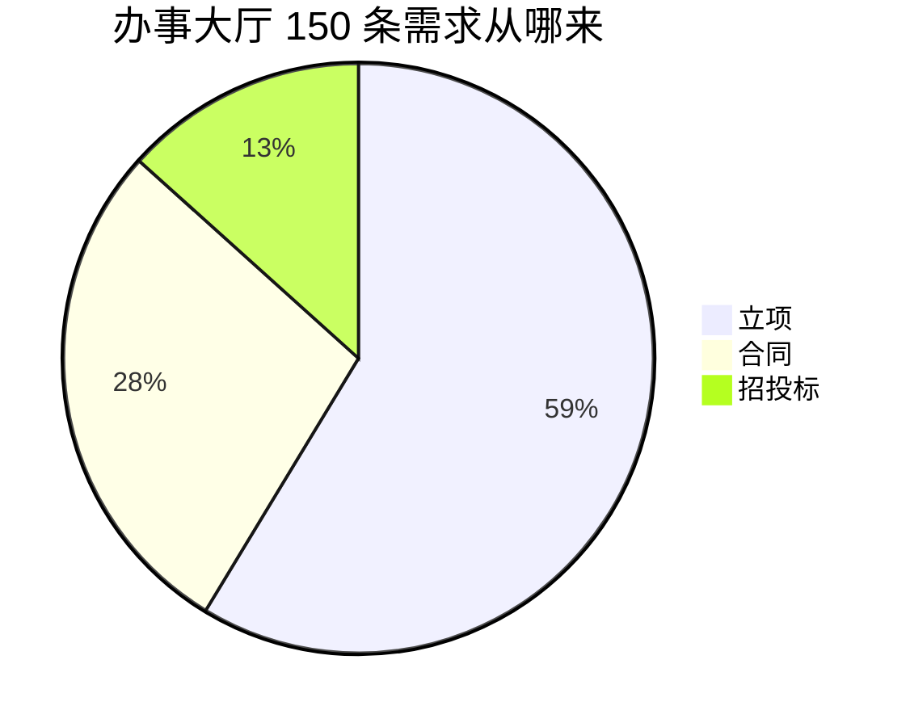
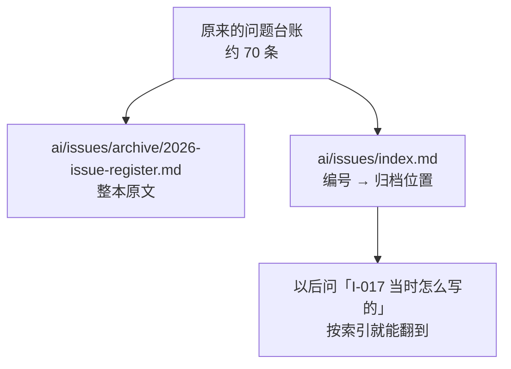
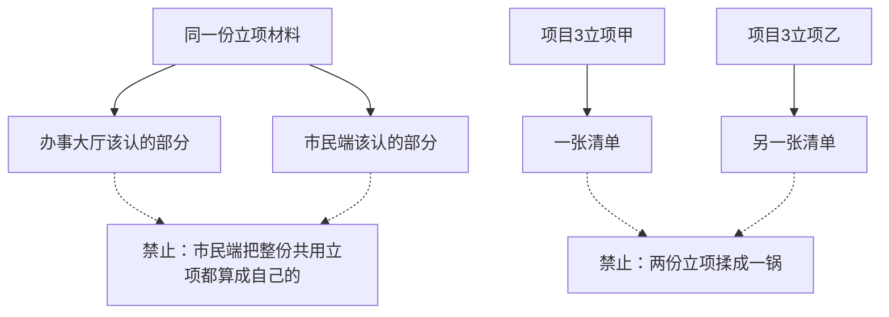
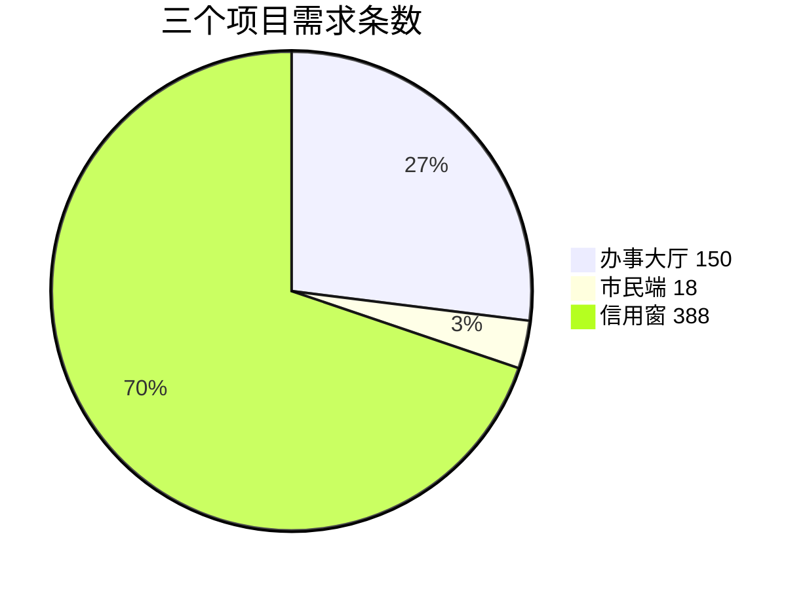
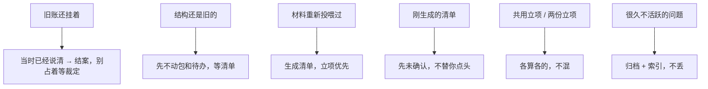

# 示例：处理待确认事项

升级完了（见 [02-升级工作区.md](02-升级工作区.md)），助手每轮开头会提醒：**有 N 件事等你裁定**。你点头它才算数，不替你做主。

> 假项目仍是：星河市民服务平台 = 办事大厅 + 市民端 + 信用窗。项目经理林夏。

---

## 这摊事从哪来


办事大厅挂着 12 条旧账，例如：下月节点能不能上、三端共用的安全方案、一批外采组件要不要买、工作包切得太碎、某天日报要不要补待办。

另外还有三件升级时故意没动的：

- 需求清单还是空的（立项、合同、招标都重新投喂过）
- 问题台账很厚，多数早已不活跃
- 清单生成后，默不默认「已确认」

---

## 全过程



### 第 1 轮 · 先处理哪一摊

**助手**（每轮开头）

> 有 **12 件事等你裁定**（办事大厅 · 其他）。
>
> 1. 这 12 条现在怎么处理  
>    A. 现在一条条问，你拍板  
>    B. 先放着  
>    C. 先看市民端 / 信用窗
>
> 回复模板：`1A`

**你**

> `1A`

---

### 第 2 轮 · 八件事一次问完

助手把能一起问的摊开。每题 2～4 个选项，写清选了之后会怎样。



> **请你拍板**
>
> 1. 办事大厅这 12 条旧账  
>    我建议：按当时已经说清的结论结案，写进已裁定记录，不再占着「等你裁定」。  
>    A. 一条条重新问  
>    B. 按当时结论结案，不再挂着  
>    C. 先放着
>
> 2. 工作包还按旧切法躺着  
>    我建议：先不动包，等需求清单出来再绑。  
>    A. 先不动  
>    B. 现在按新规则重建  
>    C. 先放着
>
> 3. 待办正文  
>    我建议：这次不改待办里的句子。  
>    A. 先不改  
>    B. 按新规则重绑工作包  
>    C. 先放着
>
> 4. 今天是周六。结转明天的待办时  
>    我建议：只给实际在干活的人结转，休息的不造空待办。  
>    A. 只给在干活的人结转  
>    B. 名单上的人全结转  
>    C. 先放着
>
> 5. 词库指针刚刷新  
>    我建议：你认了才当正式表。  
>    A. 认  
>    B. 不认，指出哪条不对  
>    C. 先放着
>
> 6. 三个项目的需求登记册还是空的  
>    立项、合同、招标你说重新投喂过。  
>    A. 现在从这些材料生成清单，立项优先  
>    B. 只扫缺口，先不生成  
>    C. 先放着
>
> 7. 清单生成之后  
>    我建议：先标「未确认」。做不做、效果、方案你还没点头，不能当已确认。  
>    A. 先未确认，等你认  
>    B. 生成完直接当已确认  
>    C. 先放着
>
> 8. 问题台账里约 70 条，多数很久没动  
>    我建议：整本归档，台账留索引，按编号还能找回。  
>    A. 归档，留索引  
>    B. 一条条仍当开放问题  
>    C. 先放着
>
> 回复模板：`1A；2A；3A；4A；5A；6A；7A；8A`

**你怎么决策（这回真实回法）**


> `1B、2A、3A、4A、5A、6` 合同、招投标文件、立项需求我应该都是重新投喂过的，你给我生成需求清单，尤其关注立项需求、`7A、8A` 归档的是去哪里，哪个文件，后面还能追溯吗

编号之间用顿号或分号都行。第 6 题直接加话，助手按你的补充做，不要求你再回一次 `6A`。

---

### 第 3 轮 · 助手按板做完，并回答归档在哪

**助手**

| 你选的 | 做了什么 |
|---|---|
| 1B | 12 条旧账结案，写进已裁定记录，「等你裁定」里不再挂它们 |
| 2A / 3A | 工作包、待办正文没动 |
| 4A | 周六只给实际干活的人结转 |
| 5A | 词库指针你认了 |
| 6 + 补充 | **先给办事大厅**从立项 / 合同 / 招标生成清单，立项优先 |
| 7A | 清单全部先「未确认」 |
| 8A | 70 条问题整本归档 |

办事大厅清单（假数据）：



**归档去哪、还能不能找回**



| 问 | 答 |
|---|---|
| 去哪里？ | `ai/issues/archive/2026-issue-register.md` |
| 哪个文件当目录？ | `ai/issues/index.md`（编号、标题、归档位置） |
| 还能追溯吗？ | 能。编号不变，不进「升级垃圾」那种封存；日常检索先看索引，需要原文再打开归档本 |

> 办事大厅 **150 条需求还没确认**。市民端、信用窗的清单还没做。
>
> 1. 另外两个项目  
>    A. 现在也生成  
>    B. 先只看办事大厅  
>    C. 先放着
>
> 2. 这 150 条  
>    A. 现在一条条认  
>    B. 抽一批先认  
>    C. 先挂着，不改「未确认」
>
> 回复模板：`1A；2C`

---

### 第 4 轮 · 另外两个项目，并划清边界

**你**

> 1、市民端、信用窗两个项目的需求清单也给生成了，但是注意：市民端只生成市民端自己的部分，它的立项原来是和办事大厅共用的；信用窗有两个立项文件，整理清单的时候要分开。  
> 2、C

**助手为什么要问清楚**



结果（假数据）：

| 项目 | 条数 | 怎么拆的 | 确认状态 |
|---|---|---|---|
| 办事大厅 | 150 | 立项 88 + 合同 42 + 招标 20 | 未确认（你选了 2C，先挂着） |
| 市民端 | 18 | 市民端自己的页面 12 + 合同里属于它的 6；**共用立项没整份算进来** | 未确认 |
| 信用窗 | 388 | 立项甲 180、立项乙 200、合同 8；**两份立项分开** | 未确认 |



开头提醒变成：**有 556 件事等你裁定**（三条清单都还没点头）。要用的时候再说「从立项里抽大厅登录相关的认一批」，不必一次认完。

---

## 拍板怎么想（这回的逻辑）



助手负责记和归类。做不做、算不算数、两份材料要不要分开，都是你回编号决定的。

---

## 你可以照着说

先指定处理哪一摊：

```text
先处理办事大厅那几条。
```

一次回多题，第 6 题可以直接加话：

```text
1B、2A、3A、4A、5A、6 立项合同招标都重新投喂过，生成需求清单尤其立项、7A、8A 归档去哪，还能追溯吗
```

清单范围要划界：

```text
市民端只生成它自己的部分，立项原来和大厅共用，别整份算进来。
信用窗有两个立项文件，清单要分开。
未确认的先挂着。
```

不想现在认：

```text
2C
```
