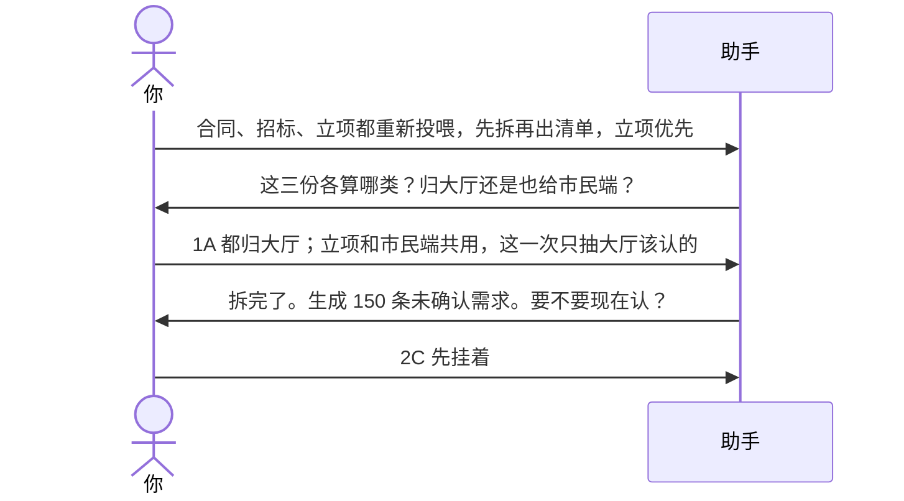
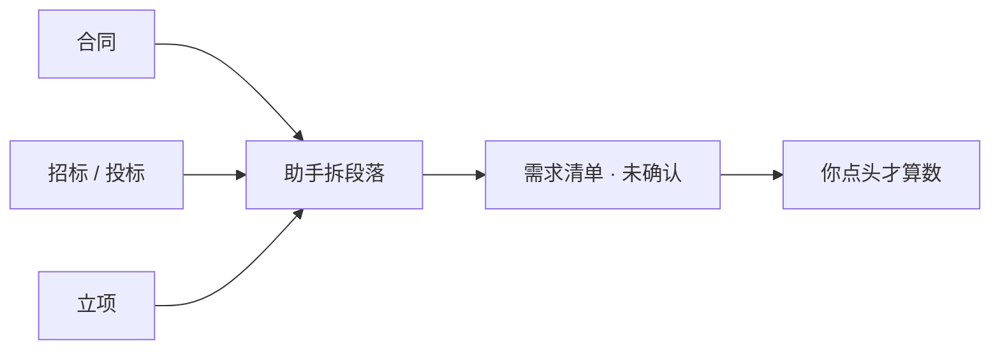
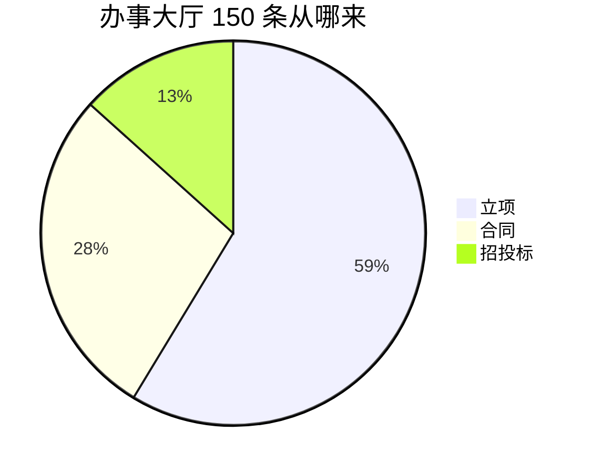

# 示例：投喂合同和立项

把合同、招标、投标、立项丢给助手。它先拆成可引用的段落，再抽出需求清单——默认全是「未确认」，做不做要你点头。

> 假项目：办事大厅。材料是假的，用法按真实投喂来。

---

## 全过程





### 第 1 轮 · 开口

**你**

> 合同、招投标、立项我都重新投喂过了。先拆文件，再生成需求清单，尤其关注立项。

**助手**（先问归属，不把一份材料默认为全项目共用）

> 收到三份。拆之前要对齐两件事。
>
> **请你拍板**
>
> 1. 这三份这一次写进哪个项目  
>    A. 只写办事大厅  
>    B. 大厅和市民端各收一份（立项共用）  
>    C. 先放着
>
> 2. 清单粒度  
>    A. 按章节拆成可核对的条目，立项优先，合同/招标作依据  
>    B. 先只建目录，先不抽条目  
>    C. 先放着
>
> 回复模板：`1A；2A`

**你**

> `1A；2A` 立项原来和市民端共用，大厅只抽大厅自己的部分。

---

### 第 2 轮 · 拆完出清单

**助手**



| 材料 | 拆成 | 抽出需求 |
|---|---|---|
| 立项 · 大厅章节 | 12 段 | 88 |
| 合同正文 + 附件 | 9 段 | 42 |
| 招标 / 投标 | 8 段 | 20 |

三份材料进了 `ai/requirements/sources/`（每份一个编号目录：meta / digest / atoms / ledger / parse-log 等），**不是**只出一份 HTML 报告。每条需求都带着出处（文件 + 章节 + 页）。状态全是 **未确认**（做不做 / 效果 / 方案还没齐）。

> **请你拍板**
>
> 1. 这 150 条  
>    A. 现在从立项里抽一批认  
>    B. 全部当已确认  
>    C. 先挂着，不改「未确认」
>
> 2. 市民端那一份立项  
>    A. 现在也抽市民端自己的部分  
>    B. 等市民端对话再说  
>    C. 先放着
>
> 回复模板：`1C；2B`

**你**

> `1C；2B`

**助手**

> 150 条挂在「需求还没确认」里。市民端不代写。出处能回点到材料段落。

---

## 和「处理待确认」的分工

| 这份 | [02-处理待确认事项.md](02-处理待确认事项.md) |
|---|---|
| 材料怎么进、怎么拆、清单从哪来 | 清单已经在了，认不认、两份立项要不要分开 |

---

## 你可以照着说

```text
这三份材料重新投喂。先拆再出清单，立项优先。大厅只抽大厅自己的部分。
```
