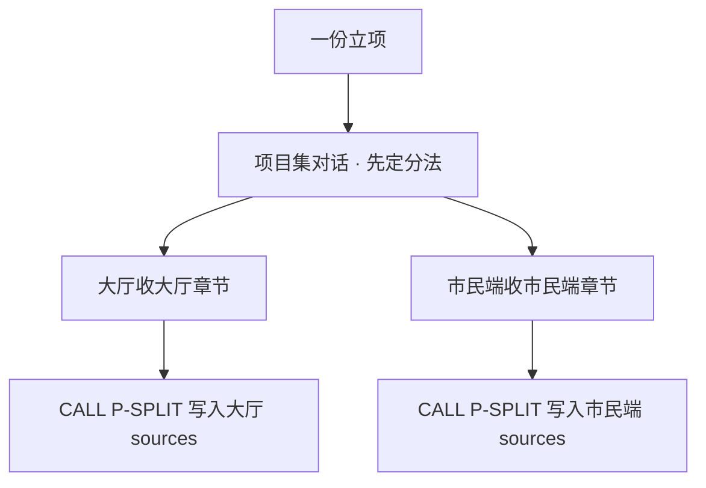
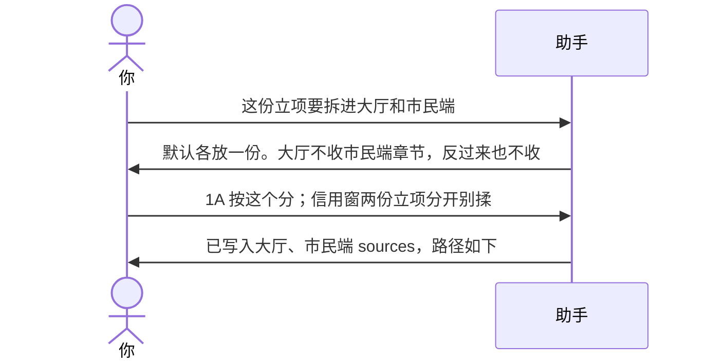

# 示例：一份材料拆到多个项目

立项、合同经常一份覆盖好几个项目。项目集对话先定分法，分法确定后**同会话调用 Project 拆进各项目**。默认各放一份完整副本，不共用一个指针。本包不手搓成员 sources 格式。

> 假材料：星河市民服务平台立项，覆盖办事大厅 + 市民端。信用窗另有两份立项，不揉进来。

---

## 全过程





### 第 1 轮 · 开口

**你**

> 这份立项要拆进大厅和市民端。市民端只拿它自己的部分。信用窗那两份立项不要和这份揉在一起。

**助手**（项目集对话）

> 原件已存集层 `portfolio/reports/ingest/{batch}/`。源文件：立项.pdf（假）。建议每个项目各收一份副本，不共用一份、不建指针。
>
> | 段落 | 建议给谁 | 理由 |
> |---|---|---|
> | 第 2 章 大厅办理 | 办事大厅 | 模块甲/模块乙/模块丙 |
> | 第 3 章 市民端页面 | 市民端 | 移动端流程 |
> | 第 1 章 总体目标 | 两份都放 | 共用背景，各留副本 |
> | 项目3 · 立项甲 / 立项乙 | **谁都不放** | 你说了不揉；那两份立项另处理 |
>
> **请你拍板**
>
> 1. 分法  
>    A. 按这张表写入两个项目  
>    B. 第 1 章只放大厅，市民端不留总体目标  
>    C. 先放着
>
> 回复模板：`1A`

**你**

> `1A`

---

### 第 2 轮 · 同会话手递

**助手**

> 已按这张表写入：
>
> - 办事大厅 `ai/requirements/sources/{编号}/`（大厅办理 + 总体目标）
> - 市民端 `ai/requirements/sources/{编号}/`（市民端页面 + 总体目标）
>
> 信用窗两份立项未写入。需求仍是未确认，不会因为「已经拆过」就自动点头。

---

## 和投喂单项目的差别

| [04-投喂合同和立项.md](04-投喂合同和立项.md) | 这份 |
|---|---|
| 对话开在某一个项目里，只写这一个 | 对话开在项目集，定分法后同会话写入各项目 |
| 适合材料本来就只属于一个项目 | 适合一份材料盖住多个项目 |

---

## 你可以照着说

```text
这份立项要拆进大厅和市民端。各放一份，别共用指针。
信用窗两份立项分开，别揉进来。
```
