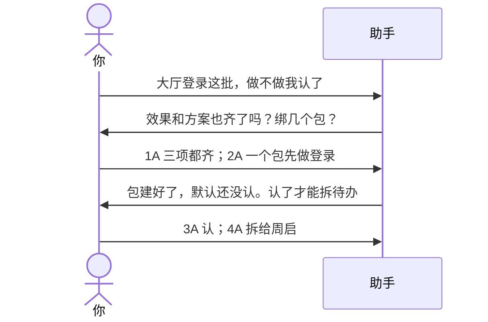
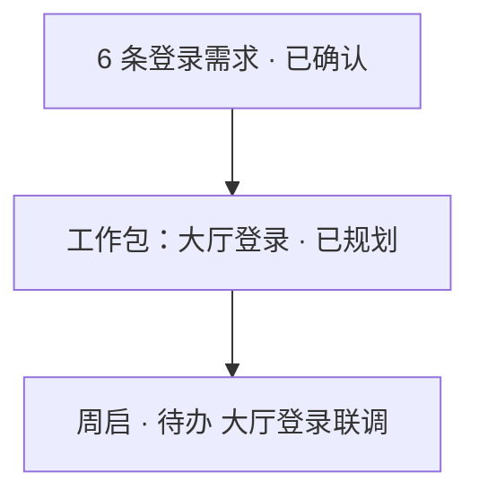
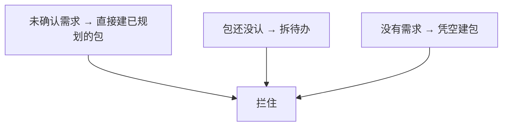

# 示例：确认需求和工作包

清单在了，还不能直接派活。顺序是：你认需求 → 绑工作包 → 你认切法 → 再拆到人。跳步助手会拦住。

> 假项目：办事大厅。接着 [04-投喂合同和立项.md](04-投喂合同和立项.md) 的 150 条未确认需求。

---

## 全过程




### 第 1 轮 · 开口

**你**

> 办事大厅登录相关的需求，做不做我认了。先别把 150 条一次全认。

**助手**

> 立项里跟「登录 / 统一身份」相关的 6 条。做不做你认了；效果、方案还空着。
>
> **请你拍板**
>
> 1. 这 6 条  
>    A. 效果按立项原文、方案按合同技术附件，三项算齐，标已确认  
>    B. 只记「做」，效果方案以后补  
>    C. 先放着
>
> 2. 工作包怎么切  
>    A. 先做一个包「大厅登录」，6 条都绑它  
>    B. 登录页、证件核验拆成两个包  
>    C. 先放着，不建包
>
> 回复模板：`1A；2A`

**你**

> `1A；2A`

---

### 第 2 轮 · 包有了，还不能派活

**助手**

> 6 条已确认。新建工作包「大厅登录」，状态是 **还没认**。没认之前：不拆待办、不写进计划时间盒。
>
> **请你拍板**
>
> 3. 这个包的切法  
>    A. 认，改为已规划  
>    B. 不认，改成两个包  
>    C. 先放着
>
> 4. 拆待办  
>    A. 认完后拆给周启，明天的待办  
>    B. 只认包，先不拆人  
>    C. 先放着
>
> 回复模板：`3A；4A`

**你**

> `3A；4A`

**助手**



| 改了什么 | 结果 |
|---|---|
| 6 条需求 | 已确认 |
| 工作包「大厅登录」 | 已规划 |
| 周启明天的待办 | 多了一条，绑在这个包上 |

计划文件只引用这个包的编号，不把待办一行行抄进去。

---

## 助手会拦住的跳步



---

## 你可以照着说

```text
大厅登录这批需求，做不做我认了。先做一个包，认完拆给周启。
```
