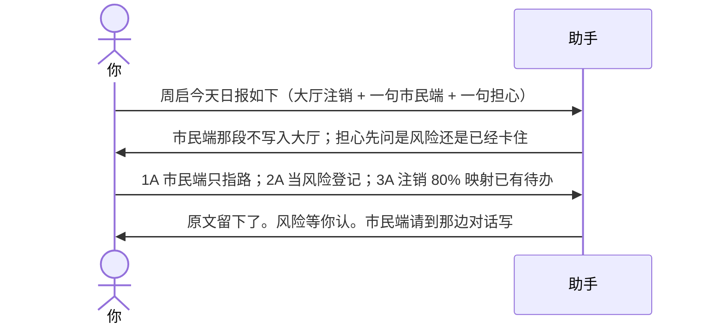
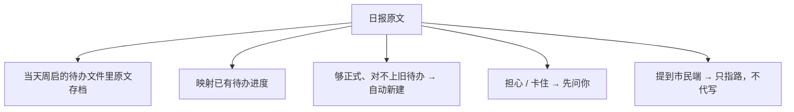
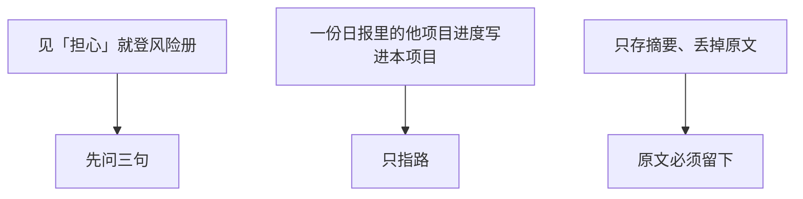

# 示例：记日报

把人的日报贴进来。原文会留下，再映射到当天待办。担心先问你，不直接登风险；混进别的项目的段落，不写进当前项目。

> 假项目对话开在 **办事大厅**。周启是后台。

---

## 全过程





### 第 1 轮 · 开口

**你**

> 周启 8 月 21 日日报：
>
> 今日：大厅注销修 bug 80%；名称拆库迁移 10%；市民端迁移页面对接看了一眼。
> 担心国庆前登录联调还是打不通。
> 明日：注销修到 100%；名称变更前置校验继续。

**助手**

> 大厅段落可以入当天文件。有两处要你拍板。
>
> 1. 「市民端迁移页面对接看了一眼」  
>    我建议：不写入办事大厅待办，告诉你去市民端对话补。  
>    A. 按这个拆，大厅不收  
>    B. 硬写进大厅（不建议，后面两个项目会对不上）  
>    C. 先放着
>
> 2. 「担心国庆前登录联调还是打不通」  
>    还没发生，是可能性。  
>    我建议记成风险：因为联调环境还不支持，可能导致国庆前登录验不通，影响上线窗口。  
>    A. 按风险登记，责任人周启，先监控  
>    B. 已经卡住了，记成问题  
>    C. 先放着，不登册
>
> 3. 进度映射  
>    「注销 80%」对得上已有待办；「名称拆库 10%」对得上另一条。市民端那句不建大厅待办。  
>    A. 按这个更新  
>    B. 名称拆库那条其实该算新任务，另建  
>    C. 先放着
>
> 回复模板：`1A；2A；3A`

**你**

> `1A；2A；3A`

---

### 第 2 轮 · 记下了，请你认风险

**助手**

| 做了 | 没做 |
|---|---|
| 周启当天文件留下原文 | 没把市民端写进大厅 |
| 注销 80%、拆库 10% 更新了进度 | 没把「担心」直接当已发生 |
| 风险草稿已写，等你认才算数 | 没替市民端建待办 |

> 我记下了风险草稿，请你认不认：登录联调国庆前可能打不通。
>
> A. 认  
> B. 不认，改成……  
> C. 先放着

**你**

> `A`

明日计划留在当天原文里，**第二天**才会变成待办，不会提前建明天的文件夹。

---

## 助手不会做的事



---

## 你可以照着说

```text
周启今天的日报如下：……
```

白天你口头同步、晚上他又写一份，助手会合并，不覆盖。两份打架时会编号问你。
