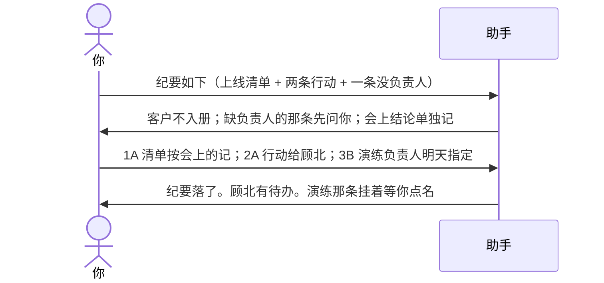
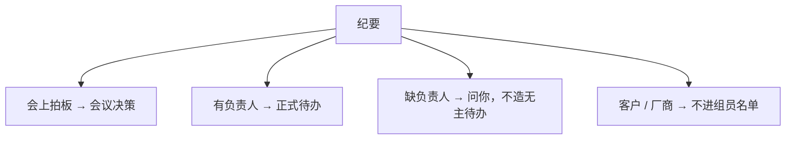

# 示例：记会议纪要

把纪要贴进来。会上拍的板记到会议决策；要做事的落到负责人当天待办。没负责人的不造「无主待办」，先问你。客户、厂商不进组员名单。

> 假场景：8 月 18 日客户现场，沟通「国庆能上哪些」。沈衡是研发负责人，客户不入册。

---

## 全过程





### 第 1 轮 · 开口

**你**

> 纪要如下。8 月 18 日客户现场，沈衡对上线清单。
>
> 结论：国庆窗口先上大厅「开办 / 变更 / 注销」里已经预演过的主体类型；住所核验带着上。
> 行动：顾北本周把可上线清单整理成一页给客户；割接演练还没人认领；客户要求周五前书面回复。

**助手**

> 结论和行动我拆开了。客户方不入组员名单。
>
> **请你拍板**
>
> 1. 会上结论  
>    A. 记成会议决策：国庆先上已预演主体类型 + 住所核验  
>    B. 只存纪要，不当正式决策  
>    C. 先放着
>
> 2. 「可上线清单一页」  
>    有负责人顾北。  
>    A. 落到顾北本周待办  
>    B. 只写在纪要里，不建待办  
>    C. 先放着
>
> 3. 「割接演练没人认领」  
>    我建议：不建无主待办，等你点名。  
>    A. 现在指定周启  
>    B. 先挂着「待办缺负责人」  
>    C. 先放着
>
> 4. 「客户要求周五书面回复」  
>    这是客户的话，不是组员任务。  
>    A. 记在纪要结论，不建客户待办  
>    B. 给林夏建一条「周五回复客户」  
>    C. 先放着
>
> 回复模板：`1A；2A；3B；4B`

**你**

> `1A；2A；3B；4B`

---

### 第 2 轮 · 落在哪

**助手**

| 内容 | 去向 |
|---|---|
| 国庆先上已预演类型 | 会议决策，可追溯 |
| 顾北整理清单一页 | 顾北待办 |
| 割接演练 | 等你裁定 · 缺负责人 |
| 周五回复客户 | 林夏待办 |
| 客户本人 | 不在花名册 |

> 有 1 件事等你裁定：割接演练缺负责人。点名后再建待办。

---

## 你可以照着说

```text
纪要如下：……
```

没想好谁干时直接说「先不指定」，助手不会编一个负责人。
