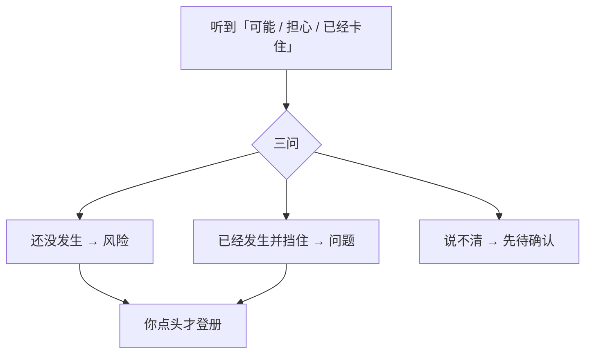
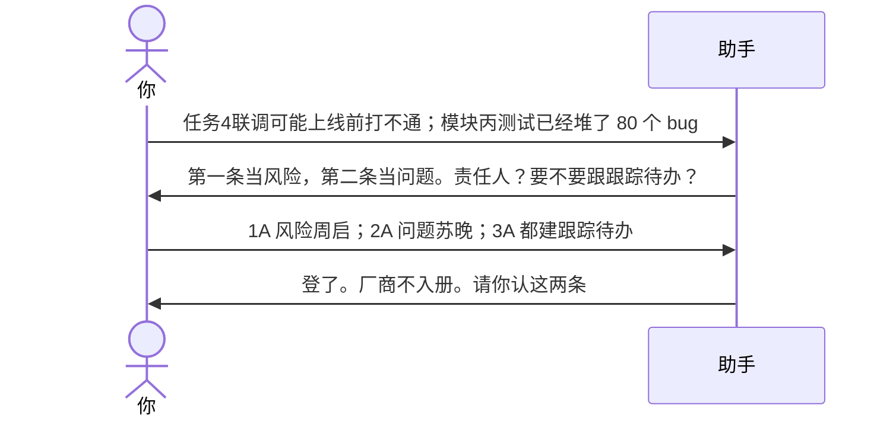

# 示例：登记风险和问题

担心是风险，已经卡住是问题。助手先问三句，不看词就登册。高等级必须有人跟。甲方、厂商不进组员名单。

> 假项目：办事大厅。任务名用任务4、模块丙，不要对号入座。

---

## 全过程





### 第 1 轮 · 开口

**你**

> 两件事：1）任务4联调可能上线前还是打不通；2）模块丙测试已经堆了大概 40 个问题，这周可能改不完。

**助手**

> 我先不登册，分类给你看。
>
> | # | 原话 | 三问 | 我建议 |
> |---|---|---|---|
> | 1 | 可能打不通 | 还没发生；是可能性；尚未挡住今天 | **风险**：因为联调环境还不支持，可能导致上线前任务4联调不通 |
> | 2 | 已经堆了 80 个 bug | 已发生；是事实；已经在消耗测试窗口 | **问题**：模块丙测试存量约 40，正在挤压本周修复 |
>
> 「这周可能改不完」是问题之上的进度担心，可以另挂一条风险，也可以先并进问题的影响里。
>
> **请你拍板**
>
> 1. 第 1 条  
>    A. 按风险登记，责任人周启，先监控  
>    B. 已经卡住了，改记问题  
>    C. 先放着
>
> 2. 第 2 条  
>    A. 按问题登记，责任人苏晚  
>    B. 只当风险，先不登问题  
>    C. 先放着
>
> 3. 跟踪  
>    高等级默认要有人跟。  
>    A. 两条都给责任人建跟踪待办  
>    B. 只登记册，先不建待办  
>    C. 先放着
>
> 4. 「改不完」要不要另开一条进度风险  
>    A. 另开，责任人林夏  
>    B. 并进第 2 条问题的影响里  
>    C. 先放着
>
> 回复模板：`1A；2A；3A；4B`

**你**

> `1A；2A；3A；4B`

---

### 第 2 轮 · 记下了，请你认

**助手**

| 编号 | 类型 | 标题 | 责任人 | 跟踪 |
|---|---|---|---|---|
| R-021 | 风险 | 任务4联调上线前可能打不通 | 周启 | 有待办 |
| I-044 | 问题 | 模块丙测试存量约 40，挤压本周 | 苏晚 | 有待办 |

厂商、客户不出现在花名册。风险真的发生时，会改成「转为问题」，两条互相关联，待办不丢。

> 我记下了，请你认不认这两条。
>
> A. 都认  
> B. 风险认、问题改数字（你说准确数量）  
> C. 先放着

**你**

> `A`

---

## 你可以照着说

```text
任务4联调可能上线前打不通。模块丙测试已经堆了大约 40 个问题。
```

说不清就让助手标「待确认」，不要让它猜。
