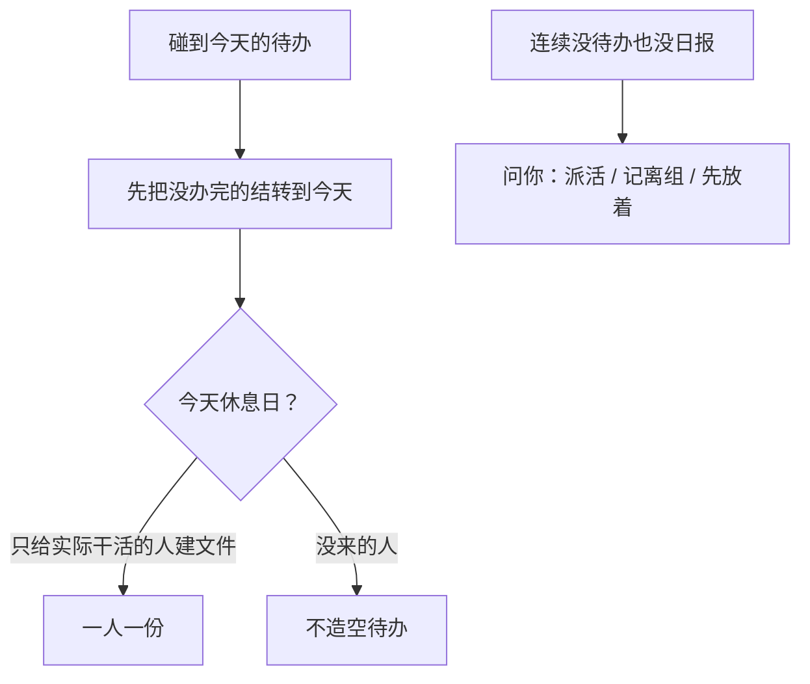

# 示例：人员进出和结转

人进组、离组、周六、手头没活，都要你点头。未办完的待办隔天编号不变。两条待办说好「一个完另一个也完」，要先记下办法，之后才自动一起关。

> 假项目：办事大厅。日期按真实用法放在周六。

---

## 全过程



### 第 1 轮 · 周六结转

**你**

> 今天周六。周启、苏晚加班，别人休息。结转一下。

**助手**

> 休息日默认不给全员建空文件夹。
>
> **请你拍板**
>
> 1. 今天给谁结转  
>    A. 只给周启、苏晚（你点名在干活）  
>    B. 花名册上的人全结转  
>    C. 先放着
>
> 2. 没来的人未办完的待办  
>    A. 留在他们上一个工作日文件里，下个工作日再结  
>    B. 周六也给他们建文件，避免看起来丢了  
>    C. 先放着
>
> 回复模板：`1A；2A`

**你**

> `1A；2A`

**助手**

> 周启、苏晚今天的文件已从昨天结转，编号不变。其他人今天没有文件夹。

---

### 第 2 轮 · 进组、空闲、两条一起关

**你**

> 顾北从下周进组做产品。韩舟这周大厅没任务也没日报。周启那两条「任务丙修问题」和「任务丙联调」，一个完另一个也完。

**助手**

> 三件不同的事。
>
> **请你拍板**
>
> 1. 顾北进组  
>    A. 下周一起写入花名册，岗位产品；还没活就不建空待办  
>    B. 今天就建空待办占位  
>    C. 先放着
>
> 2. 韩舟空闲  
>    A. 先放着，当短期空闲  
>    B. 记离组  
>    C. 现在派活（你说派什么）
>
> 3. 周启两条待办  
>    A. 记下「任一办结，另一个自动办结」  
>    B. 只关联，怎么办结以后再说  
>    C. 先放着
>
> 回复模板：`1A；2A；3A`

**你**

> `1A；2A；3A`

**助手**

| 人 | 结果 |
|---|---|
| 顾北 | 花名册有了，无空待办 |
| 韩舟 | 空闲提醒挂着，没写出组 |
| 周启两条 | 已记处理方式；以后一条办结，另一条按记录自动办结，不再问 |

客户、厂商即使出现在纪要里，也不会进花名册。旁人提到的名字，默认不入册。

---

## 你可以照着说

```text
今天周六，只给实际干活的周启、苏晚结转。
顾北下周进组，先入册别建空待办。
这两条一个完另一个也完。
```
