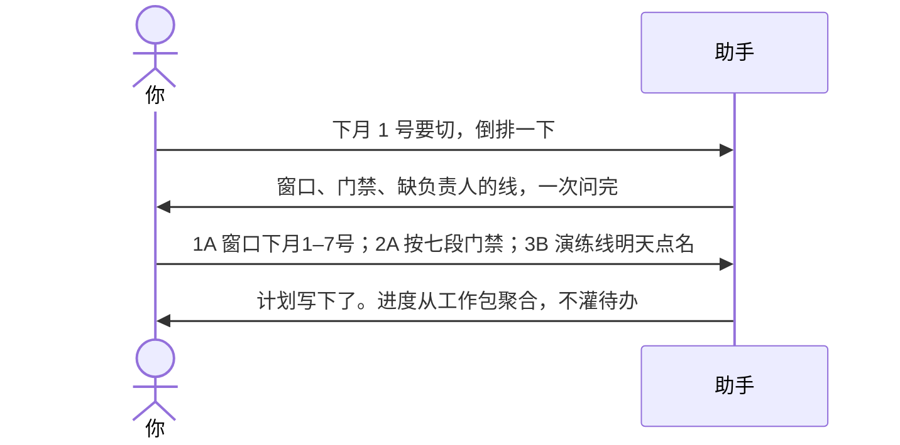

# 示例：倒排上线计划

给一个上线窗口，从那天往回排。计划只引用工作包，不把待办一行行灌进去。门禁看过没过，不报含糊的百分比。

> 假场景：新环境整体切换，窗口 **下月 1 日～7 日**。

---

## 全过程




### 第 1 轮 · 开口

**你**

> 下个月要上线，倒排一下。窗口想放月初：1 号到 4 号切核心，5 日灰度，6 日全量。

**助手**

> 按「从窗口往回排」做。下面这些我不能替你定。
>
> **请你拍板**
>
> 1. 窗口  
>    A. 下月1–4号核心切换，5号灰度，6号全量，7号观察  
>    B. 只保下月1–3号，灰度另说  
>    C. 先放着
>
> 2. 阶段怎么切  
>    我建议七段、五个门禁日（清单会签 / 网络打通 / 代码冻结 / 主链路跑通 / Go-NoGo）。进度只看门禁过没过。  
>    A. 按这个  
>    B. 不要门禁，只排每周谁干什么  
>    C. 先放着
>
> 3. 九条线里「切换演练」「保障配套」还没人  
>    A. 现在指定沈衡、林夏  
>    B. 先写入计划，负责人挂着等你点名  
>    C. 先放着，这两条线先不进计划
>
> 4. 排进计划的单位  
>    A. 只引用工作包（任务4、模块丙、任务5、任务6、任务7……）  
>    B. 把每个人每天的待办也写进计划表  
>    C. 先放着
>
> 回复模板：`1A；2A；3B；4A`

**你**

> `1A；2A；3B；4A` 计划里不要出现待办行。

---

### 第 2 轮 · 倒排结果

**助手**

```text
T-40 方案定稿 ── T-30 开发冲刺 ── T-24 代码冻结
    ── T-16 预迁移 ── T-10 主链路签字 ── T-3 上线决策
        ── T0 正式切换
```

| 门禁 | 过关条件 |
|---|---|
| T-36 | 内部网络通道实测打通（硬阻塞） |
| T-24 | 任务6、任务7 完成 |
| T-10 | 主链路全部跑通并签字 |
| T-3 | 上线决策会 |

| 线 | 工作包 | 完成时点 | 负责人 |
|---|---|---|---|
| 任务6 | WP-任务6 | T-24 | 韩舟 |
| 任务7 | WP-任务7 | T-24 | 周启 |
| 任务8 | WP-任务8 | T-22 | 周启 |
| 任务5 | WP-任务5 | T-16 | 沈衡 |
| 网络打通 | WP-网络 | T-36 / T-7 | 沈衡 |
| 测试验证 | WP-测试 | T-4 | 苏晚 |
| 切换演练 | WP-演练 | T-3 | **缺人，等你点名** |

> 有 1 件事等你裁定：切换演练缺负责人。计划按 6 节落盘（目标 / 门禁 / WP 简表 / 阶段列表 / 风险 / 变更记录），只引用工作包，不抄待办。进度以后从各包聚合。
>
> 打开计划 §3 是一张 6 列表：每个工作包一行，无子行。§4 阶段列表能看到测试节点的苏晚和排期；演练节点是 ⏳ / `⚠️待安排人`。空岗写在格子里，不加第七列。人和时间仍以工作包为准，不要在计划里直接改。

人和包打架时（周启既要任务7又要任务8），助手会标出来，换不换人仍问你。

---

## 你可以照着说

```text
下月 1 号要切，倒排一下。门禁只看过没过。计划不要写待办行。
打开计划我要能看见每个节点谁负责、谁还没排。
```
