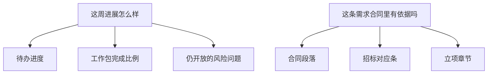
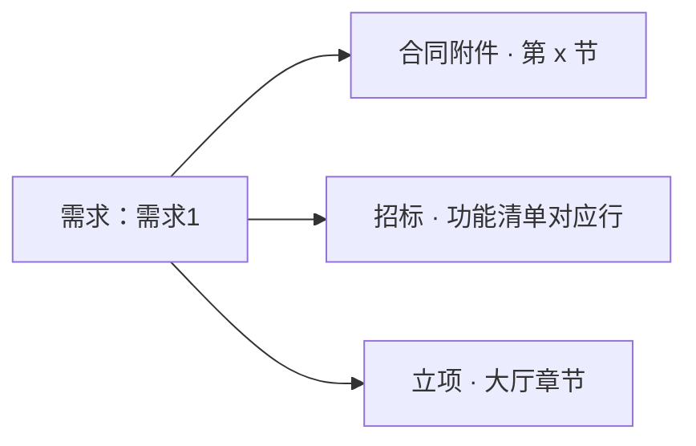

# 示例：出周报和问进度

问「这周怎么样」「这条合同里有依据吗」。数字从待办和工作包实时汇总，每条能指回出处。没有周报时，项目集不会假装拼一份正式周报。

> 假项目：办事大厅，第 33 周（8/10–8/14）。

---

## 全过程



### 第 1 轮 · 出周报

**你**

> 出办事大厅这周周报。

**助手**

> 从本周待办和工作包汇总，不拿聊天记录当结论。
>
> **请你拍板**
>
> 1. 范围  
>    A. 只出办事大厅  
>    B. 三个项目各出一份再汇总（市民端、信用窗若还没出项目周报，汇总只能标「临时摘」）  
>    C. 先放着
>
> 2. 未确认的进度  
>    A. 周报里仍显示，标「待你认」  
>    B. 藏起来，当没发生  
>    C. 先放着
>
> 回复模板：`1A；2A`

**你**

> `1A；2A`

**助手**（假数据）

| 包 | 本周 | 状态 |
|---|---|---|
| 模块丙 | 12 个子功能预演过完，4 个进测试 | 进行中 |
| 模块乙 | 1 个完成，11 个开发中 | 进行中 |
| 模块甲 | 测试未收口，待修约 40 | 进行中 |
| 任务4联调 | 环境仍不通 | 风险监控中 |

> 周报已落在 `ai/reports/weekly/`。每个数字旁边有来源人、来源待办。草稿，请你认不认。
>
> A. 认  
> B. 模块甲那行不要写百分比，改成「测试未收口」  
> C. 先放着

**你**

> `B`

---

### 第 2 轮 · 合同里有没有依据

**你**

> 需求1这条，合同里有依据吗？

**助手**



> 有。合同技术附件「核验类接口」写了需求1；招标功能清单有对应行；立项大厅章节也列了。
>
> 三条出处页码不一致的地方：立项写「与市民端共用核验」，合同没写共用——要不要当范围问题另开？
>
> 1.  
>    A. 先记下这条差异，等你裁定算不算范围变更  
>    B. 当合同已覆盖，不另开  
>    C. 先放着
>
> 回复模板：`1A`

**你**

> `1A`

问进度时助手不把「等你裁定」文件当成进度事实。没出处的数字会标明「不确定」。

---

## 你可以照着说

```text
出办事大厅这周周报。
这条需求在合同里有依据吗？
周启明天的待办是什么？
```
