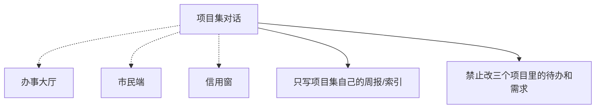
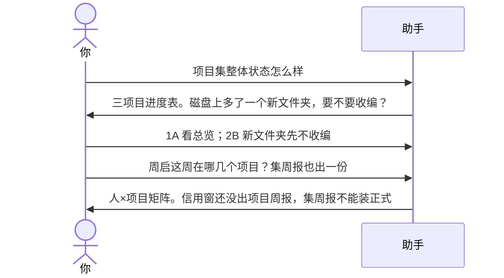
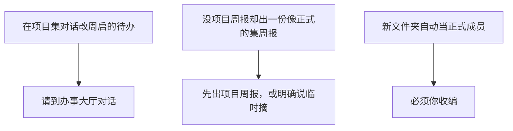

# 示例：项目集总览

三个项目一起看进度、人在哪、风险有没有串。项目集对话 **只读成员项目**，要改某个项目的待办，会告诉你去那个项目的对话改，不代写。

> 假项目集：星河市民服务平台 = 办事大厅 + 市民端 + 信用窗。

---

## 全过程





### 第 1 轮 · 总览 + 新文件夹

**你**

> 项目集整体状态怎么样。

**助手**

> 三个已登记项目。磁盘上还有一个 `临时演示/`，名单里没有。
>
> | 项目 | 本周关键 | 风险 |
> |---|---|---|
> | 办事大厅 | 模块丙预演收口，任务4联调仍不通 | 中 |
> | 市民端 | 回归 + 安全测试 | 中 |
> | 信用窗 | 任务9打通，新环境可登录 | 中（较上周低） |
>
> **请你拍板**
>
> 1. 新文件夹 `临时演示/`  
>    A. 收编成正式成员（会扫它的词库指针）  
>    B. 不收编，聚合时当它不存在  
>    C. 先放着
>
> 2. 总览深度  
>    A. 先这一张表  
>    B. 再做人×项目（谁同时在两个项目）  
>    C. 先放着
>
> 回复模板：`1B；2B`

**你**

> `1B；2B`

---

### 第 2 轮 · 人在哪、集周报

**助手**

| 人 | 办事大厅 | 市民端 | 信用窗 |
|---|---|---|---|
| 周启 | 任务丙问题、任务3 | — | — |
| 陈默 | 模块乙页面 | 任务2（一眼） | — |
| 苏晚 | 模块丙测试 | 回归测试 | — |
| 韩舟 | — | — | 任务9 |

陈默跨了两个项目，时间盒可能打架。

> **请你拍板**
>
> 1. 陈默跨项目  
>    A. 只提醒，不去改他的待办  
>    B. 帮我在大厅把模块乙页面延后（我不会在集对话里改，会给你一句带到大厅对话）  
>    C. 先放着
>
> 2. 集周报  
>    市民端、信用窗这周还没有各自的项目周报。  
>    A. 先让你去两个项目对话出周报，再汇总  
>    B. 临时从日报拼一版，并标明「临时摘要，不是正式周报」  
>    C. 先放着
>
> 回复模板：`1A；2A`

**你**

> `1A；2A`

**助手**

> 不代写。请到市民端、信用窗对话各出一份周报，回来说「出集周报」。
>
> 整体费用若要看：大厅合同 180 万，信用窗两份合同 320 万 + 160 万，市民端写在大厅合同范围内——要出费用总表再说一声。

---

## 助手不会做的事



---

## 你可以照着说

```text
项目集整体状态怎么样。
周启这周在哪几个项目。
出集周报。
这个新文件夹要不要收进项目集。
查一下大厅这边今天的对话日志。
请大厅给周启加一条待办。
```

集层对话会记在项目集自己的日志里（出处=集层）。请某个项目改待办时，日志记「请大厅做 X」，不代写成员项目。查成员日志按名单里的管理路径去打开，名单不加指针列。跨项目待办列表每一行是「项目名 + TD 编号」，不用 1、2、3。
