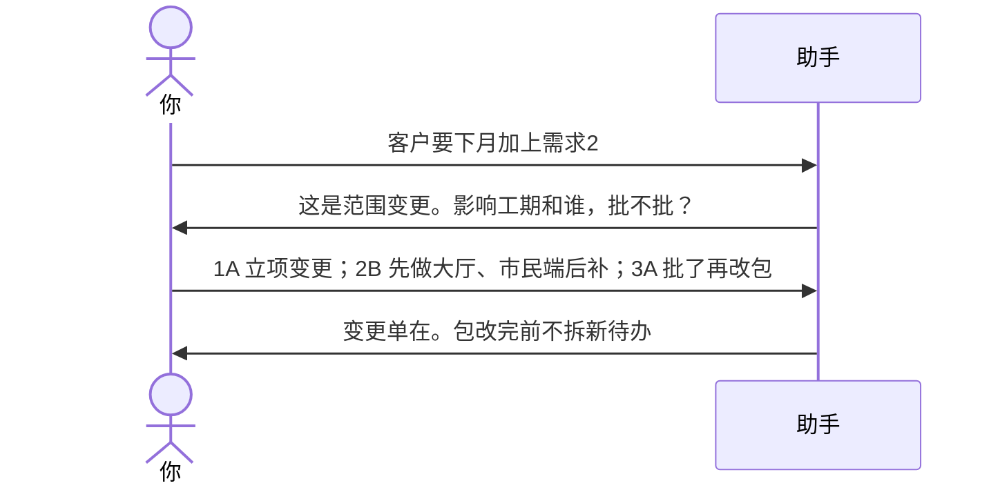
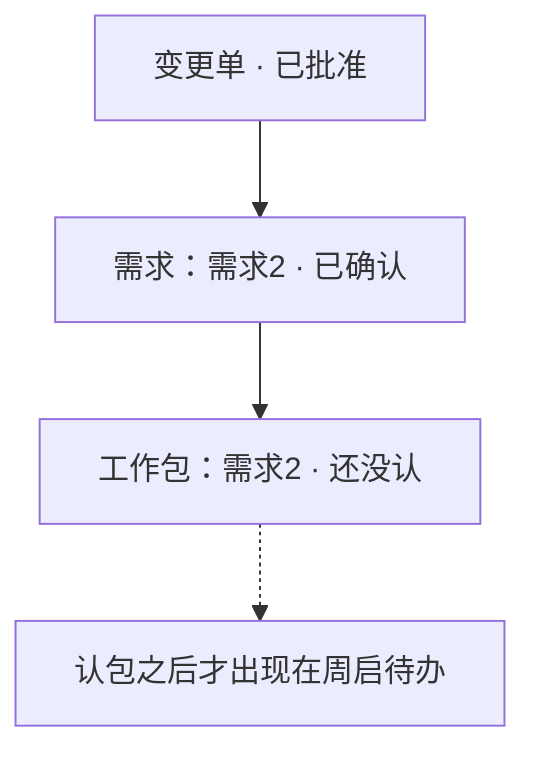

# 示例：改需求和范围

客户中途加东西。先立变更、你批准，再改需求和工作包。已规划的包才加待办；跳过包直接往人身上灌任务，助手会拦住。

> 假场景：客户要求下月窗口加上「需求2」。

---

## 全过程




### 第 1 轮 · 开口

**你**

> 客户要下月加上需求2。原来合同里只有需求1。

**助手**

> 这是范围变更：交付物增加，窗口不变的话会挤测试。
>
> 合同依据：需求1有条；需求2合同没写，立项也没有——要当新增。
>
> **请你拍板**
>
> 1. 变更立不立  
>    A. 立变更单，类型=范围/需求新增  
>    B. 当原范围漏写，直接补需求、不走变更  
>    C. 先放着
>
> 2. 做哪些项目  
>    A. 大厅 + 市民端一起做  
>    B. 先大厅，市民端后补  
>    C. 先放着
>
> 3. 窗口  
>    A. 仍赶下月 1 号，标资源风险  
>    B. 核验类改到窗口后  
>    C. 先放着
>
> 回复模板：`1A；2B；3A`

**你**

> `1A；2B；3A`

---

### 第 2 轮 · 批了才改包

**助手**

> 变更单草稿在。还没改需求清单，也没拆待办。
>
> **请你拍板**
>
> 1. 批不批  
>    A. 批，大厅新增需求「需求2」，绑到新工作包，包先处于还没认  
>    B. 不批，只在纪要里留客户原话  
>    C. 先放着
>
> 2. 周启现在就动手  
>    A. 等你认包之后再拆他的待办  
>    B. 先给他灌一条待办，包以后补  
>    C. 先放着
>
> 回复模板：`1A；2A`

**你**

> `1A；2A`

**助手**



> 市民端不代写。请到市民端对话说「需求2后补，先不进下月窗口」。
>
> 工作包还没认，周启今天不会凭空多一条。

---

## 你可以照着说

```text
客户要下月加上需求2。先走变更，别直接给周启派活。
```
