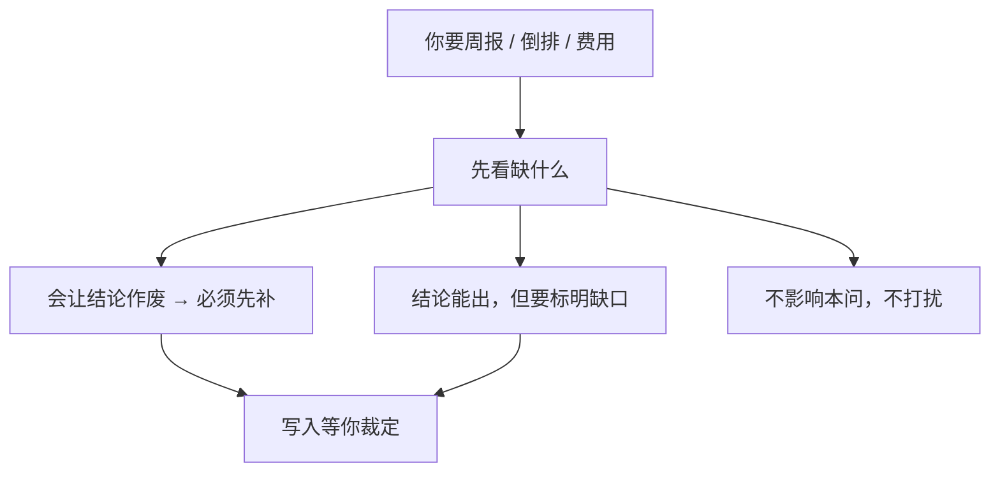

# 示例：完整性巡检

出周报、倒排、看风险之前，助手会扫一眼：缺的字段会不会让结论站不住。缺的记进「等你裁定」，不是只在聊天里说一声。

> 假项目：办事大厅。巡检时常碰到：联系方式空着、待办没绑包、需求未确认却在排期。

---

## 全过程



### 第 1 轮 · 开口

**你**

> 帮我做一次完整性巡检。

**助手**

> 扫的是办事大厅当前文件，不是聊天记忆。
>
> | 缺口 | 挡什么 | 我建议 |
> |---|---|---|
> | 周启、陈默联系方式空着 | 不挡进度结论 | 补进人员信息，不挡周报 |
> | 150 条需求还没确认 | 倒排不能把它们当成已承诺范围 | 排期时当未承诺 |
> | 多条待办没绑工作包 | 包进度会少算这些人 | 问你绑哪个包，不瞎绑 |
> | 计划完工下月1号，任务4联调仍是开放风险 | 倒排结论必须带上这条 | 周报/倒排抬头标明 |
> | WP-测试 头状态还是待确认，但已进正常计划、测试待办已排 | 计划会冻在待确认，门禁会踩空 | 建议推进链尾；你点头才追加 |
>
> **请你拍板**
>
> 1. 联系方式  
>    A. 现在你补（贴通讯录）  
>    B. 记成缺口，以后补  
>    C. 先放着
>
> 2. 没绑包的待办  
>    A. 列出来我一条条认  
>    B. 只计数，先不绑  
>    C. 先放着
>
> 3. 巡检结果  
>    A. 缺口写入「等你裁定」，下次开头还能看到  
>    B. 只在这次对话说，不记文件  
>    C. 先放着
>
> 回复模板：`1B；2B；3A`

**你**

> `1B；2B；3A`

**助手**

> 缺口已写入等你裁定。下次你问倒排，我会把「150 条未确认不能当已承诺」放在结论前面。
>
> 没有时间线月报不算缺陷——没生成过就是空的，不会当故障报。

---

### 第 2 轮 · 带着缺口问倒排

**你**

> 那现在还能不能倒排到下月 1 号？

**助手**

> 能排，但结论带缺口：未确认需求不进已承诺范围；任务4联调风险仍开放。门禁建议按 [09-倒排上线计划.md](09-倒排上线计划.md) 那套，但任务4联调不过关则 T-3 只能 No-Go。
>
> 要不要现在就按这个带缺口的版本写计划？
>
> A. 写  
> B. 先把任务4联调的责任人和窗口定了再写  
> C. 先放着

**你**

> `B`

---

## 你可以照着说

```text
帮我做一次完整性巡检。
缺的记下来，别只在对话里说一声。
```
