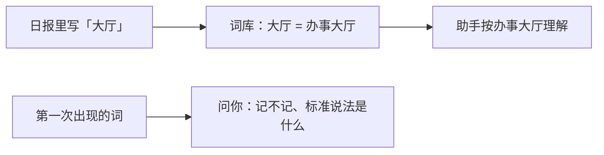
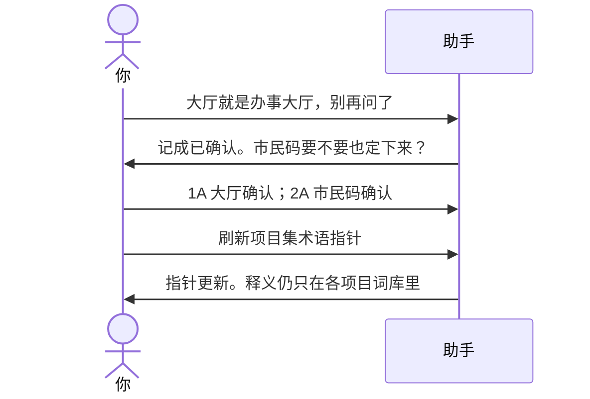

# 示例：词库

项目黑话先记下来，以后日报、纪要按标准说法理解。没经你认的新词不会悄悄当正式词。项目集只存指针，不把释义抄第二份。

> 假项目：办事大厅。口头说法「大厅」「市民码」。

---

## 全过程





### 第 1 轮 · 纠正

**你**

> 大厅就是办事大厅。市民码别写成企业码。

**助手**

> 两处纠正。
>
> **请你拍板**
>
> 1. 「大厅」  
>    A. 标准说法=办事大厅，以后默默按这个理解  
>    B. 只这回替换，不进词库  
>    C. 先放着
>
> 2. 「市民码」  
>    A. 标准说法=市民码，不要映射成别的码  
>    B. 其实是「市民端登录码」，用这个做标准说法  
>    C. 先放着
>
> 回复模板：`1A；2A`

**你**

> `1A；2A`

**助手**

> 两条已确认。以后周启日报里的「大厅注销」会按办事大厅注销映射待办，不会再问你是不是别的系统。

---

### 第 2 轮 · 项目集指针

**你**

> 项目集那边术语索引刷新一下。

**助手**

> 只抽各项目已经确认的表格行：原词、标准说法、在哪个项目。不抄释义正文。未确认的词不收录。
>
> | 口头 | 标准 | 出现在 |
> |---|---|---|
> | 大厅 | 办事大厅 | 办事大厅、市民端 |
> | 市民码 | 市民码 | 市民端 |
> | 核验窗 | 信用窗 | 信用窗 |
>
> 磁盘上拷进新项目不会自己醒来，要你在项目集对话里说一声才扫。
>
> 认不认这张指针表？
>
> A. 认  
> B. 「核验窗」那行删掉  
> C. 先放着

**你**

> `A`

投喂合同、记日报时冒出的新词，会先放在「待你认」里，不会直接当正式词。

---

## 你可以照着说

```text
大厅就是办事大厅，别再问了。
这个词以后用××，不要写成××。
刷新项目集术语指针。
```
