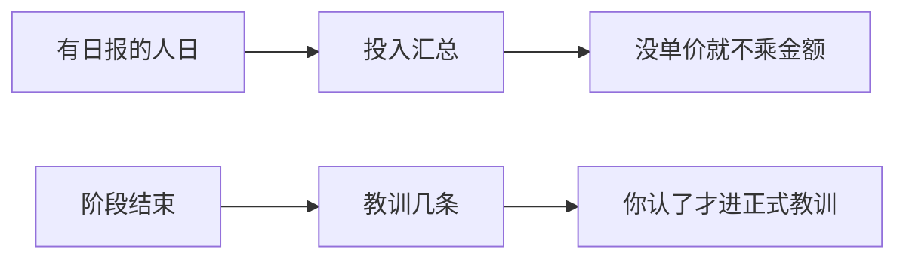

# 示例：复盘和成本

阶段结束写几条教训；费用按初始化时定的人日规则从日报汇总。没有投喂过单价，就不编金额。

> 假项目：办事大厅。计工时在 [03-初始化工作区.md](03-初始化工作区.md) 里定为：人日，有日报算 1，没日报不计。

---

## 全过程



### 第 1 轮 · 成本

**你**

> 办事大厅这周人日和费用。

**助手**

> 计工时按人日、没日报不计（初始化时你定的）。本周有日报的人：周启 5、陈默 5、苏晚 4、林夏 5 → 共 19 人日。
>
> 合同总额 180 万在简报里；人日单价你没投喂过，**不编造金额**。
>
> **请你拍板**
>
> 1. 费用  
>    A. 只出人日，金额空着  
>    B. 我现在告诉你单价，再算金额  
>    C. 先放着
>
> 2. 项目集总费用  
>    A. 只要大厅  
>    B. 三个项目人日并排（仍不编金额）  
>    C. 先放着
>
> 回复模板：`1A；2A`

**你**

> `1A；2A`

---

### 第 2 轮 · 复盘

**你**

> 模块丙预演刚收口，复盘一下。

**助手**

> 从本阶段待办、问题、会议决策抽候选教训，先不当正式。
>
> 1. 预演一次过的类型，测试仍会打回一堆交互问题 → 预演通过 ≠ 测试入口标准。  
> 2. 任务4联调环境一直未通，倒排却仍按下月1号画 → 环境类风险要进门禁，不能只写在风险册。  
> 3. 市民端段落混进大厅日报，拆开后才没把进度记错项目。
>
> **请你拍板**
>
> 1. 这三条  
>    A. 都写入正式教训  
>    B. 只要第 1、第 2 条  
>    C. 先放着
>
> 2. 第 2 条要不要改倒排门禁  
>    A. 现在去改 T-3 门禁，加上「任务4联调必须通」  
>    B. 教训记下，门禁另说  
>    C. 先放着
>
> 回复模板：`1A；2B`

**你**

> `1A；2B`

**助手**

> 三条已进教训。倒排没改。下次完整性巡检仍会把任务4联调列为倒排缺口。

历史计划若要整段导入（换工具前的旧表），另开口「导入历史计划」，会先冻结一份快照再问你冲突怎么处理——没有旧表时不要走这条。

---

## 你可以照着说

```text
这周人日和费用。没单价别编金额。
模块丙预演收口了，复盘一下。
```
