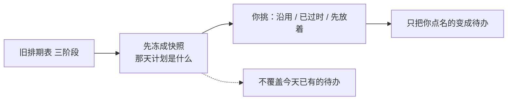
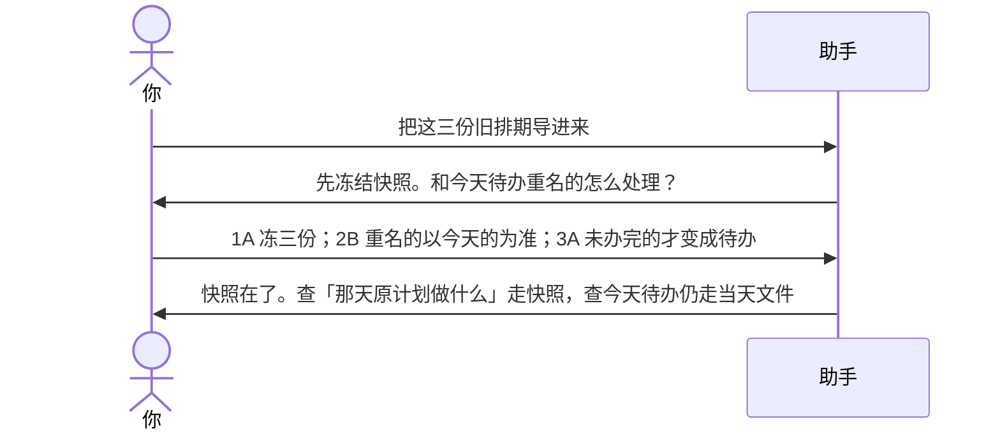

# 示例：导入历史计划

换工具之前的排期表（表格、旧计划文件）要进当前项目。先冻成「那天计划是什么」，再问你哪些变成今天的待办。不经你点头，不覆盖现在正在用的待办。

> 假项目：办事大厅。三阶段旧排期，量级按真实导入：约 200 / 220 / 110 条。

---

## 全过程





### 第 1 轮 · 开口

**你**

> 把这三份旧排期导进来。阶段一、二、三各一份。

**助手**

> 这是当前项目里的存量计划，不是另一套旧工作区。我会先冻快照，再问哪些变成待办。
>
> | 材料 | 大约条数 | 我读到的 |
> |---|---|---|
> | 阶段一 | 约 190 | 模块甲为主，不少已标完成 |
> | 阶段二 | 约 180 | 模块乙 + 模块丙预演 |
> | 阶段三 | 约 90 | 上线窗口前收口 |
>
> **请你拍板**
>
> 1. 快照  
>    A. 三份都冻住，以后能回看「那天计划是什么」  
>    B. 只冻还没标完成的  
>    C. 先放着
>
> 2. 和今天待办标题很像的  
>    A. 用旧表覆盖今天的进度  
>    B. 以今天的待办为准，旧表只进快照  
>    C. 先放着
>
> 3. 旧表里还没办完的  
>    A. 生成待办，编号新编，不沿用旧表行号  
>    B. 先只冻快照，先不生成待办  
>    C. 先放着
>
> 4. 旧表里的风险、预算  
>    A. 一并迁入当前风险册和费用  
>    B. 这次只处理计划行，风险预算不动  
>    C. 先放着
>
> 回复模板：`1A；2B；3A；4B`

**你**

> `1A；2B；3A；4B`

---

### 第 2 轮 · 导完怎么查

**助手**

| 去向 | 结果 |
|---|---|
| 快照 | 三份冻结，不能静默改 |
| 今天待办 | 未办完的生成了新编号；已有同名的没被覆盖 |
| 风险 / 费用 | 没动 |
| 导入记录 | 写了「从哪来、哪天、你怎么拍的板」 |

> 以后这样问：
>
> - 「8 月 10 日大家原计划做什么」→ 读快照  
> - 「周启今天待办」→ 仍读当天文件，不读快照  
> - 「阶段二计划和实际差在哪」→ 快照对当天实际摘要
>
> 认不认这次导入结果？
>
> A. 认  
> B. 阶段三那约 90 条先不要变成待办，只留快照  
> C. 先放着

**你**

> `A`

若你拿来的是**上一阶段整份工作区文件夹**（另一套 `ai/`），走的是衔接而不是这份导入：历史内容先登记来源，仍有效的才结转，过程材料（旧日报、旧纪要）默认只引用，不整包搬进来。开口可以说「承接上一阶段」。

---

## 你可以照着说

```text
把这三份旧排期导进来。先冻快照，今天已有的待办别覆盖。
8 月 10 日大家原计划做什么？
承接上一阶段的工作区。
```
