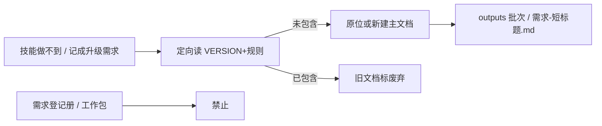

# 示例：技能缺口现场笔录

技能做不到你要的事时，助手把现场写成一份升级需求稿，放在 `ai/outputs/`，不写进项目需求册。同一痛点再说一遍，是改这一份，不另开 `rev-001`。

> 假项目：办事大厅。项目经理苏晚。组员在测登录。前置：工作区已初始化，Skill 3.19.0。

---

## 全过程



### 第 1 轮 · 开口

**你**

> 计划里看不到测试是谁、哪个节点还没排人。这是 skill 的问题，记成升级需求。

**助手**

> 已记下。不是项目需求，是技能缺口。
>
> 路径：`ai/outputs/{时间戳}/需求-计划看不到节点人期.md`。本次记了：计划只是镜子、节点人期要到工作包里看。历史迭代：本文是第 1 轮，都在这一份里。

### 第 2 轮 · 同痛点补充

**你**

> 刚才那条再补一句：人期必须按节点投影，不要再让我猜。强制。

**助手**

> 已改同一份主文档（没有 `rev-002`）。路径同上。本次记了：按节点投影人期、升格强制。历史迭代：第 1、2 轮都在文末「迭代记录」里。

### 第 3 轮 · 不要记

**你**

> 不要记。

**助手**

> 该批次标成已取消。这轮同类不再写。

### 第 4 轮 · Skill 已经有了

**你**

> （假设 3.20 已并入该能力后再次）计划看不到节点人期，这是 skill 的问题，记下来。

**助手**

> 当前 Skill 已经包含。旧需求文档已标废弃（并入 v3.20.0）。路径：`ai/outputs/{原批次}/需求-计划看不到节点人期.md`。没有新建一份。

---

## 助手不会做的事

- 不问「要不要记」（先写后告知）
- 不把缺口文写进 `requirements/` 或工作包
- 不写入、不提议写入 `pm-decisions.md`
- 不追加 `revisions/rev-NNN.md`
- 文档必须有「示例图」节和「迭代记录」节
- 落盘前对照**当前模板**逐节核对；缺节不得登记 index
- 告知必须含路径 + 记了什么 + 历史是否在文中
- 简单追问「现在什么状态，怎么还不对」不当成技能缺口

## 你可以照着说

```text
这是 skill 的问题，记成升级需求。
当前技能做不到按节点投影人和时间。
```
