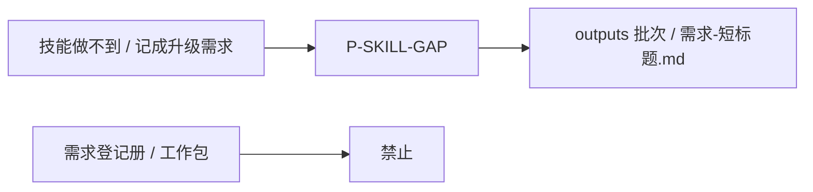

# 示例：技能缺口现场笔录

技能做不到你要的事时，助手把现场写成一份升级需求稿，放在 `ai/outputs/`，不写进项目需求册。

> 假项目：办事大厅。你发现计划上看不到测试是谁。

---

## 全过程



### 第 1 轮 · 开口

**你**

> 计划里看不到测试是谁、哪个节点还没排人。这是 skill 的问题，记成升级需求。

**助手**

> 已记下。不是项目需求，是技能缺口。
>
> 已写路径：`ai/outputs/{时间戳}/需求-计划看不到节点人期.md`
>
> 文里有：当前技能版本、工作区版本、办事大厅、你的原话、现象对照、为什么计划只是镜子、证据链。

### 第 2 轮 · 不要记

**你**

> 不要记。

**助手**

> 该批次标成已取消。这轮同类不再写。

---

## 助手不会做的事

- 不问「要不要记」（先写后告知）
- 不把缺口文写进 `requirements/` 或工作包
- 不写入、不提议写入 `pm-decisions.md`（辅助记录，不占项目裁定）
- 文档必须有「示例图」节（形态类贴目标图；本类政策需求写「本条无目标产出形态图」）
- 落盘前对照**当前模板**逐节核对，禁止拿历史 `outputs/需求-*.md` 当范本；缺节不得登记 index
- 简单追问「现在什么状态，怎么还不对」不当成技能缺口

## 你可以照着说

```text
这是 skill 的问题，记成升级需求。
当前技能做不到按节点投影人和时间。
```
