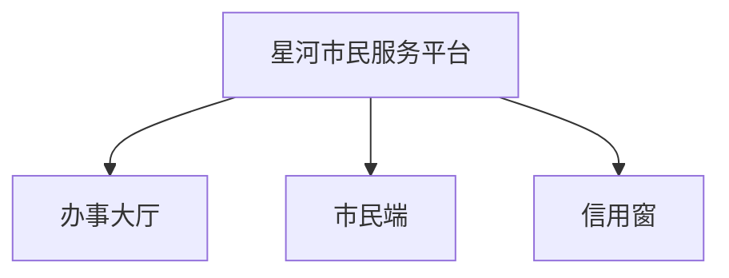

# 使用示例

这里是完整对话：你怎么开口、助手怎么问、你怎么拍板、文件怎么变。

项目名、人名、数字都是假的，只保留真实用法。贯穿始终的假项目：



项目经理林夏。组员：周启（后台）、陈默（前端）、苏晚（测试）、韩舟（后台）、顾北（产品）。

## 建议阅读顺序


| 文件 | 看什么 | 你开口可以这样说 |
|---|---|---|
| [01-升级工作区.md](01-升级工作区.md) | 技能新了、文件夹还是旧的 | 「技能已经 3.9.0 了，工作区还是旧的，开始升级」 |
| [02-处理待确认事项.md](02-处理待确认事项.md) | 有一堆事等你点头 | 「先处理办事大厅那几条」→ `1A；2B；3C` |
| [03-初始化工作区.md](03-初始化工作区.md) | 新项目从零建文件夹 | 「帮我初始化项目工作区」 |
| [04-投喂合同和立项.md](04-投喂合同和立项.md) | 把合同/招标/立项丢进去 | 「这三份材料重新投喂，先拆再出清单」 |
| [05-确认需求和工作包.md](05-确认需求和工作包.md) | 清单点头、切包、再拆待办 | 「大厅登录这批需求，做不做我认了」 |
| [06-记日报.md](06-记日报.md) | 粘日报、混报拆开、担心先问 | 「周启今天的日报如下……」 |
| [07-记会议纪要.md](07-记会议纪要.md) | 纪要落成行动项 | 「纪要如下……」 |
| [08-登记风险和问题.md](08-登记风险和问题.md) | 担心 vs 已经卡住 | 「任务4联调可能上线前打不通」 |
| [09-倒排上线计划.md](09-倒排上线计划.md) | 从下月窗口往回排 | 「下月 1 号要切，倒排一下」 |
| [10-出周报和问进度.md](10-出周报和问进度.md) | 周报、依据、数字从哪来 | 「这周进展怎么样」「这条合同里有依据吗」 |
| [11-项目集总览.md](11-项目集总览.md) | 三个项目一起看，不代写 | 「项目集整体状态怎么样」 |
| [12-人员进出和结转.md](12-人员进出和结转.md) | 进组、周六、空闲、两条待办一起关 | 「今天周六，结转一下」 |
| [13-改需求和范围.md](13-改需求和范围.md) | 客户加需求，先变更再改包 | 「客户要下月加上需求2」 |
| [14-完整性巡检.md](14-完整性巡检.md) | 缺什么会挡结论 | 「帮我做一次完整性巡检」 |
| [15-词库.md](15-词库.md) | 项目黑话越用越准 | 「大厅就是办事大厅，别再问了」 |
| [16-一份材料拆到多个项目.md](16-一份材料拆到多个项目.md) | 共用立项各拿各的 | 「这份立项要拆进大厅和市民端」 |
| [17-复盘和成本.md](17-复盘和成本.md) | 人日怎么算、阶段教训 | 「这周人日和费用」「复盘一下」 |
| [18-导入历史计划.md](18-导入历史计划.md) | 旧排期先冻快照再变成待办 | 「把这三份旧排期导进来」 |
| [19-派活与拆文件入库.md](19-派活与拆文件入库.md) | 点名派活先查重；拆文件进 sources/ | 「安排苏晚测登录和登出」「把这份规格拆文件」 |
| [20-技能缺口.md](20-技能缺口.md) | 技能做不到就落 outputs 笔录 | 「这是 skill 的问题，记成升级需求」 |

助手提问的规矩（所有示例都这样）：

```text
N. 一句话背景
   我建议：……
   A. ……（选了之后会……）
   B. ……（选了之后会……）
   C. 先放着，这题以后再说

你回：1A；2B；3C
```

同一轮可以一次回多题。已经点过头的，助手不会再问。
