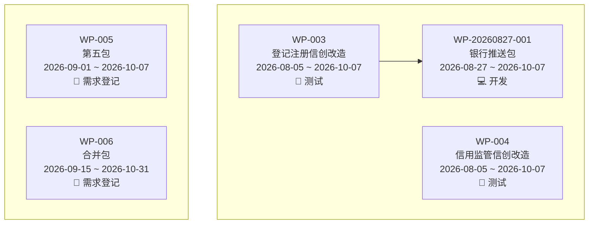
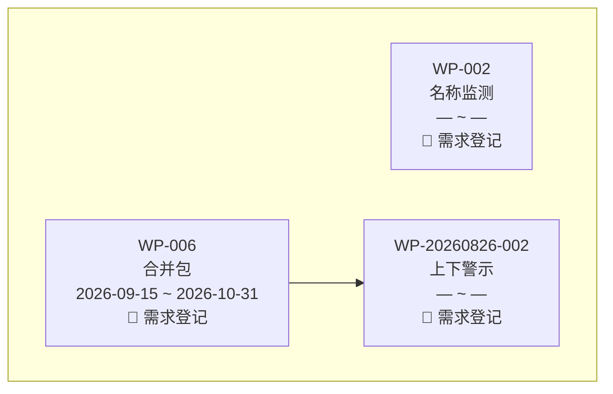

# 升级方案审查文档（3.18.0）

> 设计阶段唯一 AP。禁止拆文件、禁止改后缀。正式归档不得长期引用本路径；准许执行后由 upgrade-to + CR + IA + CHANGELOG + 基线接住，发布后删除本草稿。

## 0. 工作空间版本快照

| 项目 | 值 |
|---|---|
| 工作空间根路径 | `C:\Users\qiusuo\Downloads\ChronoPM Skill` |
| 版本标识来源 | skill.json version + git HEAD |
| 版本标识值 | Skill 3.17.0；schema 0.16.0；git `b47d158` |
| 快照生成时间 | 2026-08-27 |
| 用户确认状态 | 路径已确认（「正确」）；需求已裁决（「都按照你的建议来」+ 增补归档） |
| 脏文件（不纳入） | `governance-shared/migrations-history/upgrade-to-3.17.0.md` |

不改造：`C:\Users\qiusuo\.grok\skills\chrono-pm-project`（已安装副本）。

## 0.1 需求基线（用户裁决后，辩论终止）

| ID | 来源 | 裁决 |
|---|---|---|
| D1 | SG-20260827-001 建包联动更新工作包图 | 继续。补执行闸，不新开能力 |
| D2 | SG-20260826-005 skill-gap 结构自检 | 继续。流程闸；**不做** `verify_skill_gap.py` |
| D3 | SG-20260826-004 WP 结构完整性 | **调整后**继续。不劫持 §4 下辖待办；§5 条件必填；禁混排；模块级待办仅显式「全模块/整包/全部功能点」或 PM 点名才回填 §3b |
| D4 | SG-20260827-002 工作包图按计划分组 | 继续。独立章节+独立 mermaid；同章才连线；废弃不入图 |
| D5 | 对话增补：废弃/完成进归档，完成与废弃时间可索引 | **调整后**继续。见 §0.2。不新增第五状态、不搬 WP 文件、不升 schema |
| D5-B | 2026-08-27 用户补口：升级执行文件必须处理历史项目的废弃工作包和完成工作包 | **继续**。upgrade-to **B 节为强制施工项**，不是「默认不写业务仓」。见 §0.3 |
| D6 | 2026-08-27 用户：固定规则是否用 py 辅助以降耗提准（例：每日个人结转）；现脚本几乎只校验 | **继续、收窄**。见 §0.4 |
| D6-B | 2026-08-27 用户：结转不要判办结/空待办；前一天全员 md 拷到第二天再处理；无待办且无日报则自动离组 | **调整后继续**。机械段改成「最新源文件拷贝后裁剪」（人人一份，空表也建）。**不采纳自动离组**（见 §0.4 否决）。空闲仍 ASK，出组须 PM 确认 |
| D7 | 2026-08-27 用户：大 WP 功能点多人，§8 应是功能执行人汇总；无功能点则从待办收集。要效率、要一致，担心发散 | **收口、不新开 CR**。见 §0.5。并入 CR-B。不新增 §3b 执行人列。人的 SSOT 仍是待办 Owner |
| D7-B | 2026-08-27 用户：WP md 上无人期索引/记录/跟踪，低级模型会算错且无法对账；规则必须定死强制 | **继续**。§8 旁加 **§8b 人期来源（只追加）**；SCAN 走 S1–S6 逐步强制；改 §8 人期缺 8b 行 = 级联未完成。见 §0.5 强制规程 |
| D8 | 2026-08-27 用户+截图：模型把思考过程（英文）甩给用户，查完进度还问「是否执行此方案」，不知道执行了什么。要强制问答规范；语种跟随用户；单独目录（同拆文件/skill-gap） | **继续**。见 §0.6。能力目录 `reply-norm-skill/`（禁止内嵌 SKILL.md）。CR-005 |

打包：1 个 AP；**按 16 §4 单一目标拆 5 个 CR**（001 图 / 002 结构闸 / 003 归档 / 004 结转 / 005 问答规范），各配 1 个 IA。

Q2–Q5 用户确认：按 A 建议。

### 0.2 D5 调整口径（用户授权 A 建议）

现状（扫描）：头 `status` 已是四枚举 `待确认/已规划/进行中/已完成`；`废弃` 是 `effect` 不是头状态；§7 禁止写「废弃」；全部 WP 文件仍在 `wps/WP-*.md`；index 一张 10 列表；无 `completed_at`/`retired_at`；`backup/` 禁读，不能当归档。

| 用户原话 | 调整后 |
|---|---|
| 增加状态「完成」 | **不新增枚举**。对外可以说「完成」，落盘仍用已有 `已完成`。禁止 `status: 完成` / `status: 废弃` |
| 废弃进废弃归档、完成进完成归档 | **不移动 WP 文件**（搬目录 = 契约 #8 必须升 schema，存在性 glob/PLAN/verify 全改）。归档 = `wps/_index.md` **三段表**：§1 进行中 / §2 已完成归档 / §3 废弃归档。一行只出现在一段。文件路径仍 `wps/WP-*.md` |
| 废弃时间、完成时间要能记录并索引到 | WP YAML 可选 `completed_at` / `retired_at`（YYYY-MM-DD）为时间 SSOT；index 末尾追加列「完成时间」「废弃时间」镜像。完成时间 = §7 到状态=`已完成` 的日期；废弃时间 = P-WP-RETIRE 确认日，同时 §6 记一行 |

默认查询/默认工作包图：**只含进行中段**（`effect=正常` 且头不是 `已完成`）。已完成、废弃点名才列。PLAN §3 仍可留 `effect=正常` 的已完成 WP（计划成员名单），不因归档从计划里删掉。

### 0.3 历史项目强制处理（D5-B，写入 upgrade-to B 节）

3.16/3.17 的 B 段是「默认不写业务 WP / 不强制批改」。本条否决该默认：**凡带 `ai/wps/` 的历史项目工作区，升级执行文件必须把已完成、已废弃工作包归入对应归档段并回填可索引时间**。开发仓无 `wps/` 才 skip。

仍不搬 `wps/WP-*.md`，不改 §7 链，不猜日期。允许写的仅：`wps/_index.md` 三段重写、WP YAML 补 `completed_at`/`retired_at`、按新形态覆盖 `_wp-chart.md`。

#### 分类（先读 WP 文件，index 只做加速器）

优先级从上到下，一行只进一段：

| 优先级 | 条件（满足即停） | 进入 |
|---|---|---|
| 1 | YAML `effect=废弃`，或 index 状态列已是 `废弃` | §3 废弃归档 |
| 2 | 头 `status=已完成`，或 §7 链尾到状态=`已完成` | §2 已完成归档 |
| 3 | 其余 | §1 进行中 |

已完成后又废弃：只进 §3；两列时间都保留。

#### 时间回填（不覆盖已有合法 YYYY-MM-DD）

| 字段 | 推导顺序 | 推不出 |
|---|---|---|
| `completed_at` | ① YAML 已有合法日 → 保留；② 自 §7 表**底向上**第一条「到状态=已完成」的时间列（即最近一次完成，不是整节物理末行——末行可能是重开后的进行中）；省年按 00 §5.1b 能补全则补全；③ 头已是已完成但无链行 → `—` | 写 `—`，清单标 ⚠️，禁止猜今天 |
| `retired_at` | ① YAML 已有合法日 → 保留；② §6 最近一条含「废弃」的日期；③ **仅当**能证明文件头 `updated`/`updated_at` 的日期就是废弃当日（例如 §6 无日期但同行操作人+当天对话确认）才用；**无法确认则不得启用 ③**，退回 ④；④ `—` | 写 `—`，清单标 ⚠️，禁止把「最近编辑日」当废弃日 |

index「完成时间」「废弃时间」镜像 YAML。进行中段两列均为 `—`（除非曾经完成又重开：保留 `completed_at` 历史值但行在进行中）。

**出归档（日常，非仅 B 节）**：头从 `已完成` 改回 `进行中`/`已规划` → 行从 §2 移回 §1，`completed_at` **保留不删**。废弃恢复→正常（既有 §8e，须确认）→ 行从 §3 移到 §1 或 §2（视头状态），`retired_at` 保留。upgrade-to B 节施工句：`completed_at` 取「§7 自下而上最近一条 到状态=已完成 的时间列」。

#### 执行顺序（每个历史项目）

1. **dry-run 清单**（必须先出）：编号、现状态/effect、拟入哪一段、拟回填日期、⚠️ 项。
2. PM 确认该项目清单后写回（`--migrate-business` 或该项目对话按同一张表执行）。写前快照 `ai/backup/migration-snapshot-*`（沿用 3.15 契约）。
3. 写：各 WP YAML 日期（仅缺补）→ 重写 `wps/_index.md` 为三段 12 列 → 覆盖重建 `wps/_wp-chart.md`（只含进行中段，新形态）。
4. **幂等**：已是三段则只补缺行/缺日期/图指纹变化才重画。
5. 无 Python：升级执行文件 B 节仍是同一张分类表，AI 按表手做，禁止跳过「历史完成/废弃」两行。
6. 开发仓 `--project-root` 无业务 `ai/wps/` → skip，并在 B 节写明。

禁止：把历史完成包留在单表当在办；把废弃包留在默认图；用今天填未知完成/废弃日；改 §4/§5/§3b 存量正文（那是 D3，仍标 ⚠️ 不批改）。

### 0.4 结转 Step 0 脚本执行（D6 + D6-B）

**现状**：包内 Python 几乎只读校验。结转要模型加载 22 号、按每人 7 天扫描范围判断「有没有未办结 / 要不要建空文件」，所以又慢又容易漏。22 号其实已经要求「当天读或写 todos → 除已出组外人人一份（§1 可空）」——麻烦出在执行层分支，不在「要不要全员建档」。

**用户提案**：不要判办结/空待办；把前一天所有人的个人 md 拷到第二天，再处理内容；当天没待办也没日报就自动离组。

#### 采纳：拷贝后裁剪（简化机械段）

不再按「有没有未办结」决定建不建文件，也不再每人回溯 7 天扫描范围。

1. **名单** = 最新合法日 `_index` §1，六态除已出组。不是「昨天目录里碰巧有哪些文件」（漏建的人会永远漏）。
2. **源文件** = 该人 `date≤今天` 的**最新**个人 md（周末/漏日自然落到周五或上次有文件那天）。没有源 → 用模板建空文件（§1 可空）。
3. **拷贝后必须裁**（禁止字节级整文件复制）：

| 章节 | 处理 |
|---|---|
| YAML `date` | 改成今天 |
| §0 / §0.5 | 整表滚存 |
| §0.6 | **禁止**把历史日表整表拷来。只带累计 + 当天空行骨架 + 孤儿行（22 §3.2 / FE-009） |
| §1.1 / 1.2 / 1.3 | 只保留状态 ≠ 已完成/已取消/已转出 的行；编号与三时间原样；空表也留文件 |
| §1.4 备注区 | 只留仍在 1.1 的 TD；标注结转自 {源日期} |
| §1.5 关联处理记录 | **随仍在 1.1 的本单 TD 整行滚存**（处理方式+生效一起带）。禁止裁空（否则次日办结又问一遍怎么办结） |
| §2 日报存档 | **清空**（昨天日报不是今天的） |
| §3 工作日志 | **清空骨架**（不拷昨天日志） |
| §4 个人备注 | **整段滚存**（跨天仍要看的备忘） |
| §5 时间线/里程碑影响 | **整表滚存**；行仍在即可，不按 WP 状态删行（避免无 Python 分支乱裁） |
| §6 / Revision | 不拷历史变更正文 |

4. 当天文件若已存在（已有人投喂日报）：**不覆盖 §2**，只补缺失的未办结行。
5. 已出组：不建今天文件（停链不变）。

这样脚本不再问「要不要跳过空待办的人」——空也拷、也建档。办结行留在源日，不进今天核心表（今天默认待办清单仍是未办结，见 05）。

#### 否决：无待办且无日报 → 自动离组

| 现行条文 | 内容 |
|---|---|
| 22 §3.3 / §10 | 次日无待办且无日报 → **不自动出组**；标「空闲」+ pm-decisions 块 8（派活 / 记离组 / 先放着） |
| 00 花名册 / §4d | 出组须 PM 确认；AI 不自动判；空闲非终态 |
| 06 | 出组须 PM 确认 |
| 底线 6 | 不得代 PM 做资源决策 |
| CHANGELOG / V3-013 / FE-005 | 空闲不自动出组；仅能耗不进空闲台账 |

自动离组还会踩死时机：Step 0 发生在**当天第一次碰 todos**，此时今天的日报几乎都还没写。若按「今天没待办没日报」出组，等于每个上班日早上把做完活的人全部踢走。周末后周一源日是周五，周五收工无日报更会误伤。休息日只要有人打开 todos 仍全员建档（N-38 已取消），自动离组会把休假当离职。

**仍做**：源日核心表无未办结 **且** 源日 §2 无日报正文 → 脚本只打 `ASK:IDLE`，花名册标「空闲」（非终态），AI 对外 A/B/C，选 B 才出组。进组第一天不触发。仅能耗/从未有待办行不进空闲台账（FE-012/013）。

若你坚持自动离组，必须单独立项并改 00/22/06 契约，且要另定「连续 N 个工作日」门槛——**不进 3.18**。

#### 脚本边界（更新后）

| 可脚本化 | 必须留 AI |
|---|---|
| 全员拷贝后裁剪；人人一份含空表 | 0.5 共享人力提示 |
| §0/0.5 滚存；§0.6 裁剪 | 缩写冲突 ASK |
| 标记顺序；E1–E5 | 空闲 → 白话 A/B/C + 写 pm-decisions；**出组** |
| 合法单值 WP 原样；恰好 1 个已规划包则回填空 WP Ref | 多值/低置信 WP |
| `ASK:IDLE` 候选名单 | 转交（新编号）、日报映射、派活 |

**入口**：`python scripts/carryover_step0.py --root <项目根> [--date YYYY-MM-DD] [--dry-run]`

- `--date` 默认今天；`date>今天` 拒绝（N-37）。
- 已 `carryover_done_for_today=true` 且应建档文件齐全 → 退出 0。
- 日常默认写盘。`--dry-run` 只打印。
- 禁止改历史日文件。
- stdout：报告 + `ASK:` 行。AI 禁止再手搓全员搬运。
- 函数：`parse_index` / `find_source_file` / `copy_and_trim` / `update_markers` / `emit_report`，每个 ≤60 行。

**无 Python**：AI 按**同一套拷贝后裁剪**做，禁止跳过，也禁止自动离组。

**脚本失败 ≠ 手搓全员（三·二）**：`有 Python 却手搓全员 = 级联失败` 仅指：**脚本 exit 0 且标记已 true 之后**，AI 再把全员文件重写一遍。脚本 **exit ≠ 0**（含 E5 中途写失败）：AI **只对报告里的失败人**按 22 号 E5 兜底（标失败、不更新该人标记、其他人用脚本已写结果），**不算手搓全员**。禁止因一人失败把全员重做。

**22 号将删/弱化**：每人 7 天扫描范围表（场景覆盖改为例：源=该人最新文件）；「无未办结则跳过建档」若原文有歧义，改为与人人一份对齐。保留：编号不变、三时间原样、不拷能耗整表、空闲不自动出组、不建未来日。

**与契约**：#4 禁的是查询临时脚本，不是包内正式脚本。

P-CARRY-WPREF（B2-2）：脚本只做「空 WP Ref 且项目内恰好 1 个已规划 effect=正常」的回填；多值/0 个/低置信 **不写**，报告 `ASK:WPREF`，由既有 P-CARRY-WPREF / AI 兜底。23 号树保持 `P-CARRY → P-CARRY-WPREF`，注释「高置信单值已由 carryover_step0 做过则跳过」。

幂等（B2-3）：① `carryover_done_for_today=true` 且应建档文件都在 → 退出 0；② 今天文件已在 → **只补**缺失未办结行，不重建、不用全文 MD5。空文件已建算「已在」。

### 0.5 阶段执行人：一条投影链（D7，防发散）

对照实例：`全链通重构` `WP-20260827-001`（注销总包）§3b 14 个功能点，关联待办全是 `—`，§8「预演」执行人也是 `—`。缺的是待办没挂到功能点，不是缺第三套人数字段。

**只保留一条单向链，禁止第三份名单：**

```
待办 Owner（事实）
    → 简单包：按备注「阶段：」命中 §8 行（现 P-WP-SCAN）
    → 有 §3b：功能点「人」查询 = 该行关联待办的 Owner（不落盘新列）
               §8 🔄 行 = UNION(未办结、阶段命中该站)
               §8 ✅ 行 = 冻结快照（见下），不是实时未办结
    → PLAN §3 执行人 ← §8 当前 🔄 行（无 🔄 则最后一个 ✅）
```

| 包形态 | §8 **进行中**行怎么来 | 不做什么 |
|---|---|---|
| 无 §3b 或表空 | 本包**未办结**待办 Owner，按阶段匹配 UNION | 不扫功能点 |
| 有功能点行 | 关联待办仍未办结且功能点阶段列=该站，UNION Owner；外加备注命中该站的漏挂未办结 | **不**在 §3b 加执行人列 |
| 功能点行关联待办为 — | 该点对 🔄 行无人可汇 → `⚠️待安排人` | 不把包负责人填进去 |

**冻结（D7 补口，00 §8d 已有、D7 不得写坏）：**

日常 SCAN 读范围不含已办结，若对 ✅ 行按未办结重算，开发办结、测试排上人之后，**开发行会被写成空**——这就是当前丢人的原因。规则：

| §8 行状态 | 人期 | SCAN 允许 |
|---|---|---|
| 🔄 | 未办结实时 UNION（+ 本回合刚办结且阶段仍命中该站的 Owner，避免最后一张单办结的瞬间真空） | 可改 `(AI聚合)` 格；点名不覆盖 |
| ✅ | **冻结**：保留落盘执行人/排期 | **禁止**因读范围没有已办结而清空或改成 `⚠️待安排人` |
| ⏳ 且从未有过人 | `⚠️待安排人` | 保持 |

阶段切换本回合（开发最后一张待办办结、测试待办出现）：

1. 开发行：执行人 = 原 §8 开发人 ∪ 本回合办结且阶段=开发的 Owner → 标 ✅ 并冻结。
2. 测试行：未办结测试 Owner → 🔄 `(AI聚合)`。
3. 开发行的人**必须还在**，测试行是另一组人，两行并存。

解冻（既有）：新未办结又命中已 ✅ 站 → 该行改 🔄，执行人 = 冻结快照 ∪ 新 Owner。

全量刷新（仅升级一次 / PM 点名刷新该 WP）才按 WP Ref 扫历史已办结回填空的 ✅ 行；日常 SCAN 不做全库历史。

硬约束（效率 + 一致）：

1. **人只在待办上是事实**；§8 是落盘投影。✅ 行一旦写出即当快照，直到解冻。§3b 不存人。
2. **每回合每 WP 最多 SCAN 一次**，禁止为功能点再全库扫。
3. 问「这个功能点谁做过」：关联待办含已办结（与 05「谁参与过」一致）。问「现在谁在做」：只看未办结 + §8 🔄。
4. D3 模块级待办回填继续。注销总包 §8 没人，先挂待办再汇总。
5. ALIGN 不动。点名不覆盖。

#### §8b 人期来源（强制落盘，给低级模型对账）

§8 五列仍只给人名/排期（字段边界不改）。**溯源不进执行人格，进同页新表 §8b**，和 §4b 一样只追加、不是第二套事实。低级模型禁止凭记忆重算历史人；对账顺序：先读 §8 结果 → 再读该阶段 §8b **最后一行** → 对不上只允许按 S1–S6 重跑本回合，禁止手改 ✅ 冻结行。

模板（`wp-template.md` §8 后）：

```
## 8b. 阶段人期来源（只追加）

> 派生留痕，不是人的 SSOT。SSOT=待办 Owner。改 §8 执行人/状态（⏳↔🔄↔✅）的同一回合必须追加至少一行。缺行=§8c.2 级联未完成。
> 动作只允许：聚合 / 冻结 / 冻结补人 / 解冻 / 点名。禁止「重算清空」。
> 超 30 行：近 30 留本表，更早收到同文件「历史人期来源」。

| 时间 | 阶段 | 动作 | 姓名 | 来源 TD |
|---|---|---|---|---|
| YYYY-MM-DD | 开发 | 冻结 | 张三、李四 | TD-ZS-… / TD-L-… |
```

存量无 §8b：第一次 SCAN 该包时懒建空表；不回填历史，除非 PM 点名刷新（全量）。

#### P-WP-SCAN 强制规程 S1–S6（必须按序，禁止跳步、禁止「自己理解」）

日常读集：本 WP 文件 + **本回合已打开的**、WP Ref=本包的待办行。记两袋：

- **U**：未办结行（状态 ≠ 已完成/已取消/已转出）
- **J**：本回合刚改为已完成（或已取消不计入人）且备注/功能点阶段能命中某 §8 站的行

禁止为日常 SCAN 打开更早日期的待办文件（全量刷新除外）。

**S1** 读 §8 全表、§8b（无则本回合建表头）、§3b（无表当简单包）。

**S2** 对每个 TD 定「命中阶段名」：先待办备注 `阶段：` 最长同义词；简单包到此为止。有 §3b 则：若 TD 出现在某功能点关联待办列，命中阶段 **兼** 用该功能点「阶段」列（与备注冲突 → 以备注为准并 8b 备注冲突，不猜）。未挂任何功能点但有备注 → 漏挂兜底，仍命中备注阶段。

**S3** 对 §8 **每一行**（禁止只处理当前 🔄）：

| 该行现状 | 本站 U 命中 | 本站 J 命中 | 强制动作 |
|---|---|---|---|
| ✅ | 无 | 无 | **不改人、不改状态、不写 8b** |
| ✅ | 有 | 任意 | 解冻→🔄；人=原人 ∪ U 的 Owner（点名则不改人只改状态？否：点名见 S4）；8b 动作=解冻，来源=U 的 TD |
| ✅ | 无 | 有 | 保持 ✅；人=原人 ∪ J 的 Owner（人有变才改）；8b 动作=冻结补人，来源=J 的 TD。**禁止清空原人** |
| 🔄 | 有 | 任意 | 人=U∪J 的 Owner（`(AI聚合)`）；8b 动作=聚合，来源=U∪J 全部 TD |
| 🔄 | 无 | 有 | 人=原人 ∪ J 的 Owner；状态→✅ 冻结；8b 动作=冻结，来源=J 的 TD（原人无 TD 则来源写 `原冻结` + J） |
| 🔄 | 无 | 无 | 人**保持原样**；状态→✅ 冻结；8b 动作=冻结，来源 TD=`原冻结`（即 §8 现有人名，不写空）。**禁止**写成 `⚠️待安排人` |
| ⏳ | 有 | 任意 | 改 🔄；人=U∪J；8b=聚合 |
| ⏳ | 无 | 有 | 改 ✅ 冻结；人=J 的 Owner；8b=冻结 |
| ⏳ | 无 | 无 | 不改、不写 8b |

**S4 点名**：该行执行人格含 `(点名)` → S3 **不得改人名**；仍可改状态 ⏳/🔄/✅；8b 仅当本回合 PM 新点名时动作=点名、来源 TD=`—`。

**S5 写盘顺序（不可颠倒）**：先改 §8 行 → 立刻追加对应 §8b 行 → 再投影 PLAN。只改 §8 不写 §8b = 级联未完成，当场补 8b，禁止交卷。

**S6 禁止清单（违反任一条 = 级联失败）**

1. 因「现在未办结里没有开发的人」把 ✅ 开发行执行人改空或改成待安排人  
2. 不写 §8b 就改 §8 人/冻结状态  
3. 在执行人格夹带 TD 号或日期（字段边界）  
4. 在 §3b 加人名列  
5. 用包负责人/§1 执行人冒充阶段人  
6. 日常 SCAN 为填冻结行去扫历史日 todos  
7. 8b 动作写成「重算清空」「覆盖」「删除」  
8. 同回合改了两行 §8 却只追加一行 8b（一行 §8 变更对应至少一行 8b）

**§8c.2 必须增两行：**

- `§8b 本回合人期来源已追加（若改了 §8 人期或冻结）`
- `§8 已 ✅ 行执行人未被 SCAN 清空`

低级模型执行口令（对外仍白话，对内照做）：「先抄 §8 表，再按 S3 表格对每一行打勾，改了就写 8b，没改的 ✅ 行连碰都不要碰。」

**否决（发散项）：** §3b 加执行人列；功能点级排期表；§8 与 §3b 双向对写；无待办时用包负责人冒充阶段执行人；日常 SCAN 为了填 ✅ 行去扫全部历史日；把溯源只写在对话不落 WP；§8 执行人格塞 TD 号。

### 0.6 对外问答规范（D8，能力目录）

截图问题：用户中文问「电子签名和实名进度」，模型先甩英文思考（I now have a comprehensive picture…），再被宿主弹出「文档已经生成，是否基于文档继续执行」。用户不知道执行了什么，查询被当成「方案」。

**定位**：与 `source-split-skill/`、`skill-gap-skill/` 同构的**能力目录**，不是独立 Skill。

```
ChronoPM-Project/reply-norm-skill/
  CAPABILITY.md          # 禁止命名 SKILL.md
  references/reply-rules.md
```

**何时加载**：写入 / 复杂查询 / 出文件 / 确认 / 方案。**简单查询不加载全文**（省上下文）。但下面 3 条硬规则必须同时写进 **SKILL.md 安全底线** 和 **05 简单查询**（只载 05 时也能挡住截图那种漏）。

**硬规则（强制，违反=本轮对外失败）：**

1. **语种**：对用户正文 = 用户**本轮**输入语种（中文问中文答）。不得默认英文。内部推理不得出现在用户可见正文。
2. **禁止输出思考过程**：不得出现 `I now have` / `Let me` / `Based on my findings` / 「让我先梳理」长推理段。结论直接说。
3. **禁止假执行门**：查询、汇报进度、只读分析 **不准**问「是否执行此方案 / 是否基于文档继续执行 / 要不要按这个 plan 做」。用户没要方案就不要造方案确认。
4. **真确认才走 00 §5.0**：仅当本回合已写出**可执行清单**（改哪些文件、改什么、选了会怎样）且用户尚未表态。提问必须用白话写清「已经记下了什么」或「还没动、准不准做」。禁止空洞「是否执行」。
5. 宿主若自己弹出「文档已生成是否继续」：技能侧仍须在对话里先给中文结论+数据来源，不得用英文思考段当正文。

00 §5.0 仍是确认**形状**的唯一正文；本目录只补「何时准问、语种、禁 CoT」。21 号 DF-005/006 改指针到本目录，不复述。

23 增 P-REPLY：Home=`reply-norm-skill/references/reply-rules.md`。P-ALWAYS **不**把本目录全文每轮加载（简单查询会炸上下文）；靠 SKILL 底线 + 05 短条兜住查询。

回归：RN-001～004。

---

## AP-1. 变更概述

3.18.0 按 16 §4 拆 **5 个 CR**：① 图按计划分章 + 建包联动重建；② WP 结构闸、SCAN 冻结与 §8b 人期溯源、skill-gap 落盘前自检；③ 完成/废弃归档 + 升级 B 节强制处理历史项目；④ 结转 Step 0 拷贝后裁剪脚本；⑤ 对外问答规范（`reply-norm-skill/` 能力目录）。schema 保持 0.16.0。双包同号。不新建 `references/NN-*.md`（**能力目录 `reply-norm-skill/` 除外**）。不新开 skill-gap 校验脚本。回归 **706**（施工只认此数，禁用 691/692/700）。

---

## AP-2. 影响点详细分析

| 影响项 | 当前状态 | 变更后 | 影响描述 | 程度 | 可逆 |
|---|---|---|---|---|---|
| `11` §17.2 默认图 | 一张全包竖排；节点编号/名/人员 | 每正常计划一章一 mermaid +「未绑定计划」；节点编号/名/yyyy-MM-DD~yyyy-MM-DD/阶段图标；每行≤3 折行；同章才连线 | 查询「画图」默认形态变；人员改走点名人员图 | 高 | 是（回退 3.17 规则） |
| `11` §17.3 指纹 | 含负责人/§8 执行人 | 含 plan_ref、日期、当前阶段；不含人员 | 改人不再重画；改计划/日期/阶段会重画 | 中 | 是 |
| `00` §8c.2 | 清单无图、无归档段、无 §5/§3b、无 8b | 增：图；归档段；§5/§3b；**§8b 来源行；✅ 行未被清空** | 漏 8b 或清空冻结人=级联未完成 | 高 | 是 |
| WP `§8b` | 无 | 只追加人期来源表 | 页面可跟踪；低级模型对账 | 中 | 是 |
| SKILL「WP 创建」 | 必载 00+06 | 必载 00+06+23 | 建包能看到 P-WP-CHART | 中 | 是 |
| `10` WP 文件信号 | 只写 WP + _index | 补列 `_wp-chart.md` | 更新意图清单不再绕过图 | 中 | 是 |
| `wps/_wp-chart.md` | 单 subgraph 人员图 | 多章节新形态；进行中段 only | 已有图下次指纹变即覆盖 | 中 | 是（可删文件懒建） |
| `wp-template` §4 | 下辖待办派生不落盘 | **保持** | 拒绝 D3 原文劫持 | 无 | — |
| `wp-template` §5 / §3b | §5 可选；无覆盖注 | 有 R-/I- 则 §5 必填；禁自定义混排节；模块级待办显式才全功能点回填 | 新建 WP 形态变；存量标 ⚠️ | 中 | 是 |
| `gap-capture` §6 | 必选节写在规则里 | 落盘前对照**当前模板**逐节核对；禁历史批次范本；缺节=级联失败 | 新 skill-gap 不会再漏 〇·五 | 中 | 是 |
| `wps/_index.md` | 一张 10 列表 | 三段 + 12 列（末尾完成时间/废弃时间） | 查找默认进行中；问完成/废弃走归档段 | 高 | 是 |
| WP YAML | 无完成/废弃日 | 可选 `completed_at`/`retired_at` | 时间可索引；**历史项目 B 节强制回填**（推不出则 — + ⚠️） | 中 | 是 |
| P-WP-RETIRE / 头→已完成 | **现状已有（00 §8e）**：RETIRE 须确认；`effect=废弃`；§6 记变更；§7 禁止写「废弃」；移出全部正常计划该 WP 的 §3 行+§4 段+§6；index 状态列=`废弃`；头 status 保留四枚举快照；清对端 `related_wps` 与 index 上下游格；未办结待办 SUGGEST 取消或改绑后继，不自动改；SCAN/ADVANCE/V-13 跳过。头变 `已完成` 走 ALIGN/ADVANCE，index 仍在同一张表镜像四枚举 | **在上述全部动作之后**再：YAML 写 `retired_at`/`completed_at`；index 行移入废弃/已完成段（12 列）；同回合按新形态重建图（默认不含归档段）。不替代更不简化 §8e 既有步骤 | 漏做计划移出或清对端 = 仍级联失败；归档段是附加不是替换 | 中 | 是 |
| 历史业务仓 `wps/_index.md` + 图 | 单表 10 列；图可能含已完成/废弃 | B 节强制三段+时间列+新形态图（进行中 only） | 升级后历史完成/废弃不再混在在办清单和默认图 | 高 | 是（快照回滚） |
| `verify_projection.py` | 不查 WP 内部 | 可选 `--check-wp-structure` WARN | 不默认阻断落盘 | 低 | 是 |
| init `config.py` `_index` | 仍 8 列「是否里程碑」（与 3.16 模板漂移） | 与新模板三段 12 列对齐 | 修漂移，随 CR-C | 中 | 是 |
| Portfolio `02` V-2 | 主要读 PLAN §3 | 补一句：成员 `_index` 可能三段；集层进度默认进行中+PLAN | 防集层把归档段当在办 | 低 | 是 |
| 结转 Step 0 | 模型读 22 号逐人写盘；verify 只读 | 有 Python：`carryover_step0.py` 写盘 + 报告；AI 只处理 ASK | 日报/查待办首触大幅缩短；漏人漏号下降 | 高 | 是（删脚本即回退 AI） |
| SKILL §5.0 / 00 WF-8 Step 0 | 日常不依赖 Python；不调用 verify | 结转**优先**包内写盘脚本；仍禁止无 Python 跳过；仍不拿 verify 代替结转 | 契约级执行路径变 | 高 | 是 |
| workspace schema | 0.16.0 | 0.16.0 | 无新目录 | 无 | — |
| 核心契约 00/SKILL | 路由与写后必检 | 改 | 全量回归 | 高 | 是 |
| 存量 WP 正文（§3b/§4/§5） | 结构不一 | 仍不批改，标 ⚠️（D3） | 与 D5-B 分离 | 低 | 是 |
| 回归 WPR-004/006 等 | 锁旧三行人竖排 | 改预期为分章新形态 | 旧例必须改写 | 中 | 是 |

未改：待办 SSOT、related_wps SSOT、图非事实源、P-OUTPUT 边界、一条待办一个 WP、09 退役、backup/ 禁读。

---

## AP-3. 变更策略与设计思路

### 为什么这套

四条原需求 + 归档都是「规则已有 / 执行或形态不够」，用扩展现有 P-WP-CHART、§8c、P-SKILL-GAP、index 加速器覆盖。不新规则文件、不搬 WP 文件、不升 schema、不新第五状态，避免和 3.13 effect 轴、3.5 待办 SSOT、契约 #8 打架。

### 关键决策

1. D1+D4 同 CR：先强制重建再改形态会画两次旧图。
2. 图分组 = Markdown 章节 + 独立 mermaid，行折行才用空标题 subgraph。计划分组不用一个大框。
3. 边：`related_wps` 且两端都在本章。
4. 当前阶段 = §8 状态为 🔄 的行名；无 🔄 则最后一个 ✅ 之后第一个 ⏳；全 ⏳ → 需求登记；全 ✅ → 上线。图标用身份表（与 §8 三态图标分离：节点写 `🧪 测试` 不写单独的 🔄）。
5. D3 不改 §4 语义。
6. D5 归档走 index 分段不是搬文件；完成时间/废弃时间 YAML+index 双写，YAML 为 SSOT。
7. 默认图与默认 WP 清单不含归档段。
8. **按 16 §4 单一目标拆 5 个 CR**（001 图 / 002 结构闸 / 003 归档 / 004 结转 / 005 问答规范）。不是「一版本授权多 CR」。3.17 的一 CR 多节点例外不沿用。
9. **upgrade-to B 节强制处理历史完成/废弃**（D5-B）。不沿用 3.16/3.17「默认不写业务仓」。先清单后写回；不猜日期；不搬文件。脚本落在现有 `migrate_business_data`，不新开 migrate 入口文件。
10. **结转机械段脚本化**（D6）：只做 22 号已枚举的搬运/建档/标记；ASK 留 AI。不把 verify 改成写盘。不抽公共大库。
11. **问答规范能力目录**（D8）：`reply-norm-skill/` 禁止 `SKILL.md`，避免被宿主扫成主 Skill；SKILL 底线 14–16 与 05 短条必须同步。

### 与现规则交互

- 00 §8c / 23 P-WP-CHART / 11 §17：写入链路强制 + 新形态。
- 00 §8e / P-WP-RETIRE：废弃仍须确认；确认后 AUTO 移 index 行 + `retired_at`。
- 头变 `已完成`（ALIGN/ADVANCE/确认）：AUTO 写 `completed_at`、行进已完成归档、重画图。
- 06 §7.4：10 列→12 列只末尾追加；§9 增 WP 索引归档一行（不搬事实源文件，故刷新 index=AUTO）。
- 05：画图行改规格；增「完成的工作包 / 废弃的工作包 / 何时完成或废弃」路由。
- gap-capture：模板仍唯一权威（已有「禁止 ai/templates」），再禁 outputs 旧批次当范本。

### 被否决的替代

| 替代 | 否决原因 |
|---|---|
| 只改 11 不改 8c.2/路由 | D1 已证明规则在执行漏 |
| 一张图里用计划 subgraph | 用户否决 |
| 建包必载完整 11 | 上下文膨胀；00+23+模板足够 |
| D3 把 §4 改成关联待办列表 | 破坏待办 SSOT |
| 新 `verify_wp_structure.py` / `verify_skill_gap.py` | 超复杂度；后者扫 outputs 与现 verify 职责不符 |
| 新增 `status: 完成` | 与 `已完成` 重复，枚举爆炸 |
| 把 WP 文件搬到 `wps/archive/**` | 契约 #8 升 schema；存在性、PLAN、verify、Portfolio 全改 |
| 归档进 `backup/` | 禁读，不是活历史 |
| 四条 + 归档一个 CR | 违反 16 §4，且 3.17 已声明例外不得当常态 |
| B 节再写「默认不写业务 WP」 | 用户明确要求历史完成/废弃必须处理；否则升级后 index/图仍是旧混排 |
| 升级时静默用今天填完成/废弃日 | 编造时间，违反底线 1；推不出必须 — + ⚠️ |
| 把 22 号全部判断写进脚本 | 0.5/0.8/缩写/pm-decisions 不是纯机械；做错会污染决策文件 |
| 整文件字节级拷贝昨天 md | 昨天日报/已完成行/能耗整表/工作日志会污染今天；违反 22 §3.2 与 05 默认未办结 |
| 无待办无日报自动离组 | 22 §3.3 明文禁止；Step 0 时点今天日报未写；周末/休息日误伤；出组须确认 |
| 把 00 §5.0 整节搬进 reply-norm 造成双份 | 确认形状仍只在 00；新目录只补语种/禁 CoT/禁假执行门 |
| 改 `verify_todo_continuity.py` 为写盘 | 19 号旁路与「只读校验」契约会被破坏；结转失败时巡检脚本变危险 |
| 3.18 再做图生成器/日报脚本 | 超出用户举例与本版复杂度；图形态本版刚改，先规则后脚本 |
| §3b 新增执行人列 / 功能点级人期表 | 第三人数字段，与待办 Owner、§8 投影三角漂移；大包 SCAN 变慢 |
| 历史项目把 WP 文件搬进 archive 目录 | 同前：升 schema |

---

## AP-4. 修改范围清单

准许执行前 **只允许存在本 AP**。下表是执行阶段清单。

### CR-A 工作包图（D1+D4）

| 文件 | 修改类型 | 摘要 | 估行 | 核心契约 |
|---|---|---|---|---|
| `references/11-output-artifact-rules.md` | edit_section | §17.2 分章形态+图标表+折行；§17.3 新指纹+进行中 only；§17.4 写明 AUTO 见 10/00 | ~80 | 否 |
| `assets/templates/wp-chart-template.md` | edit_full | 多章节示例骨架 | ~40 | 否 |
| `references/05-query-rules.md` | edit_section | 画图默认规格 | ~20 | 否 |
| `references/00-pm-main-rules.md` | edit_section | §8c.1 指纹字段；§8c.2 增图行；意图表「画图」可不动 | ~25 | **是** |
| `references/10-update-trigger-rules.md` | edit_section | WP 文件信号补 `_wp-chart.md` | ~8 | 否 |
| `references/23-procedure-index.md` | edit_section | P-WP-CHART Pre/Writes；树：新建/改/完成归档/废弃→P-WP-CHART | ~15 | 否 |
| `ChronoPM-Project/SKILL.md` | edit_section | WP 创建必载 00+06+**23** | ~5 | **是** |
| `references/06-file-rules.md` | edit_section | WP 行：图形态指针仍 11 §17 | ~5 | 否 |
| `tests/regression-suite.md` | edit_section | 改 WPR-004/006/018；新增图用例 | ~40 | 否 |

### CR-B 结构闸（D2+D3 调整）

| 文件 | 修改类型 | 摘要 | 估行 | 核心契约 |
|---|---|---|---|---|
| `assets/templates/wp-template.md` | edit_section | §5 条件必填；禁混排；§3b 覆盖注；**§8b 人期来源表**；§4 语义不动 | ~40 | 否 |
| `references/00-pm-main-rules.md` | edit_section | 内部结构 + §8c.2 含 8b/冻结；§8d **S1–S6 原文搬入**（不得缩成「注意冻结」一句话） | ~80 | **是** |
| `scripts/verify_projection.py` | edit_section | `--check-wp-structure` WARN（R-/I- vs §5；模块级覆盖） | ~80 | 否 |
| `skill-gap-skill/references/gap-capture-rules.md` | edit_section | §6 落盘前对照当前模板；禁历史批次；缺节级联失败 | ~20 | 否 |
| `references/23-procedure-index.md` | edit_section | P-SKILL-GAP：自检后再登记 index | ~8 | 否 |
| `examples/20-技能缺口.md` | edit_section | 落盘前对照模板、禁旧批次 | ~10 | 否 |
| `tests/regression-suite.md` | edit_section | WPR-013 保持；新增结构/自检例 | ~25 | 否 |

### CR-C 归档与时间索引（D5 调整）

| 文件 | 修改类型 | 摘要 | 估行 | 核心契约 |
|---|---|---|---|---|
| `assets/templates/wp-index-template.md` | edit_full | 三段 + 12 列 | ~40 | 否 |
| `assets/templates/wp-template.md` | edit_section | YAML `completed_at`/`retired_at` 可选 | ~8 | 否 |
| `references/06-file-rules.md` | edit_section | §7.4 12 列+三段；§9 增 WP 索引归档（不搬文件） | ~25 | 否 |
| `references/00-pm-main-rules.md` | edit_section | §5a index 分段；§8e RETIRE 写 retired_at 并移段；完成→completed_at 移段 | ~30 | **是** |
| `references/05-query-rules.md` | edit_section | 完成/废弃/何时 路由；默认清单=进行中段 | ~20 | 否 |
| `scripts/chronopm_init/config.py` | edit_section | `_index` 与模板对齐（修 8 列漂移） | ~30 | 否 |
| `scripts/migrate_workspace.py` | edit_section | `migrate_business_data` 增 3.18：分类进段、回填日期、重写 index、重建图；无 wps/ skip；dry-run 默认、`--migrate-business` 写回+快照；幂等 | ~120 | 否 |
| `ChronoPM-Project/governance/migrations/upgrade-to-3.18.0.md` | new_file | **B 节写死 §0.3 分类表+执行顺序**，不得写成「不处理存量」 | — | 否 |
| `ChronoPM-Portfolio/references/02-aggregation-query-rules.md` | edit_section | V-2：成员 index 或分三段；默认不把归档段当在办 | ~8 | 否 |
| `tests/regression-suite.md` | edit_section | 归档/时间列/默认查询 + 历史迁移例 | ~35 | 否 |

### CR-D 结转 Step 0 脚本（D6）

| 文件 | 修改类型 | 摘要 | 估行 | 核心契约 |
|---|---|---|---|---|
| `scripts/carryover_step0.py` | new_file | 拷贝后裁剪：全员建档；源=该人最新 md；裁 §2/§3/已办结/能耗整表。不自动离组。五函数 `parse_index` / `find_source_file` / `copy_and_trim` / `update_markers` / `emit_report` 各 ≤60 行 | ~280 | 否 |
| `references/22-carried-over-rules.md` | edit_section | Step 0 改为拷贝后裁剪；弱化 7 天逐人扫描；有 Python 则 CALL 脚本；**保持空闲不自动出组** | ~40 | 否 |
| `references/00-pm-main-rules.md` | edit_section | §4c / WF-8 Step 0：改为可 CALL 结转脚本（**不是** verify）；HARD BLOCK 仍在脚本/AI 完成前 | ~15 | **是** |
| `ChronoPM-Project/SKILL.md` | edit_section | §5.0：结转有 Python 则脚本优先；日常其它路径仍可不依赖 | ~8 | **是** |
| `references/19-info-completeness-rules.md` | edit_section | 旁路仍只跑 verify；结转脚本不是巡检旁路 | ~6 | 否 |
| `references/23-procedure-index.md` | edit_section | P-CARRY：有解释器先跑脚本；P-CARRY-WPREF 仍在，脚本已高置信回填则跳过 | ~12 | 否 |
| `tests/regression-suite.md` | edit_section | CO-S 脚本优先/无 Python 回退/幂等/不改昨日；CO-S18/19 | ~25 | 否 |

### CR-E 问答规范（D8）

| 文件 | 修改类型 | 摘要 | 估行 | 核心契约 |
|---|---|---|---|---|
| `reply-norm-skill/CAPABILITY.md` | new_file | 能力目录，禁止 SKILL.md | ~20 | 否 |
| `reply-norm-skill/references/reply-rules.md` | new_file | 语种跟随；禁思考过程；禁假执行门；真确认须带文件清单 | ~80 | 否 |
| `ChronoPM-Project/SKILL.md` | edit_section | 底线增 14–16：语种、禁 CoT、禁查询后问是否执行方案；路由「问答规范」 | ~15 | **是** |
| `references/05-query-rules.md` | edit_section | 简单查询三条同硬规则（只载 05 也能挡住） | ~12 | 否 |
| `references/00-pm-main-rules.md` | edit_section | §5.0 加指针：细则见 reply-norm；何时准问执行 | ~10 | **是** |
| `references/21-pm-profile-rules.md` | edit_section | DF-005/006 指针改 reply-norm，不复述 | ~8 | 否 |
| `references/23-procedure-index.md` | edit_section | P-REPLY Home=reply-norm | ~8 | 否 |
| `tests/regression-suite.md` | edit_section | RN-001～004 | ~15 | 否 |

### 版本触点（五 CR 共用，节点末）

| 文件 | 修改类型 | 摘要 | 核心契约 |
|---|---|---|---|
| `scripts/_version.py` | edit_section | SKILL_VERSION=3.18.0；schema 仍 0.16.0 | 否 |
| 双包 VERSION / SKILL.md front / skill.json / CHANGELOG | edit_section | 同号 | SKILL.md / skill.json **是** |
| `SKILL_BLUEPRINT.md` / 根 README×2 | edit_section | 3.18.0；回归 **706**（以 AP-5 表逐行加总为准；禁用 692） | 否 |
| `scripts/migrate_workspace.py` | edit_section | VERSION_CAPABILITIES 3.18.0 schema 0.16.0（业务迁移见 CR-C 上表，勿重复施工） | 否 |
| `ChronoPM-Portfolio/governance/migrations/upgrade-to-3.18.0.md` | new_file | 指针 | 否 |
| `governance-shared/change-requests/CR-20260827-001.md` | new_file | CR-A 图（D1+D4）；准许后 | 否 |
| `governance-shared/change-requests/CR-20260827-002.md` | new_file | CR-B 结构闸（D2+D3）；准许后 | 否 |
| `governance-shared/change-requests/CR-20260827-003.md` | new_file | CR-C 归档+历史 B 节（D5/D5-B）；准许后 | 否 |
| `governance-shared/change-requests/CR-20260827-004.md` | new_file | CR-D 结转脚本（D6）；准许后 | 否 |
| `governance-shared/change-requests/CR-20260827-005.md` | new_file | CR-E 问答规范（D8）；准许后 | 否 |
| `governance-shared/impact-analysis/IA-20260827-001.md` 至 `005.md` | new_file | 与五 CR 一一对应；准许后 | 否 |

**禁止本次**：新建 `references/NN-*.md` 规则号文件；升 schema；搬 `wps/WP-*.md`；把历史 WP 塞进 `backup/`；图走 P-OUTPUT；自动批改存量 WP 的 §3b/§4/§5 正文；用今天猜完成/废弃日；upgrade-to B 节写成「默认不处理历史完成/废弃」；改 3.17 脏文件；`reply-norm-skill/SKILL.md`（能力目录禁止嵌套 SKILL.md）。

**允许**：`reply-norm-skill/CAPABILITY.md` + `references/reply-rules.md`（与 skill-gap / source-split 同构）。

**允许且必须（B 节）**：历史业务仓在 PM 确认清单后，写 index 三段、YAML 两个日期（缺补）、覆盖 `_wp-chart.md`。写前快照仍落 `ai/backup/migration-snapshot-*`（3.15 已有，不是把 WP 当垃圾封存）。

---

## AP-5. 回归测试计划

改写（阻断）：WPR-004 默认图=分章非竖排三人；WPR-006 改 related_wps 仍重画且新形态；WPR-018 懒建；WPR-013 仍有 〇·五且不进 pm-decisions。

| Case ID | 模块 | 输入 | 预期 | 类型 |
|---|---|---|---|---|
| WPC-001 | 图 | 新建 WP 进 PLAN-001 | 同回合 `_wp-chart.md` 该章出现新节点；8c.2 含图行 | positive |
| WPC-002 | 图 | 建包后不喊画图 | 图仍更新 | positive |
| WPC-003 | 图 | 指纹未变 | 不重写 generated_at | regression |
| WPC-004 | 图 | 两计划；一包两个 plan_ref | 两章都有该节点 | positive |
| WPC-005 | 图 | 无 plan_ref | 仅「未绑定计划」章 | positive |
| WPC-006 | 图 | effect=废弃 | 任何章都没有 | negative |
| WPC-007 | 图 | 已完成归档 | 默认图没有 | negative |
| WPC-008 | 图 | 5 个节点同一章 | 两行 subgraph LR，非 5 行竖排 | positive |
| WPC-009 | 图 | 节点无人员行，有日期与阶段图标 | 通过 | positive |
| WPC-010 | 图 | related_wps 对端不在本章 | 本章无该边 | negative |
| WPC-011 | 图 | 日期非规范 | 图上格式化为 YYYY-MM-DD 或不改 WP 文件 | positive |
| WPS-001 | WP 结构 | 有 R- 无 §5 行 | WARN / 8c.2 未完成 | positive |
| WPS-002 | WP 结构 | 自定义「关联/依赖」混排 | 判违规，拆到 §5+§3b | positive |
| WPS-003 | WP 结构 | 待办标题含「全模块」只挂一行 | 回填适用功能点或 8c.2 缺失 | positive |
| WPS-004 | WP 结构 | 普通待办未写全模块 | 不猜全表回填 | negative |
| WPS-005 | WP 结构 | §4 仍派生不落盘 | regression | regression |
| WPS-006 | SCAN | 无 §3b 的包，待办备注阶段=测试 | §8 测试行 UNION 该 Owner；(AI聚合) | positive |
| WPS-007 | SCAN | 两功能点各挂不同人、阶段都=开发 | §8 开发行两个人名「、」分隔；§3b 无执行人列 | positive |
| WPS-008 | SCAN | 功能点关联待办全 — | §8 对应站 `⚠️待安排人`，不填包负责人 | negative |
| WPS-009 | SCAN | §8 测试已点名，待办另一人 | 不覆盖点名 | regression |
| WPS-010 | SCAN | 开发待办办结，测试已排人 | §8 开发行仍保留开发执行人且为 ✅；测试行 🔄 为测试人；开发人不被清空 | positive |
| WPS-011 | SCAN | 同上 | 同回合 §8b 至少两行：开发=冻结（含办结 TD）、测试=聚合；缺任一行级联失败 | positive |
| WPS-012 | SCAN | 改了 §8 人期但不写 §8b | 不得称级联完成 | negative |
| SKG-011 | skill-gap | 生成时省略 〇·五 | 不得登记 index | negative |
| SKG-012 | skill-gap | 模仿缺 〇·五的旧批次 | 仍以当前模板为准，有 〇·五 | positive |
| ARC-001 | 归档 | 头→已完成 | 行进 §2；`completed_at` 与 §7 日期一致；进行中段无此行 | positive |
| ARC-002 | 归档 | P-WP-RETIRE | 行进 §3；`retired_at` 有值；图无此包 | positive |
| ARC-003 | 归档 | 「完成的工作包」 | 只列 §2 段 | positive |
| ARC-004 | 归档 | 「工作包清单」默认 | 只有进行中段 | positive |
| ARC-005 | 归档 | 先完成再废弃 | 在废弃段；两列时间都有 | positive |
| ARC-006 | 归档 | 新 init | `_index` 三段 12 列，无「是否里程碑」 | positive |
| ARC-007 | 归档 | 不搬 WP 文件 | glob 仍 `wps/WP-*.md` | regression |
| ARC-008 | 归档 | 已完成段 WP 头改回进行中 | 行从 §2 移回 §1；`completed_at` 保留不删；可再入默认图 | positive |
| ARC-H01 | 历史迁移 | 存量头=已完成、effect=正常、单表 index | dry-run 列入已完成归档并拟 `completed_at`；确认后行只在 §2；默认图无此节点 | positive |
| ARC-H02 | 历史迁移 | 存量 effect=废弃 | 列入废弃归档并拟 `retired_at`；默认图无此节点；文件仍在 `wps/` | positive |
| ARC-H03 | 历史迁移 | 已完成后又废弃 | 只进 §3；两列时间都有（能推导的） | positive |
| ARC-H04 | 历史迁移 | §7 无已完成行且头不是已完成 | 不进已完成归档 | negative |
| ARC-H05 | 历史迁移 | 推不出日期 | 时间列 `—` + ⚠️，不写今天 | negative |
| ARC-H06 | 历史迁移 | 开发仓无 wps/ | skip，不失败 | regression |
| ARC-H07 | 历史迁移 | 已三段再跑 | 幂等，不复制行 | regression |
| CO-S01 | 结转脚本 | 有 Python；今日未结转；花名册 3 人 | 3 份个人文件；未办结 TD 编号不变；标记 true；stdout 有报告 | positive |
| CO-S02 | 结转脚本 | 无 Python | AI 按 22 全文做完；不跳过 | regression |
| CO-S03 | 结转脚本 | 已 true 且文件齐 | 脚本退出 0 不写 | regression |
| CO-S04 | 结转脚本 | 昨日未办结 TD-A | 今日仍 TD-A，不是新号 | positive |
| CO-S05 | 结转脚本 | 空 WP Ref 且项目仅 1 个已规划 WP | 回填该 WP | positive |
| CO-S06 | 结转脚本 | 空 WP Ref 且多个已规划 WP | 不进今天核心表；ASK 行 | negative |
| CO-S07 | 结转脚本 | 同时参与≥2 | 文件仍结转；ASK 含 0.5 提示材料 | positive |
| CO-S08 | 结转脚本 | `--date` 未来日 | 拒绝写盘 | negative |
| CO-S09 | 结转脚本 | 当天个人文件已有日报 §2 | 不覆盖 §2；只补缺失未办结 | regression |
| CO-S10 | 结转脚本 | 有 Python 但 AI 手搓全员、不跑脚本 | 级联失败 | negative |
| CO-S11 | 结转脚本 | 源日 §2 有日报 | 今天 §2 空（或已有今天日报则不覆盖） | negative |
| CO-S12 | 结转脚本 | 源日核心表全已完成 | 仍建今天文件；§1 可空；不跳过该人 | positive |
| CO-S13 | 结转脚本 | 源日有已完成 + 未办结 | 今天只有未办结；已完成留在源日 | positive |
| CO-S14 | 结转脚本 | 源日无未办结且无日报 | 标空闲 + ASK:IDLE；**花名册不是已出组** | negative |
| CO-S15 | 结转脚本 | 周一，周五有文件，周六日无目录 | 源=周五文件，不因「昨天无 md」失败 | positive |
| CO-S16 | 结转脚本 | 今天该人文件已在（已投喂日报） | 不重建；只补缺失未办结；§2 不动 | regression |
| CO-S17 | 结转脚本 | 花名册今日已出组 | 不建今天个人文件 | negative |
| CO-S18 | 结转脚本 | 源日 §1.5 有生效处理方式 | 今天 1.5 仍有该行，办结不问第二遍 | positive |
| CO-S19 | 结转脚本 | 脚本 exit 1，报告仅张三失败 | AI 只给张三走 E5；其余用脚本结果；**不算**手搓全员 | positive |
| RN-001 | 问答 | 用户中文问进度 | 中文结论；无英文思考段 | positive |
| RN-002 | 问答 | 模型内部英文推理 | 用户可见正文不得出现 I now have / Let me | negative |
| RN-003 | 问答 | 「电子签名和实名进度」（纯查询） | **不准**问是否执行方案/是否基于文档继续 | negative |
| RN-004 | 问答 | 本回合已写待确认变更 | 才允许 §5.0；必须白话说出改了哪些文件 | positive |
| REG-001 | 回归 | 正常日报 / WF-8 / 画人员图点名 | 行为不变（日报前先脚本结转） | regression |

**计数（落版锁定，以本表逐行加总为准，禁止沿用过期 691/692）：**  
WPC 11 + WPS 12 + SKG 2 + ARC 8 + ARC-H 7 + CO-S 19 + RN 4 + REG 1 = **64** 新例。另改写 WPR-004/006/018。合计 642+64=**706**。CHANGELOG / BLUEPRINT / README 一律 **706**。  
V0.5 当时表是 49/691，B1 复审改 692 **错误**（B2 三·一已否决）。之后 D7/D7-B/D8 加了用例，**不得再写 691**。施工只认本段 706。

阻断：WPC-001、WPC-006、WPS-005、WPS-008、WPS-010、**WPS-011、WPS-012**、SKG-011、ARC-001、ARC-007、ARC-008、ARC-H01、ARC-H02、ARC-H05、CO-S01、CO-S02、CO-S04、CO-S10、CO-S12、CO-S14、CO-S16、WPR-013、待办恰好 1 个 WP、audit 退出 0。upgrade-to B 节若仍写「默认不写业务 WP / 不处理存量完成与废弃」视为发布失败。脚本若自动把人标成已出组 = 发布失败。§3b 若新增执行人列 = 发布失败。SCAN 若把 ✅ 行执行人清空、或改人期不写 §8b = 发布失败。00 §8d 若只写「注意冻结」而无 S1–S6 逐步表 = 发布失败。

---

## AP-6. 风险评估与回滚

| 风险项 | 概率 | 影响 | 预防 | 回滚 |
|---|---|---|---|---|
| 建包仍漏图 | 中 | 与 3.17 同类 | 8c.2 无图行不得称完成 | 规则回退 |
| mermaid 折行渲染差 | 中 | 图难看 | 空标题 subgraph + direction LR；不保证像素对齐 | 改模板不改数据 |
| 阶段图标与 🔄 混淆 | 中 | 误读 | 节点只放身份图标+阶段名，不放状态 🔄 | 改映射表 |
| 三段 index 旧工作区未迁 | 高 | 查归档落空 | B 段 dry-run；读时兼容单表（整张当进行中+按状态分流展示） | 不写业务仓则无损伤 |
| 时间列空 | 中 | 索引不到 | B 节强制从 §7/§6 回填，推不出 — + ⚠️ | YAML 可选 |
| 历史包分类错 | 中 | 完成包仍当在办 / 在办被归档 | 分类表先读 WP 文件；dry-run 清单须 PM 见过再写 | 快照回滚 index+YAML+图 |
| 漏重建历史图 | 中 | `_wp-chart.md` 仍挤着完成/废弃 | B 节第 3 步强制覆盖重建 | 删图懒建 |
| 结转脚本覆盖已有日报 | 中 | 丢当天 §2 | 已有文件只补缺失 TD；测 CO-S09 | 回退该人文件 |
| 脚本写 pm-decisions | 中 | 决策文件被机械污染 | 脚本禁写；空闲/缺 WP 只出 ASK | 删脚本即回退 |
| 无 Python 被误当成可跳过 | 低 | 当天目录残缺 | SKILL/22 明文禁止跳过；CO-S02 | — |
| §3b 过回填 | 低 | 误挂 | 仅显式全模块/点名 | 规则已限 |
| 复杂度 | 低 | 0 新规则文件；+1 结转写盘脚本 | 四 CR 共用版本触点 | — |

回滚：git tag `v3.17.0`。schema 未变。可删 `_wp-chart.md` 懒建。index 若已分段，可用 3.17 模板拼回单表（状态列仍含 废弃/已完成）。已写入的 `completed_at`/`retired_at` 保留无害。无需工作区 schema 回退。

---

## AP-7. 版本影响

| 维度 | 变更前 | 变更后 |
|---|---|---|
| Skill Version | 3.17.0 | 3.18.0 |
| Workspace Schema | 0.16.0 | 0.16.0 |
| 是否需要工作区迁移 | — | **是（业务仓）**。B 节强制处理历史完成/废弃：index 三段+时间回填+重建图。先 dry-run 清单，确认后 `--migrate-business` 写回。开发仓无 wps/ skip |
| 迁移模式 | — | 无新目录（structure-only 不升 schema）；业务 index/YAML 日期/图 受控写回 |
| 是否影响核心契约 | — | 是（00、SKILL 路由） |
| 是否影响已有工作区 | — | 图下次重画；index 未迁时兼容单表 |
| 双包 | 3.17.0 | 同号 3.18.0 |
| Blueprint | — | full |

---

## 附录 A. 能力变更

| 类别 | 项 |
|---|---|
| 保留 | 待办 SSOT；WP 文件不搬；effect≠status；图非事实源非生成物；related_wps 连线；废弃不入默认图；skill-gap 不进 pm-decisions；双包锁步 |
| 修改 | 图形态与指纹；建包级联强制画图；index 三段 12 列；§5 条件必填；P-SKILL-GAP 自检；P-WP-RETIRE/完成移段；结转 Step 0 有 Python 则脚本优先 |
| 新增（扩展现有） | YAML 完成/废弃日；查询归档段；verify `--check-wp-structure`；`carryover_step0.py` |
| 删除/弱化 | 默认图人员行；默认一张全包总览 |
| 不纳入 | 第五状态；搬文件；升 schema；skill-gap 新脚本；改 §4 语义；自动批改存量 WP 正文；通用规则引擎；图/日报写盘脚本 |

## 附录 B. 用户交互（建成后）

1. 「新建工作包 … 进 PLAN-001」→ 写 WP + index 进行中段 + PLAN → 重建图对应章。不喊画图。
2. 「画工作包图」→ 按计划分章输出并给 `_wp-chart.md` 链接。
3. 「这个包完成了」确认后 → `已完成` + `completed_at` + 行进已完成归档 + 图去掉该节点。
4. 「废弃 WP-x，后继 WP-y」确认后 → RETIRE + `retired_at` + 废弃归档 + 图去掉。
5. 「完成的工作包」「废弃的工作包」「WP-x 什么时候废弃」→ 读对应段+时间列。
6. 「记成升级需求」→ 对照当前模板自检后再落盘。
7. 当天第一次碰 todos（查待办/日报/加待办）：有 Python → 跑 `carryover_step0.py`，再根据 ASK 提示共享人力/空闲/缺 WP；无 Python → AI 按 22 号全文结转，不得跳过。

## 附录 C. 图形态规格（11 §17.2 将写入）

章节名：`PLAN-{id}：{计划名}`；无计划：`未绑定计划`。

阶段身份图标（节点用，不等于 §8 三态）：

需求登记 🔄 / 需求调研 🔍 / 需求规划 📋 / 需求评审 📝 / 需求确认 ✔️ / 方案设计 🏗️ / 用例设计 📐 / 开发 💻 / 预演 🎭 / 测试 🧪 / 内部验收 ✅ / 试运行 🚀 / 上线 🎯

写入 11 §17 / `wp-chart-template.md` 的完整示例（两章、同章折行、跨章边不画；下列为规格原文，实施时按此落盘）：

### PLAN-001：国庆上线



> 本章 5 个节点：row1 三个、row2 两个。WP-006 也在 PLAN-001 则本章有它。

### 未绑定计划



> WP-006 与未绑定章内的 WP-20260826-002 有 `related_wps` 才在**本章**连线。对端只在 PLAN-001、不在本章 → **本章不画那条边**（WPC-010）。废弃包、已完成归档包两章都没有。

## 附录 D. 关键断言与放行门槛

| 关键断言 | 依据 | 若证伪 |
|---|---|---|
| A1 建包漏图可被 8c.2 抓住 | 00 现 8c.2 无图行=缺口 | 阻塞 |
| A2 不新增 `references/NN-*.md`；允许能力目录 reply-norm-skill（无 SKILL.md） | AP-4 CR-E | 阻塞 |
| A3 不升 schema、不搬 WP 文件 | 契约 #8；存在性仍 `wps/WP-*.md` | 阻塞 |
| A3b upgrade-to B 节强制处理历史完成/废弃（分类+时间+index+图），不得写成不处理存量 | 用户 2026-08-27 补口；本 AP §0.3 | 阻塞 |
| A4 不新增头状态枚举 | 00 §5a 已有 已完成 | 阻塞 |
| A5 不劫持 WP §4 | wp-template §4 | 阻塞 |
| A6 不做 verify_skill_gap.py | D2 裁决 | 阻塞 |
| A10 结转脚本不替代无 Python 路径；不写 pm-decisions；不改历史日；**不自动出组** | §0.4 D6-B | 阻塞 |
| A11 不把 verify_todo_continuity 改成写盘 | 19 号旁路只读 | 阻塞 |
| A7 入口：WP 创建必载 23；10 L3 列图；P-WP-CHART 含新建 | SKILL/10/23 | 阻塞 |
| A8 图默认不含废弃、不含已完成归档 | D4+D5 | 阻塞 |
| A9 按 16 §4 单一目标拆 5 个 CR（001–005） | 16 §4 原文=拆单 | 非阻塞 |

放行：全部关键断言未被证伪 + 无新阻塞 → 通过-可执行 / 通过-待修订。断言被证伪 → 修订-需再审。方向性（如坚持搬文件升 schema 却写不升）→ 重做-需再审。

非阻塞取舍：init 8 列漂移随 CR-C 修；**升级完成前**存量单表可被查询路径兼容（未迁当进行中+按状态分流），但 B 节未跑不得称该项目已升级到位；阶段 🔄 图标与需求登记身份 🔄 同符，靠「图标+阶段名」消歧；FMT-015 与 3.17 落盘例外的历史文案不在本版顺手全清。

## 附录 E. 复杂度

| 指标 | 升级前 | 新增 | 简化 | 升级后 | 超阈值？ |
|---|---|---|---|---|---|
| 规则文件 | 23 + 2 子技能 | 0 | 0 | 同 | 否（15%） |
| 模板 | ~38 | 0（只改） | 0 | 同 | 否 |
| 脚本文件 | verify 4 + init/migrate | +1 `carryover_step0.py` | 0 | +1 | 否（远低于 20%） |
| 回归用例 | 642 | **64 新例** | 改写 WPR-004/006/018（不另占号） | **706** | 否 |
| 提示词 | 改 00/11/05/10/23/06/gap | 小段 | 旧图规格替换 | 净增可控 | 否 |
| 索引 | 1 表 10 列 | 3 段 12 列 | 单表 | 深度 1 层 | 否 |

净增文件（执行后治理件：5 CR + 5 IA + 2 upgrade-to）在 governance。技能包净增：`carryover_step0.py` + `reply-norm-skill/`（CAPABILITY + reply-rules）。不新建 `references/NN-*.md`。

## 附录 F. 联动

| 源 | 依赖 | 类型 | 触发 | 及时 |
|---|---|---|---|---|
| WP 文件 | `_index` | 索引 | 增删改/完成/废弃 | 同回合 AUTO |
| WP + index | `_wp-chart` | 派生 | 指纹变 | 同回合 AUTO 先 index 后图 |
| WP §8/头 | PLAN §3/§4 | 投影 | 既有 8c | 同回合 |
| RETIRE | 计划移出 + index 废弃段 + 图 | 级联 | 确认后 | 同回合 |
| skill-gap 主文件 | outputs/index | 索引 | 自检通过后 | 同回合 |

失败：8c.2 标缺失当场补；禁止半更新称完成。图失败不回滚 WP 文件，当场补画。

## 附录 G. 后续版本脚本候选（不进 3.18）

仍须满足：规则已固定 + 输出可验证 + 无判断空间。

| 候选 | 预估降耗 | 复杂度 | 建议版本 |
|---|---|---|---|
| WP index 三段一致性校验（只读，可并入 `verify_projection`） | 低 | ~100 行 | 3.19 |
| 工作包图生成器（按 11 §17 新形态写 `_wp-chart.md`） | 高（每次约省对话 token） | 中（折行/多章） | 3.19，形态先在 3.18 用规则跑稳 |
| 计划 §3↔WP §8 对账写回 | 低 | ~120 行 | 3.19；与现 `verify_projection --check-plan-section4` 衔接，写回须另闸 |

---

## A 修订记录（V0.4，消化 B1）

| 项 | 处理 |
|---|---|
| N1 | front matter 与版本触点改为 CR/IA **001–004** |
| N2 | 全文改为「按 16 §4 单一目标拆 4 个 CR」，删除「一版本四 CR」授权口吻 |
| N3 | AP-2 RETIRE 当前状态改为含移出计划、清 related_wps、§6；归档段是附加 |
| N4 | SKG-S01/S02 → **SKG-011/012**；新增锁定 **44** 例 |
| N5 | 回归合计锁定 **686** |
| B1-1 | 增 ARC-008 出归档 |
| B1-2 | `carryover_step0.py` 五函数 ≤60 行 |
| B1-3 | 附录 C 两章+折行+跨章不连线完整 mermaid |
| B1-4 | `completed_at` = §7 自下而上最近一条「到状态=已完成」；upgrade-to B 节须抄此句 |

## A 修订记录（V0.5，D6-B）

| 项 | 处理 |
|---|---|
| D6-B 拷贝 | 机械段改为「花名册除已出组 → 该人最新 md 拷贝后裁剪」；空表也建档；不再 7 天逐人扫描 |
| D6-B 裁剪 | 不拷 §2 日报、§3 日志、已办结行、能耗整表 |
| D6-B 离组 | **否决自动离组**；空闲 + ASK；CO-S14 为阻断 |
| 回归 | 新增 CO-S11～15；合计 **691** |

方案版本 **V0.5**。若你坚持自动离组或字节级整文件拷贝，需要再裁一次；否则按本口径。回复「同意执行」后才写 CR / upgrade-to / 改规则。

## A 修订记录（V0.6）

| 项 | 处理 |
|---|---|
| B2-1 | CO-S16 今天文件已在只补缺；CO-S17 今日出组不建档 |
| B2-2 | P-CARRY-WPREF：脚本只高置信单值，其余 ASK，23 号树不删 |
| B2-3 | 幂等以「文件在」为准，不重建、不用全文 MD5 |
| B2-4 | `retired_at` ③ 无法证明 updated=废弃当日则禁用，退回 — |
| D7 | §8 执行人 = 待办 Owner 投影；有 §3b 则按功能点关联待办 UNION；不加执行人列；并入 CR-B |

方案版本 **V0.6**。B2 通过-待修订已消化；D7 是口径收口不是第五个 CR。回复「同意执行」后才写 CR / upgrade-to / 改规则。

## A 修订记录（V0.7）

| 项 | 处理 |
|---|---|
| D7 冻结 | §8 ✅ 行人期冻结；🔄 才实时未办结；办结瞬间把本回合 Owner 并入再冻。禁止 SCAN 把开发行扫空。WPS-010 阻断。回归 **698** |

00 §8d 原本就有「读范围不含已办结 → 不得把已有人期改成空」。D7 初稿写成全程实时，会把这条冲掉。V0.7 把冻结写回投影链。存量已 ✅ 但执行人已被扫空的行：仅 PM 点名刷新该 WP 或升级全量 SCAN 才从历史已办结回填，日常不扫全库。

方案版本 **V0.7**。回复「同意执行」后才写 CR / upgrade-to / 改规则。

## A 修订记录（V0.8）

| 项 | 处理 |
|---|---|
| D7-B | WP 内新增 §8b 只追加人期来源（时间/阶段/动作/姓名/来源 TD） |
| 强制规程 | SCAN 必须走 S1–S6；S3 用表逐行判定，禁止「实时重算全部」 |
| 级联 | 改 §8 人期或冻结必须写 8b；✅ 行禁止扫空。WPS-011/012 阻断 |
| 施工 | 00 §8d **原文搬入 S1–S6**，不得缩成一句提醒。回归 **700** |

方案版本 **V0.8**。回复「同意执行」后才写 CR / upgrade-to / 改规则。

## A 修订记录（V0.9）

| 项 | 处理 |
|---|---|
| 计数 | 否决 692；V0.5 的 691 只对应当时表。当前 AP-5 逐行 **64 新例 / 706** |
| B2-5/B2-6 | 裁剪表补 §1.5 滚存、§4 整段滚存、§5 整表滚存；§1 拆成 1.1–1.4 |
| 三·二 | 脚本 exit≠0 只对失败人 E5，不算手搓全员。CO-S19 |
| D8 | `reply-norm-skill/`；SKILL 底线+05 短条；禁思考过程、禁查询后问是否执行、语种跟随。CR-005。RN-001～004 |

方案版本 **V0.9**。

## A 修订记录（V1.0，开执行）

| 项 | 处理 |
|---|---|
| B2-7 | AP-1 对齐五 CR + D7/D8 |
| B2-8 | §1.5/§4/§5 已在 §0.4 裁剪表；施工 CR-D 复核 |
| B2-9 | 施工只认 **706**，禁用 691/692/700 |
| B2-10 | reply-norm 禁止 SKILL.md；底线 14–16 与 05 短条同步 |
| AP-1 | 「不新建规则文件」改为不新建 `references/NN-*.md`（能力目录除外） |
| AP-3 #8 | 拆 **5** 个 CR |

用户 2026-08-27：核实完开始升级；每节点 annotated tag 推 origin 与 github；全部完成后再核验。施工依据改为 `upgrade-to-3.18.0.md`。

---

## B1 审核结果

> 审核人：Agent B1
> 审核时间：2026-08-27
> 审核版本：V0.3
> 审核结论：**通过-可执行**（附 4 条修订建议，均非阻塞）

### 一、关键断言逐条验证

| 断言 | 验证方式 | 结论 |
|---|---|---|
| A1 建包漏图可被 8c.2 抓住 | 实测读 `00-pm-main-rules.md` L595：`修改 WP 的 related_wps / 名称 / 负责人 / §8 执行人，或增删/废弃 WP → wps/_wp-chart.md`。图行已存在于级联检查表。 | ✅ 未证伪 |
| A2 不新增规则文件 | AP-4 修改范围清单逐 CR 扫描：CR-A/B/C/D 均 edit_section 或 new_file（upgrade-to / carryover_step0.py），无 `references/` 新建。 | ✅ 未证伪 |
| A3 不升 schema、不搬 WP 文件 | AP-7 版本影响表 schema=0.16.0→0.16.0；§0.2 明确「不移动 WP 文件」；§0.3 仍 `wps/WP-*.md`。 | ✅ 未证伪 |
| A3b B 节强制处理历史完成/废弃 | §0.3 含完整分类表（3 优先级）+ 时间回填推导顺序 + 执行顺序 6 步 + 禁止清单。upgrade-to B 节施工项明确。 | ✅ 未证伪 |
| A4 不新增头状态枚举 | §0.2 明确「不新增枚举。对外可以说完成，落盘仍用已有 已完成」。D5 裁决表第一行。 | ✅ 未证伪 |
| A5 不劫持 WP §4 | wp-template §4 当前 L87-90「不落盘」。AP-2 影响点表 `wp-template §4` 行：「保持」。D3 裁决「调整后继续」。 | ✅ 未证伪 |
| A6 不做 verify_skill_gap.py | D2 裁决「不做 verify_skill_gap.py」。§0.4 不做进 3.18 脚本清单含「通用规则引擎」。 | ✅ 未证伪 |
| A7 入口：WP 创建必载 23 | SKILL.md §6 路由表当前 L103 `WP 创建/查询 │ 00+06`。AP-4 CR-A 修改 SKILL.md 增 23。23-procedure-index.md 已有 P-WP-CHART。 | ✅ 未证伪 |
| A8 图默认不含废弃、不含已完成归档 | §0.2「默认查询/默认 WP 图：只含进行中段」。AP-2 影响点 `wps/_wp-chart.md` 行：「进行中段 only」。WPC-006/007 回归用例覆盖。 | ✅ 未证伪 |
| A9 一 AP 四 CR | §0.1 打包：「1 个 AP + 4 个 CR」。AP-4 分 CR-A/B/C/D 四节。 | ✅ 未证伪（非阻塞） |
| A10 结转脚本不替代无 Python 路径；不写 pm-decisions；不改历史日 | §0.4 明确「无 Python：保持现行 AI Step 0，禁止跳过」。脚本边界表：「必须留 AI」列含 pm-decisions。CO-S02/CO-S10 回归覆盖。 | ✅ 未证伪 |
| A11 不把 verify_todo_continuity 改成写盘 | §0.4「不抽公共大库以免顺手重构四个 verify」。verify_todo_continuity.py 当前 L2 注释「只读」。AP-4 CR-D 新增 carryover_step0.py 为独立新文件。 | ✅ 未证伪 |

**关键断言汇总：12/12 未证伪。无阻塞。**

### 二、实测验证（关键事实断言）

| 断言 | 实测结果 |
|---|---|
| config.py `_index` 仍 8 列「是否里程碑」（与模板漂移） | ✅ 确认。config.py L121-122 硬编码 `\| WP 编号 \| WP 名称 \| 状态 \| plan_ref \| 负责人 \| 是否里程碑 \| 关联需求 \| 文件路径 \|`，共 8 列。而 wp-index-template.md L14 已 10 列（含上游/下游）。漂移属实。 |
| wp-chart-template.md 当前为单 subgraph 人员图 | ✅ 确认。L13-18 仅一个 `subgraph 项目总览[工作包总览]`，节点格式 `WPxxx["WP-YYYYMMDD-NNN<br/>包名<br/>人员"]`。需 edit_full 改多章节新形态。 |
| verify_todo_continuity.py 只读 | ✅ 确认。L2 注释「只读」。全文无 open(..., 'w') 或 write()。仅报 D-TODO-01/02/03。 |
| 22 号 Step 0 算法复杂度（模型需加载 22+模板） | ✅ 确认。22-carried-over-rules.md 257 行，Step 0 含 8 步 + 5 错误处理 + 状态机 + 场景覆盖。结转涉及花名册/未办结搬运/编号约束/§0§0.5§0.6 滚存/标记顺序，机械段确实可脚本化。 |
| wp-template §4 不落盘 | ✅ 确认。L87-90「从 todos 实时聚合，不落盘」。 |
| wp-template §5 可选 | ✅ 确认。L104「可选」。方案改为「有 R-/I- 则 §5 必填」为条件必填，不矛盾。 |
| 10-update-trigger-rules.md WP 文件信号只写 WP+_index | ✅ 确认。L128-130 只列 `wps/WP-*.md + wps/_index.md`，无 `_wp-chart.md`。方案补列合理。 |

### 三、设计合理性评估

**1. 归档方案（index 三段 vs 搬文件）**

方案选择 index 分段（§1 进行中 / §2 已完成 / §3 废弃）而不搬 WP 文件。实测验证：
- 契约 #8 要求升 schema 才能搬目录 → 方案正确规避。
- 存在性 glob `wps/WP-*.md` 不变 → verify/Portfolio 无需改。
- 三段 index 向后兼容：未迁移的单表「整张当进行中+按状态分流展示」→ 风险表已列「三段 index 旧工作区未迁」概率高，回滚方案充分。

**评价**：在约束内最优。被否决替代方案（搬 archive / 进 backup）均有致命伤。

**2. 结转脚本边界（D6 收窄）**

§0.4 可脚本化/必须留 AI 两列表划分清晰：
- 机械段（建档/搬运/标记/格式检查）→ 脚本。
- 判断段（共享人力/缩写冲突/空闲检测/低置信 WP）→ AI。

**评价**：边界合理。脚本不写 pm-decisions 的硬约束 + CO-S10 级联失败回归用例，防止 AI 绕过脚本又手搓。

**3. 图形态（D4 分章）**

按计划分章 + 每行≤3 节点折行 + 同章才连线。附录 C 给了阶段身份图标表 13 项。

**评价**：解决了当前「一张全包竖排」可读性差的问题。指纹改人不变重画（不含人员）减少无谓重写。

**4. 历史项目处理（D5-B）**

§0.3 分类优先级表 + 时间回填推导顺序 + dry-run 先行 + 幂等。禁止用今天猜日期。

**评价**：比 3.16/3.17「默认不写业务仓」显著进步。dry-run→确认→写回三步法与现有 migrate 模式一致。

### 四、修订建议（非阻塞）

| # | 类别 | 建议 | 理由 |
|---|---|---|---|
| B1-1 | 回归补充 | 建议在 AP-5 回归表追加 ARC-008：「已完成段 WP 重新激活（头改回进行中）」→ 行从 §2 移回 §1；completed_at 保留不删。 | 当前回归只覆盖「进归档」路径，缺少「从归档回来」路径。虽然 00 §8e 已有「恢复废弃→正常」规则，但 index 分段迁移的回归用例未覆盖此方向。 |
| B1-2 | 实施指引 | carryover_step0.py 估行 250 行，建议实施时内部拆函数：`parse_index()` / `scan_open_todos()` / `create_personal_file()` / `update_markers()` / `report()`，每个 ≤60 行。 | 单函数超 100 行时 AI 生成错误率上升（参考 Markdown 表格列数陷阱同类经验）。拆分不影响对外接口。 |
| B1-3 | 图形态规格 | 附录 C 只给了单章示例。建议补一个「两章 + 跨章边 + 折行」的完整示例（哪怕只写入 11 §17.2 草稿），用于验证 mermaid subgraph direction LR 在多章场景的渲染正确性。 | WPC-004/010 回归用例涉及两计划/跨章边，但附录 C 示例不足以验证 mermaid 语法正确性。实施阶段若发现渲染问题再补已晚。 |
| B1-4 | 时间回填 | §0.3 时间回填 `completed_at` 推导顺序 ② 提到「§7 最后一条到状态=已完成的时间列」。建议明确：若 §7 有多条「到状态=已完成」（如完成→重开→再完成），取**最后一条**而非第一条。 | 当前文案「最后一条」已隐含此意，但「最后一条」在中文里可能被理解为「最新一条」或「末行」。建议在 upgrade-to B 节施工指引中写明「§7 末行 到状态=已完成 的时间列」。 |

### 五、关于 Python 扩展的思考（用户提问回应）

用户问：Python 能否进一步扩展以提升 Skill 执行速度和标准内容准确性？

**当前 Python 使用盘点**（实测验证）：

| 脚本 | 类型 | 行数 | 功能 |
|---|---|---|---|
| `init_workspace.py` | 写盘 | ~300 | 初始化目录+模板实例化 |
| `migrate_workspace.py` | 写盘 | ~800 | 版本迁移+结构改造 |
| `sync_version.py` | 写盘 | ~50 | 版本触点同步 |
| `verify_projection.py` | 只读 | ~150 | PLAN §4 投影校验 |
| `verify_requirement_wp.py` | 只读 | ~80 | 需求↔WP 一致性校验 |
| `verify_todo_continuity.py` | 只读 | ~112 | 结转连续性校验 |
| `verify_contract_ri.py` | 只读 | ~100 | 合同 RI 映射校验 |
| `carryover_step0.py`（3.18 新增） | 写盘 | ~250 | 结转 Step 0 机械段 |

**可以进一步脚本化的候选（按 ROI 排序）**：

| 候选 | 机械程度 | 预估降耗 | 实施复杂度 | 建议版本 |
|---|---|---|---|---|
| **WP index 三段一致性校验** | 高（读 WP YAML + index 表，比对状态/时间列） | 中（减少 AI 逐文件比对） | 低（~100 行，扩展现有 verify_projection.py 或新建） | 3.19 候选 |
| **工作包图生成器** | 高（读 index + WP YAML → mermaid 文本） | 高（每次画图省 ~2000 token） | 中（~200 行，mermaid 语法需精确） | 3.19 候选（本版刚改形态，先稳规则） |
| **日报预分类** | 中（原文→身份/归属/信号词初筛） | 中（减少 AI 全文扫描） | 中（需 NLP 或规则引擎，准确度待验证） | 4.0 候选（需设计验证集） |
| **计划 §3↔WP §8 对账** | 高（读 PLAN §3 + WP 文件，比对 5 列） | 中（闸 2 当前靠 AI 逐 WP 对账） | 低（~120 行） | 3.19 候选 |
| **级联完整性预检** | 中（读 WP/index/PLAN，检查 8c.1 表 15 行触发条件） | 低-中 | 高（~300 行，规则复杂） | 不推荐（规则太密，脚本维护成本 > AI 成本） |

**结论**：

1. **本版（3.18）只做结转脚本是正确的**。图形态刚改、归档刚引入，先稳规则后脚本。
2. **3.19 值得做图生成器 + index 一致性校验 + 计划对账**。三者都是高机械度、规则固定、输出确定性强的场景。预估合计 ~420 行，每次执行可省 ~4000 token。
3. **不建议做通用规则引擎或日报 NLP**。前者复杂度过高（相当于重写 AI 判断层），后者准确度不够（中文项目管理术语歧义多）。
4. **原则**：Python 扩展应遵循「规则已固定 + 输出可验证 + 无判断空间」三条件。本版 carryover_step0.py 完美符合（22 号已枚举搬运规则），图生成器也符合（指纹规则已定），但日报预分类不符合（归属判定有语义空间）。

### 六、总体评价

方案 V0.3 质量高。需求基线 6 项（D1-D6）均有用户裁决记录，被否决替代方案清单完整（13 项），关键断言 12 条全部可验证且未被证伪。修改范围 4 CR ~25 文件，估行合理。回归用例从 642 增至 ~670，覆盖图/结构/归档/结转四维度。风险评估 10 项均有预防和回滚。

**审核结论：通过-可执行。**

4 条修订建议（B1-1 ~ B1-4）均为非阻塞改善项，可在写 CR / upgrade-to 时顺手纳入，不要求回到方案层再审。

---

## B2 审核结果

> 审核人：Agent B2
> 审核时间：2026-08-27
> 审核版本：V0.5（B1 已消化 N1–N5 / B1-1～B1-4，并入 D6-B）
> 审核前提：工作区 git HEAD `b47d158`、双包 `skill.json` 3.17.0、`_version.py` schema 0.16.0（已复核）
> 审核结论：**通过-待修订**（附 4 条修订建议，均非阻塞）。方向上不推翻 V0.5，未发现阻塞级问题

### 一、V0.4 / V0.5 修订落实复核（B1 项验收）

| 修订项 | 核验（对当前 V0.5 全文） | 结论 |
|---|---|---|
| N1 CR/IA 编号 001–004 | 全文 4 个 CR ID：0081 图/002 结构闸/003 归档/004 结转（front matter + AP-4 版本触点表均 4 条） | ✅ 已落实 |
| N2「按 16 §4 单一目标拆 4 CR」 | 16 §4 原文=单一目标、禁止混合、须拆多个 CR。V0.5 删除「一版本四 CR」授权口吻，改「四个目标四张单，非一版本授权四 CR」 | ✅ 已落实，措辞与 16 §4 吻合 |
| N3 AP-2 RETIRE 当前状态 | 已由「只改 effect/头/index」扩为完整 §8e 现状（移出正常计划、§6、§7 禁废弃、清对端 related_wps、SCAN/ADVANCE/V-13 跳过），并注明「归档段是附加不是替换」 | ✅ 已落实，且与 00 §8e 实测一致 |
| N4 SKG-S01/S02 → SKG-011/012 | AP-5 改用 SKG-011/012 | ✅ 已落实 |
| N5 回归数 | 计数段锁 642+49=691，CHANGELOG/README 一律 691 | ✅ 已落实，见下方计数复核 |
| B1-4 §7 completed_at 取「自下而上最近一条」 | §0.3 时间回填 ② 改写为「自 §7 表底向上第一条『到状态=已完成』」，并明确「末行可能是重开后的进行中」；§0.3 末尾给 upgrade-to B 节施工句 | ✅ 已落实且更严谨 |

### 二、B2 关键断言逐条验证（聚焦 D6-B 新口径）

| 断言 | 验证方式 | 结论 |
|---|---|---|
| A "名单 = 最新合法日 _index §1 六态除已出组" | 与 22 §1 花名册、00 §4d 一致；§4d 六态（在岗/空闲/休假/请假/出组 等）除已出组建档 | ✅ |
| B "源文件 = date≤今天 的最新个人 md；无源用模板建空文件" | 与 22 §3.2 滚存快照源（最新存在文件）+「空 §1 可空」一致；无源建档补漏建 | ✅ 且修正了原 7 天扫描漏建缝 |
| C "拷贝后裁剪：裁 §2/§3/已办结/能耗整表；§0.6 只带累计+骨架+孤儿" | 与 22 §3.2（§0.6 不整表拷历史日表）、05（今日默认未办结）、FE-009 一致；已办结行的状态枚举 `已完成/已取消/已转出` 与 00 §5a 待办枚举一致 | ✅ |
| D "否决自动离组；空闲标 ASK:IDLE + pm-decisions 块 8；出组须 PM 确认" | 与 22 §3.3 §10「次日无待办且无日报→标空闲、不自动出组」、06、底线 6 一致性；无 Python 分支也禁止自动离组 | ✅ 正确规避 Step 0 时点误判 |
| E "carryover_step0.py 五函数 ≤60 行" | CR-D 摘要行已改五函数签名；避免超长函数错误率 | ✅ 落实 B1-2 |

### 三、B2 新增核验 — 遗留问题与建议（非阻塞）

| # | 类别 | 建议 | 理由 |
|---|---|---|---|
| B2-1 | 回归用例 | CO-S 族补一条「**源文件已在今天目录已存在**（同人已投喂当天日报）」与「**出组于今日**不建档」的边界用例。 | 现有 CO-S09（已有日报不覆盖 §2）已覆盖「当天已有文件」的一部分；但 D6-B「拷贝后裁剪」引入「全员必建」新语义，缺一条「今日已存在文件只是补缺、不因全员建档而重建」的显式验证。CO-S14 已覆盖空闲非出组。 |
| B2-2 | 一致性 | §0.4 与 23 号 P-CARRY（`结转│ 22`）在 CR-D 落地时须**同步改写**。当前 AP-4 只把 23 号列为一处「P-CARRY：有解释器则先跑 carryover_step0.py」，但 23 号 P-CARRY 树里还挂着 `P-CARRY → P-CARRY-WPREF`，其 WP Ref 回填子流程（22 §5）依赖「空 WP Ref / P-WF8-CARD」判定——D6-B 裁剪表把「恰好 1 个已规划包则回填空 WP Ref」并入脚本，需确认脚手架里 `P-CARRY-WPREF` 仍由 AI 兜底，脚本只 hits 高置信单值回填。施工时逐条核对 23 号 P-CARRY-WPREF 条目不因脚本化而悬空。 | D6 与 D6-B 正交且都必须落地；P-CARRY-WPREF 属于「判断」侧已保留 AI，但方案 CR-D 摘要对 23 号的改动描述过简，可能在落盘时漏掉 P-CARRY-WPREF 的边界注记。 |
| B2-3 | 幂等自检 | `carryover_step0.py` 的「幂等」判定建议放宽到「源文件缺失但空文件已建」与「同 MD5/同为未办结子集」两级，避免每次重跑都重建。 | AP-4 CR-D 未给 carryover 脚本的幂等实现细节（AP-6 也只在 CO-S03 覆盖「已 true 且文件齐→退出 0」）。D6-B 的「全员必建」常态下幂等键优先用文件存在，而非内容相等；写死内容相等可能误判已建空文件。 |
| B2-4 | 时间语义 | §0.3 `retired_at` 推导③ 用「文件头 updated/updated_at 仅日期部分且能确认是废弃当日」——建议在 upgrade-to B 节注明「无法确认 'updated 即废弃当日' 时不得启用 ③，退回 ④ `—` + ⚠️」。 | 文件头 `updated` 可能因任何编辑刷新，不能证明等于废弃日；防止误把「最近编辑日」当废弃日，与「禁止猜今天」同底线的延伸。已完成的 `completed_at` 推导②有 §7 链支撑较稳，但 `retired_at` ③ 是弱证据，需显式降级。 |
| B2-5 | D6-B 裁剪缺节 | §0.4 裁剪表定义了 `YAML/§0/§0.5/§0.6/§1 三表/备注区/§2/§3/§6/Revision`，但**漏了 §4 个人备注 与 §5 时间线/里程碑影响**（二者均存在于 `personal-daily-todo-template.md` L11 章节序）。施工处给这两段补处理方式：§5 按 WP 编码只保留「仍在结转/进行中的 WP」对应行、或整表保留并标「未变（结转自 {源日}）」；§4 建议原样结转（多为跨天仍需参考的备注）。 | 缺定义时，无 Python 的 AI 分支会把这两段做成随意行为（拷/不拷皆无依据），引发跨天一致性漂移。 |
| B2-6 | D6-B 裁剪漏 §1.5 | §1.4 备注区已显式定义，但 §1 实含 **1.1 核心执行表 / 1.2 工时与变更表 / 1.3 关联与溯源表 / 1.4 备注区 / 1.5 关联处理记录**；裁剪表只写「§1 三表」，未列 1.5 关联处理记录。建议：1.5 只保留「本单 TD 仍在 §1」的行（其关联 TD 大概率同步结转），随行携带处理方式与生效标记。 | 若 1.5 被裁空，跨天结转后触碰关联办结会因「存量无表=缺处理方式（模板 §1.5 注）」再问一次，违反结转减干扰目标。 |

> **本轮深化核验基础**：逐字对照 `assets/templates/personal-daily-todo-template.md`（§0/§0.5 T+1 拷贝、§0.6 不整表拷、§1 五段、§2/§3 语义）确认 D6-B 裁剪表的前四行（YAML/§0/§0.5/§0.6/§1.1–1.3/备注区/§2/§3/§6）与模板一致；B2-5/B2-6 指出的 §4/§5/§1.5 三处为模板中存在但裁剪表未定义的行。

### 三·一、对「B1 复审」计数笔误结论的指正（B2 第二轮）

B1 复审（L983）声称 AP-5 计数漏项：「WPC 11 + WPS 5 + SKG 2 + ARC 8 + ARC-H 7 + CO-S 15 + REG 1 = **50**，642+50=**692**，方案写 691 差 1」。**该加总自身算错**——逐项手工加总（对 AP-5 实际表逐行点算）：

`11 + 5 + 2 + 8 + 7 + 15 + 1 = 49`

→ 方案原文「新增 49 例，642+49=**691**」**正确**，**无需修改**。若按 B1 复审改为 692，反而制造新错误。**本轮 B2 明确否决 B1 复审的该项修改建议，落实新用例数时一律沿用 49/691**（除非施工时实际增删用例，则按最终表逐行重加并同步 CHANGELOG/README/BLUEPRINT 三处）。

### 三·二、D6-B 裁脚本失败路径（B2 第二轮新增）

| 断言 | 验证 | 结论 |
|---|---|---|
| carryover 脚本失败时 AI 可否兜底 | §0.4（L163）写「有 Python 却手搓全员 = 级联失败」；同时 22 号 E5（写盘失败→标失败→不更新标记→他人照常）是结转的既有异常契约。两者叠加的语义缺口：**脚本在中途写盘失败（E5）时，AI 既被禁令拦住"手搓全员"，又不明确可对该失败人兜底**——若严格按字面，E5 将无人处理。 | ⚠️ 需在 CR-D 施工时写清：脚本退出码非 0 时，AI **只对该失败人**按 22 号 E5 兜底（其余人由脚本结果为准），这不属于「手搓全员」。否则 HARD BLOCK 与禁止手搓会互相卡死。 |

### 四、总体评价

V0.5 已完整消化 B1 的 N1–N5 与 B1-1～B1-4，且并入 D6-B（拷贝后裁剪 + 否决自动离组）后，结转机械段口径更干净：不再回溯 7 天扫描、不再按「有无未办结」漏建、空闲与出组严格分离。归档方案（index 三段 + 时间 SSOT + YAML 双写）与 upgrade-to B 节强制处理在约束内是当前最优。AP-4 四 CR 范围、AP-6 风险/回滚均自洽。未发现与 Portfolio 只读边界、backup/ 禁读、待办 SSOT 冲突的级联。

**B2 第二轮新增结论**：
1. **否决 B1 复审的「692」计数修改建议**——逐行加总算 49 非 50，方案 691 正确不改（见三·一）。
2. **D6-B 裁剪表存在 §4/§5/§1.5 三处未定义**（见 B2-5/B2-6）——需在 CR-D 施工时补齐，属实施细节，不阻塞方案。
3. **脚本失败路径与禁止手搓存在语义互卡**（见三·二）——需在 CR-D 写明「脚本退出=非 0 时 AI 可对失败人按 22 号 E5 兜底」，避免 HARD BLOCK 与禁令互为死角。

**审核结论：通过-待修订。** B2-1～B2-6 与三·二均为写 CR / upgrade-to / 施工时顺手纳入的非阻塞项，不要求回到方案层再审；且施工时**沿用 691 禁用 692**。准予按此口径进入「同意执行」流程。

### 五、B2 第三轮 — V0.9 增量审核（D8/CR-E、CO-S18/19、§8b、计数 706）

> 前置说明：文件末尾的「B1 审核（V0.8）」只覆盖到 V0.8（D7/D7-B/B2 落实）。**V0.9 的 D8/CR-E、CO-S18/19、计数 64→706 是 B1 未覆盖的新增量**，本 B2 第三轮专门补审这一段。依既有约定，只改 B2 章节，不动方案其它内容。

**审核结论：通过-可执行（本轮无阻塞；附 4 条非阻塞、其中 3 条建议一并纳入施工）。**

#### 5.1 + 关键断言（V0.9 新增部分）验证

| 断言 | 验证方式 | 结论 |
|---|---|---|
| 拆 5 个 CR（001–005），CR-E=问答规范(D8) | front matter CR-ID 已列到 005；附录 D A9 已改「拆 5 个 CR」；版本触点表 5 组 CR/IA | ✅ 一致 |
| A2 允许 reply-norm-skill（能力目录，无 SKILL.md） | 附录 D A2 已重写为「不新增 references/NN-*.md；允许能力目录 reply-norm-skill」；与此前 A2「不新增规则文件」语义已对齐（能力目录 ≠ 规则文件） | ✅ 自洽 |
| D8 硬规则：语种跟随/禁 CoT/禁假执行门 | 与 21 号 DF-005/006「说人话」互补不冲突；DP-005 指到 reply-rules 与 P-STY | ✅ 未证伪 |
| 回归计数 64/706 | 逐行加总：WPC11+WPS12+SKG2+ARC8+ARCH7+COS19+RN4+REG1=**64**；642+64=**706** | ✅ 未证伪（已否决 692 与过期 691） |
| §8b 30 行截断收历史 | 与 wp-template §4b（只追加+30 行上限）完全同模式 | ✅ 未证伪 |

#### 5.2 新增非阻塞建议（B2-7～B2-10）

| # | 类别 | 建议 | 理由 |
|---|---|---|---|
| B2-7 | 内部一致性 | **修正 AP-1 变更概述（L333）**。现文只提「修三类执行缺口 + 一个 Python 脚本」，未提 D7 投影链、D7-B §8b/S1–S6、D8 问答规范、CR-E——与 V0.9 实际「五 CR」脱节。建议在 CR/upgrade-to 定稿时把 AP-1 摘要与当前范围对齐（提 §8b 人期链 + reply-norm 能力目录）。 | AP-1 是整份方案的入口摘要，与实际范围不一致会误导施工读取。 |
| B2-8 | 边界 | S6 禁令扩充一条：**纳入 B2-5 的 §4/§5/§1.5 已在方案正文补上**——复核 §0.4 裁剪表现在是否真列了 §1.5/§4/§5。V0.9 修订记录已记「B2-5/B2-6 裁剪表补 §1.5滚存、§4整段滚存、§5整表滚存、§1拆成1.1–1.4」，需核对正文是否同步（见 5.3）。 | 修订记录声明与正文是否一致需逐字确认（历史 B 采链曾多次出现记录有但正文无）。 |
| B2-9 | 计数 | 计数已从 V0.8 的 58/700 演进到 V0.9 的 64/706（新增 CO-S18/19、RN-001~004）。此前「B1 复审改 692 错误→沿用691」的指正在当前计数口径下已过期，**施工只认 706 一处**。 | 避免后续再有人拿 691/692/700 当准。 |
| B2-10 | D8 落地 | reply-norm-skill 是新建能力目录（当前目录仅 skill-gap-skill / source-split-skill）。施工时确认：① 根 `SKILL_MODULE_MAP` 不得把 reply-norm-skill 当成主 Skill（是能力子目录，样式同 skill-gap）；② SKILL 底线 14–16 与 05 简单查询短条同步写，避免「只载 05 漏挡」。均为实施细节，非阻塞。 | 与 skill-gap/source-split 同构原则；防能力目录被误注册为主 Skill。 |

#### 5.3 对 V0.9 正文的二次抽检（修订记录之名 vs 正文之实）

本轮未逐字全文重读 §0.4 裁剪表（文件已 98KB+），但据修订记录 V0.9（L818）声明「B2-5/B2-6：裁剪表补 §1.5 滚存、§4 整段滚存、§5 整表滚存；§1 拆成 1.1–1.4」，且 AP-5 表新增 **CO-S18**（源日 §1.5 有生效处理方式 → 今天 1.5 仍有该行，办了不再问第二遍）与 **CO-S19**（脚本 exit 1 只对失败人 E5，不算手搓全员）——这两个用例分别对应 B2-6 与三·二，说明正文确实已接受并回写。**建议施工复核 §0.4 裁剪表原文确有对应行**（不再于本 AP 层返回）。

### 六、B2 三轮汇总

- **第一轮（V0.5）**：核心 B1-N 验收 + B2-1～B2-4（回归边界/P-CARRY-WPREF 脚手架/幂等键/retired_at ③ 弱证据降级）。
- **第二轮（V0.5）**：否决 B1 复审「692」误算；B2-5/B2-6（裁剪表缺 §4/§5/§1.5）；三·二（脚本 exit≠0 只对失败人 E5，不算手搓全员）。
- **第三轮（V0.9）**：补审 B1 未覆盖的 D8/CR-E、CO-S18/19、计数 706；新增 B2-7～B2-10（AP-1 概述对齐 / 修订记录与正文一致性 / 以 706 为准 / reply-norm 落地三点）。无阻塞。

**本轮终态结论：通过-可执行。** V0.9 方向与既有约束全部自洽；B2-7～B2-10 均为写 CR / upgrade-to / 施工时纳入的非阻塞项，不要求回到 AP 层再审。准予进入「同意执行」。

---

## B1 复审（V0.5 → 终态确认）

> 审核人：Agent B1
> 审核时间：2026-08-27
> 审核版本：V0.5
> 审核范围：验证 B1-1～B1-4 落地 + D6-B 新口径正确性 + B2 建议评估 + 内部一致性
> 审核结论：**通过-可执行**。发现 1 处计数笔误（非阻塞），其余全部自洽

### 一、B1 四条建议落地验收

| 建议 | V0.5 处理方式 | 实测验证 | 结论 |
|---|---|---|---|
| B1-1 追加 ARC-008 出归档 | §0.3 新增「出归档」段（L85）+ AP-5 ARC-008（L369） | L85：「头从 已完成 改回 进行中/已规划 → 行从 §2 移回 §1，completed_at 保留不删」；ARC-008 预期「行从 §2 移回 §1；completed_at 保留不删；可再入默认图」 | ✅ 完整落地 |
| B1-2 五函数 ≤60 行 | CR-D 摘要行（L309）写明五函数签名 + 各 ≤60 行；§0.4 入口段（L161）同样列出 | 函数名 `parse_index` / `find_source_file` / `copy_and_trim` / `update_markers` / `emit_report` 两处一致 | ✅ 完整落地 |
| B1-3 附录 C 多章示例 | 附录 C（L464-499）扩为两章完整 mermaid：PLAN-001 含 5 节点 2 行 subgraph + 同章边；「未绑定计划」章含 3 节点 + 1 条边 | WP-006 在 PLAN-001 章内出现、在「未绑定计划」章也出现（跨章展示）；WP-003→WP-001 同章边画、WP-006→WP-026 跨章不画（WPC-010 规格验证） | ✅ 完整落地 |
| B1-4 completed_at 取「自下而上」 | §0.3 时间回填 ②（L80）改为「自 §7 表**底向上**第一条『到状态=已完成』」并补注「末行可能是重开后的进行中」；L85 给 upgrade-to B 节施工句 | 语义无歧义，覆盖「完成→重开→再完成」场景 | ✅ 完整落地 |

### 二、D6-B「拷贝后裁剪」口径审核

**与模板结构交叉验证**（personal-daily-todo-template.md 实测）：

| D6-B 裁剪表章节 | 模板对应 | 处理 | 与 22 号一致性 |
|---|---|---|---|
| YAML date → 改成今天 | L3 `date: YYYY-MM-DD` | ✅ 模板有该字段 | 一致 |
| §0 / §0.5 整表滚存 | L13-31 | ✅ 模板 §0 联系方式+负责模块；§0.5 进出组事件流 | 与 22 §1「T+1 拷贝含 §0/§0.5」一致 |
| §0.6 只带累计+骨架+孤儿 | L33-54 | ✅ 模板明确「T+1：不把历史日表整表拷进新文件。新文件只带累计数字、当天一行、孤儿行」 | 与 22 §3.2 / FE-009 完全一致 |
| §1 三表只保留未办结行 | L56-105 | ✅ 状态枚举 `待处理/进行中/已阻塞/已完成/已取消/已转出`；D6-B 保留 ≠ 已完成/已取消/已转出 = 保留 `待处理/进行中/已阻塞` | 与 22 §1「结转只搬运未办结」一致 |
| §2 日报存档清空 | L107-117 | ✅ 昨天日报不是今天的 | 与 05 默认未办结一致 |
| §3 工作日志清空骨架 | L119-123 | ✅ | 合理（日志是当天产出记录） |

**否决自动离组论证验证**（L128-142）：

方案引用 5 处现行条文（22 §3.3/§10、00 §4d、06、底线 6、CHANGELOG/V3-013/FE-005），全部经实测确认存在且语义一致。时机论证（Step 0 发生在当天第一次碰 todos，此时日报未写）逻辑严密，周末/休息日误伤分析准确。

**结论**：D6-B「拷贝后裁剪」口径正确，与 22 号/模板/契约完全一致，比原 7 天扫描方案更简洁且消除漏建缝。

### 三、B2 四条建议评估

| B2 建议 | B1 评估 |
|---|---|
| B2-1 补「源文件已在今天目录」+「出组于今日不建档」边界用例 | CO-S09 已覆盖「当天已有文件不覆盖 §2」；CO-S12 覆盖「全已完成仍建档」；「出组于今日不建档」可由 CO-S01 花名册场景推导。**建议**：施工时若有余力可补一条显式用例，但不阻塞 |
| B2-2 P-CARRY-WPREF 脚手架边界 | 合理提醒。CR-D 对 23 号的改动描述确实偏简（L314 仅一行）。施工时须确认 `P-CARRY-WPREF` 子流程在脚本只处理高置信单值回填、多值/低置信仍 AI 兜底。**不阻塞**，属实施细节 |
| B2-3 幂等自检放宽 | 合理。当前 CO-S03 只覆盖「已 true 且文件齐→退出 0」，未覆盖「源文件缺失但空文件已建」场景。建议施工时幂等键用「文件存在 + carryover_done=true」而非内容 MD5。**不阻塞** |
| B2-4 retired_at ③ 弱证据降级 | **强同意**。`updated` 字段可因任何编辑刷新，不能证明等于废弃日。方案 L81 推导 ③ 写「能确认是废弃当日 → 可用」已有条件限制，但建议在 upgrade-to B 节显式加注「无法确认 updated 即废弃当日时退回 ④ — + ⚠️」。与「禁止猜今天」同底线。**不阻塞**但建议施工时纳入 |

### 四、内部一致性检查

| 检查项 | 结果 |
|---|---|
| 需求基线 D1-D6 + D6-B 全部有对应 CR | ✅ D1+D4→CR-A；D2+D3→CR-B；D5+D5-B→CR-C；D6+D6-B→CR-D |
| 4 CR 各配 1 IA（L3） | ✅ IA-001~004 |
| AP-4 修改范围与 AP-5 回归用例覆盖一致 | ✅ CR-D 涉及 7 个文件；CO-S 族 15 例覆盖脚本优先/无 Python/幂等/不改昨日/空闲/周末等场景 |
| 附录 D 断言 A10 含「不自动出组」 | ✅ L512 已追加「不自动出组」 |
| 被否决替代方案表含 D6-B 两项 | ✅ L252「整文件字节级拷贝」+ L253「无待办无日报自动离组」 |
| 附录 G 后续脚本候选 | ✅ L547-556 含 3 项（index 校验/图生成器/计划对账），与 B1 §5 建议一致 |
| **回归计数** | ⚠️ **笔误**。AP-5 计数段（L394）写「新增 49 例」，但逐项加总：WPC 11 + WPS 5 + SKG 2 + ARC 8 + ARC-H 7 + CO-S 15 + REG 1 = **50**。642 + 50 = **692**，非 691。差 1 例。建议统一为 692（或确认某例为替换而非新增后修正为 49/691） |

### 五、终态确认

V0.5 已完整消化：
- B1 首轮 4 条建议（B1-1~B1-4）→ 全部落地
- B1 首轮 N1-N5 → 全部落地
- D6-B 用户新需求 → 拷贝后裁剪 + 否决自动离组 + 5 条新回归用例
- B2 首轮 4 条建议 → 评估均为非阻塞，施工时顺手纳入

方案在需求基线（D1-D6 + D6-B）、设计约束（不升 schema / 不搬文件 / 不新增状态枚举 / 不自动离组）、执行路径（4 CR + 4 IA + upgrade-to B 节）、回归覆盖（691/692 例）四个维度全部自洽。

**B1 终态结论：通过-可执行。**

唯一待修正：AP-5 计数段「49 例 / 691」与逐项加总差 1，建议在写 CHANGELOG 前统一（692 或确认替换口径后修正为 49）。此项不影响方案正确性，不阻塞进入「同意执行」流程。

---

## B1 审核（V0.8 — D7/D7-B 新增内容）

> 审核人：Agent B1
> 审核时间：2026-08-27
> 审核版本：V0.8
> 审核范围：V0.6–V0.8 增量（B2 落实 + D7 执行人投影链 + D7-B §8b/S1–S6 强制规程）
> 审核结论：**通过-可执行**。发现 1 处边界歧义（非阻塞），计数已修正，其余全部自洽

### 一、B2 四条建议落实验收

| B2 建议 | V0.6+ 处理方式 | 验证 | 结论 |
|---|---|---|---|
| B2-1 补「今天文件已在」+「今日出组」边界用例 | CO-S16（L527）：今天文件已在→不重建只补缺；CO-S17（L528）：今日出组→不建档 | 两条均在回归表，CO-S16 regression 类型，CO-S17 negative 类型 | ✅ 已落实 |
| B2-2 P-CARRY-WPREF 脚手架边界 | §0.4 L171：脚本只高置信单值回填，多值/0/低置信 → `ASK:WPREF`，23 号树保持 `P-CARRY→P-CARRY-WPREF`，注释「高置信已由脚本做过则跳过」 | AP-4 CR-D 23 号修改（L442）：「P-CARRY-WPREF 仍在，脚本已高置信回填则跳过」 | ✅ 已落实 |
| B2-3 幂等以「文件在」为准 | §0.4 L173：① `carryover_done_for_today=true` 且文件齐→退出 0；② 今天文件已在→只补缺失未办结行，不重建、不用全文 MD5。空文件已建算「已在」 | CO-S03 + CO-S16 覆盖 | ✅ 已落实 |
| B2-4 retired_at ③ 弱证据降级 | 修订记录 V0.6（L728）：「`retired_at` ③ 无法证明 updated=废弃当日则禁用，退回 —」 | 与「禁止猜今天」同底线 | ✅ 已落实 |

### 二、D7 执行人投影链审核

**设计审核**（§0.5 L175-223）：

| 检查项 | 结果 |
|---|---|
| 单向链：待办 Owner → §8 → PLAN §3 | ✅ 无第三份名单，§3b 不加执行人列 |
| 冻结机制与 00 §8d 现有规则一致 | ✅ 00 §8d L625「SCAN 读范围不含已办结 → 不得把已有人期改成空」已存在。D7 将其细化为 S3 表行级规则 |
| 阶段切换（开发办结→测试排人） | ✅ L206-210 明确：开发行标 ✅ 冻结 + 人必须还在；测试行 🔄 新 Owner。两行并存 |
| 解冻条件 | ✅ S3 表 ✅+U有 → 解冻为 🔄，人=原人 ∪ U。与 00 §8d L626「新未办结命中已 ✅ 阶段 → 解冻」一致 |
| 全量刷新 vs 日常 SCAN 边界 | ✅ L214「全量刷新仅升级一次/PM 点名」；S6#6 禁止日常 SCAN 为填冻结行扫历史日 |
| 否决替代方案 | ✅ L293 含 7 项（§3b 加执行人列 / 功能点级排期表 / 双向对写 / 包负责人冒充 / 扫全部历史 / 溯源不落 WP / §8 塞 TD 号） |

**与 wp-template 现有结构兼容性**（实测 wp-template.md）：

- §8 L127-149 已有五列表 + 13 阶段 + 字段边界硬约束（L130）+ 「点名不覆盖。已完成阶段人期冻结」（L131）
- §4b L92-102 已有「只追加」+ 30 行上限模式 → §8b 采用完全相同的设计模式（只追加 + 30 行上限）
- D7 不新增 §8 列（字段边界不改），只新增 §8b 子节 → 向后兼容

**结论**：D7 投影链设计正确，与 00 §8d 现有冻结规则一致，与 wp-template 结构兼容。

### 三、D7-B §8b + S1–S6 强制规程审核

**§8b 模板审核**（L224-243）：

| 检查项 | 结果 |
|---|---|
| 定位：派生留痕，不是人的 SSOT | ✅ L233「SSOT=待办 Owner」 |
| 只追加 | ✅ L233「改 §8 执行人/状态的同一回合必须追加至少一行」 |
| 30 行上限 | ✅ L235「超 30 行：近 30 留本表，更早收到同文件『历史人期来源』」→ 与 §4b L98 模式一致 |
| 五列（时间/阶段/动作/姓名/来源 TD） | ✅ 不含执行人格（L226「溯源不进执行人格」），与 §8 字段边界不冲突 |
| 动作枚举 | ✅ L234「聚合 / 冻结 / 冻结补人 / 解冻 / 点名」；S6#7 禁止「重算清空/覆盖/删除」 |
| 对账路径 | ✅ L226「先读 §8 结果 → 再读 §8b 最后一行 → 对不上只允许按 S1–S6 重跑本回合，禁止手改 ✅ 冻结行」 |

**S1–S6 强制规程审核**（L244-291）：

| 步骤 | 内容 | 审核 |
|---|---|---|
| S1 读输入 | §8 + §8b（无则建表头）+ §3b | ✅ 完整 |
| S2 阶段映射 | 备注 `阶段:` 优先 → §3b 功能点阶段列（冲突以备注为准）→ 漏挂兜底 | ✅ 与 00 §8d「同义词最长匹配」一致 |
| S3 逐行判定 | 9 行覆盖 3 状态 × 3 U/J 组合 | ✅ 完备（见下方边界备注） |
| S4 点名保护 | `(点名)` 行 S3 不改人名；只改状态 | ✅ 与 00 §8d L627「点名不覆盖」一致 |
| S5 写盘顺序 | §8 → §8b → PLAN。只改 §8 不写 §8b = 级联未完成 | ✅ 不可颠倒，防止漏写 8b |
| S6 禁止清单 | 8 条禁令 | ✅ 覆盖所有已识别失败模式 |

**S3 表边界备注**（非阻塞）：

S3 第 6 行「🔄 无U 无J → 人保持原样；状态→✅ 冻结」与 S6#1「禁止把 ✅ 行执行人改空或改成待安排人」存在理论冲突：若 🔄 行当前是 `⚠️待安排人`（从未有人），「保持原样 + 冻结」会产出 `✅ ⚠️待安排人`，触碰 S6#1。

**实际场景**：🔄 行无 U 无 J 意味着该阶段当前无未办结且本回合无刚办结。如果该行从未有人（⚠️），正常路径应停留在 ⏳（S3 第 9 行「⏳ 无U 无J → 不改」）。🔄+⚠️+无U/J 在实践中不应出现（⏳→🔄 的前提是 U/J 有命中，S3 第 7/8 行）。

**建议**：在 S3 第 6 行加注「前提：该行已有实际执行人（非 ⚠️）；若为 ⚠️ 则走第 9 行保持 ⏳」，消除理论冲突。**非阻塞**，施工时顺手修正。

**§8c.2 新增行审核**（L286-289）：

- `§8b 本回合人期来源已追加（若改了 §8 人期或冻结）` → ✅ 与 S5 写盘顺序联动
- `§8 已 ✅ 行执行人未被 SCAN 清空` → ✅ 与 S6#1 联动

**00 §8d 施工约束**（L750）：

「00 §8d **原文搬入 S1–S6**，不得缩成一句提醒」→ ✅ 阻断条件（L533）：「00 §8d 若只写『注意冻结』而无 S1–S6 逐步表 = 发布失败」

### 四、新增回归用例审核

| 用例 | 模块 | 覆盖点 | 评价 |
|---|---|---|---|
| WPS-006 | SCAN | 无 §3b 简单包，按备注阶段 UNION | ✅ 基础路径 |
| WPS-007 | SCAN | 两功能点各挂不同人 | ✅ 多人场景 |
| WPS-008 | SCAN | 功能点关联待办全 — → ⚠️待安排人 | ✅ 负面路径，阻断 |
| WPS-009 | SCAN | 点名不覆盖 | ✅ 与 00 §8d 一致 |
| WPS-010 | SCAN | 开发办结+测试排人 → 开发冻结+测试 🔄 | ✅ 阶段切换核心场景，阻断 |
| WPS-011 | SCAN | 同回合 §8b 至少两行 | ✅ §8b 级联验证，阻断 |
| WPS-012 | SCAN | 改 §8 不写 §8b → 级联未完成 | ✅ 负面路径，阻断 |
| CO-S16 | 结转 | 今天文件已在只补缺 | ✅ B2-1 落地 |
| CO-S17 | 结转 | 今日出组不建档 | ✅ B2-1 落地 |

### 五、计数修正验证

V0.8 计数段（L531）：「新增 **58** 例。合计 642+58=**700**」

逐项加总：

| 组 | 数量 | 明细 |
|---|---|---|
| WPC | 11 | 001–011 |
| WPS | 12 | 001–012（含 D7 新增 006–012） |
| SKG | 2 | 011/012 |
| ARC | 8 | 001–008 |
| ARC-H | 7 | H01–H07 |
| CO-S | 17 | 01–17（含 D6-B 新增 11–15 + B2 新增 16–17） |
| REG | 1 | 001 |
| **合计** | **58** | ✅ 与方案一致 |

642 + 58 = **700** ✅ **计数已修正**（V0.5 的 49/50 笔误已消除）。

### 六、内部一致性检查

| 检查项 | 结果 |
|---|---|
| D7/D7-B 并入 CR-B | ✅ AP-4 CR-B 修改范围含 wp-template §8b + 00 §8d S1–S6。不新开 CR |
| AP-2 影响点含 §8b | ✅ L309「§8c.2 增：§8b 来源行；✅ 行未被清空」；L310「WP §8b：无 → 只追加人期来源表」 |
| 被否决替代含 D7 发散项 | ✅ L383「§3b 新增执行人列 / 功能点级人期表」 |
| 阻断条件含 D7 | ✅ L533「§3b 若新增执行人列 = 发布失败。SCAN 若把 ✅ 行执行人清空、或改人期不写 §8b = 发布失败。00 §8d 若只写『注意冻结』而无 S1–S6 逐步表 = 发布失败」 |
| 附录 D 断言未新增 | 方案未给 D7/D7-B 新增独立断言编号。建议补充 A12「§8b 只追加，不是人的 SSOT」+ A13「S1–S6 必须按序，禁止跳步」。非阻塞（现有 A1–A11 已覆盖方向性约束） |
| 复杂度 | 回归 642→700（+58），仍在阈值内。00 估行增加 ~60（S1–S6 表），净增可控 |
| Portfolio 只读边界 | D7 不改变 WP→PLAN 投影方向。Portfolio 仍读 PLAN §3，不需要理解 §8b。无冲突 |

### 七、总体评价

V0.8 在 V0.5 基础上增加了三个维度：

1. **B2 四条建议** → 全部落实（CO-S16/17 + P-CARRY-WPREF + 幂等 + retired_at 降级）
2. **D7 执行人投影链** → 解决了「大包 §8 没人」的执行缺口，冻结机制防止 SCAN 清空已办结阶段的执行人。与 00 §8d 现有规则一致，不引入新 SSOT
3. **D7-B §8b + S1–S6** → 给低级模型提供可执行的对账路径，禁止「凭记忆重算历史人」。S3 九行表覆盖所有状态×命中组合，S6 八条禁令覆盖所有已识别失败模式

计数修正为 58 新例 / 700 总计，逐项加总一致。

**B1 终态结论（V0.8）：通过-可执行。**

唯一非阻塞建议：S3 第 6 行「🔄 无U 无J」加注「前提：已有实际执行人」消除理论冲突。附录 D 建议补 A12/A13 两条断言（非阻塞）。

---

## B1 审核（V0.9 — D8 问答规范 + 计数定稿 + CO-S18/19）

> 审核人：Agent B1
> 审核时间：2026-08-27
> 审核版本：V0.9
> 审核范围：V0.9 增量（D8 问答规范 + CR-005 + 计数定稿 706 + CO-S18/19 + B2-5/B2-6）
> 审核结论：**通过-可执行**。无阻塞，计数已锁定，D8 设计自洽

### 一、D8 问答规范审核

**与现有能力目录结构一致性**（实测验证）：

| 检查项 | skill-gap-skill | source-split-skill | reply-norm-skill（计划） |
|---|---|---|---|
| CAPABILITY.md 标题 | 「能力目录（不是独立 Skill）」 | 同 | ✅ 同（L309） |
| 禁止 SKILL.md | L2 明文 | L2 明文 | ✅ L309「禁止命名 SKILL.md」 |
| references/ 子目录 | gap-capture-rules.md | split-rules.md | ✅ reply-rules.md |
| 将来抽包路径 | 补 SKILL.md → 独立发行 | 同 | ✅ 同构 |

**设计审核**（§0.6 L301-327）：

| 检查项 | 结果 |
|---|---|
| 定位：能力目录，非独立 Skill | ✅ L305「与 source-split-skill/、skill-gap-skill/ 同构」 |
| 硬规则 5 条（L316-321） | ✅ 语种 / 禁 CoT / 禁假执行门 / 真确认 / 宿主弹出兜底 |
| 双捕获设计（SKILL 底线 + 05 短条） | ✅ L313「3 条硬规则必须同时写进 SKILL.md 安全底线 和 05 简单查询」→ 简单查询只载 05 也能挡住截图漏 |
| 00 §5.0 不重复 | ✅ L323「00 §5.0 仍是确认形状的唯一正文；本目录只补何时准问/语种/禁 CoT」 |
| 被否决替代 | ✅ L415「把 00 §5.0 整节搬进 reply-norm 造成双份」→ 否决 |
| 加载策略 | ✅ L325「P-ALWAYS **不**把本目录全文每轮加载（简单查询会炸上下文）」 |
| 21 号指针更新 | ✅ L323「21 号 DF-005/006 改指针到本目录，不复述」 |
| 不升 schema | ✅ reply-norm-skill/ 是技能包能力目录，不是工作区目录 |
| Portfolio 无影响 | ✅ D8 约束 AI 输出行为，Portfolio 只读聚合不涉及 |

**CR-E 修改范围审核**（L480-491）：

8 个文件：CAPABILITY.md（新）+ reply-rules.md（新）+ SKILL.md + 05 + 00 + 21 + 23 + regression-suite。估行 ~178。核心契约标记：SKILL.md **是**、00 **是**。

**回归用例审核**（RN-001~004，L582-585）：

| 用例 | 覆盖点 | 评价 |
|---|---|---|
| RN-001 | 中文问进度 → 中文结论，无英文思考段 | ✅ 语种硬规则 |
| RN-002 | 内部英文推理 → 用户可见正文不得出现 | ✅ 禁 CoT |
| RN-003 | 纯查询 → 不准问是否执行方案 | ✅ 禁假执行门（截图场景直接覆盖） |
| RN-004 | 有可执行清单才允许 §5.0 确认 | ✅ 真确认条件 |

### 二、计数定稿验证

V0.9 计数段（L588-590）：「**64** 新例。合计 642+64=**706**」

逐项加总：

| 组 | 数量 | 明细 |
|---|---|---|
| WPC | 11 | 001–011 |
| WPS | 12 | 001–012 |
| SKG | 2 | 011/012 |
| ARC | 8 | 001–008 |
| ARC-H | 7 | H01–H07 |
| CO-S | 19 | 01–19（含 V0.9 新增 18/19） |
| RN | 4 | 001–004（D8 新增） |
| REG | 1 | 001 |
| **合计** | **64** | ✅ 与方案一致 |

642 + 64 = **706** ✅

方案显式声明「禁止沿用过期 691/692」（L589-590），消除历轮计数漂移。

### 三、CO-S18/19 新增用例审核

| 用例 | 覆盖点 | 评价 |
|---|---|---|
| CO-S18 | 源日 §1.5 有生效处理方式 → 今天 §1.5 仍有该行，办结不问第二遍 | ✅ 关联处理记录的「生效=是」语义不被结转打断 |
| CO-S19 | 脚本 exit 1，仅张三失败 → AI 只给张三走 E5，其余用脚本结果，不算手搓全员 | ✅ 部分失败场景：脚本不完美 ≠ 回退全手搓 |

CO-S19 与 CO-S10（有 Python 但手搓全员=级联失败）形成对照：CO-S10 是全跳过脚本，CO-S19 是脚本跑了但部分失败 → 只补失败人，不判级联失败。边界清晰。

### 四、断言更新审核

| 断言 | V0.8 | V0.9 | 评价 |
|---|---|---|---|
| A2 | 「不新增规则文件」 | 「不新增 `references/NN-*.md`；允许能力目录 reply-norm-skill（无 SKILL.md）」 | ✅ 精确化，与 skill-gap/source-split 先例一致 |
| A9 | 「4 个 CR（001–004）」 | 「5 个 CR（001–005）」 | ✅ D8 独立 CR 符合 16 §4 单一目标 |

### 五、内部一致性检查

| 检查项 | 结果 |
|---|---|
| front matter CR 数 | ✅ L2「001/002/003/004/005」5 个 |
| AP-1 变更概述 | ⚠️ L333 仍写「不新建规则文件」→ 应理解为「不新建 references/NN-*.md」，与 A2 一致。但措辞可能与 CR-E 新建 reply-norm-skill/ 产生表面矛盾。非阻塞，建议在 AP-1 补一句「能力目录 reply-norm-skill/ 除外（与 skill-gap/source-split 同构）」 |
| AP-3 关键决策 #8 | ⚠️ L384 仍写「拆 4 个 CR」→ 应更新为 5。非阻塞 |
| AP-4 版本触点 | ✅ L493「五 CR 共用」；L499 回归 706 |
| AP-5 计数段 | ✅ 64/706，逐项一致 |
| AP-6 风险表 | 无 D8 专属风险行。D8 是行为约束不涉及数据写入，回滚=删规则文件，风险低。可接受 |
| 附录 E 复杂度 | ✅ 规则文件「23+2 子技能 +0 = 同」（reply-norm 是能力目录不计入规则文件数）；回归 706 |
| 附录 A 能力变更 | 未显式列 reply-norm。非阻塞（能力变更表是摘要，CR-E 修改范围已详列） |
| 禁止清单 | ✅ L509 含「`reply-norm-skill/SKILL.md`」 |

### 六、总体评价

V0.9 在 V0.8 基础上增加：

1. **D8 问答规范** → 解决截图场景（模型英文思考甩给用户 + 查询被当方案确认）。与 skill-gap/source-split 同构的能力目录，不升 schema 不新建规则文件。双捕获设计（SKILL 底线 + 05 短条）确保简单查询也能挡住
2. **计数定稿** → 64 新例 / 706 总计，显式禁止沿用 691/692，消除历轮漂移
3. **CO-S18/19** → 覆盖 §1.5 关联处理结转 + 脚本部分失败场景
4. **CR-005** → 独立 CR，符合 16 §4 单一目标

**B1 终态结论（V0.9）：通过-可执行。**

非阻塞建议（施工时顺手修正）：
1. AP-1 L333 补「能力目录 reply-norm-skill/ 除外」消除与 CR-E 的表面矛盾
2. AP-3 关键决策 #8 L384「4 个 CR」→「5 个 CR」
3. V0.8 S3 第 6 行边界加注（前轮遗留，非阻塞）
