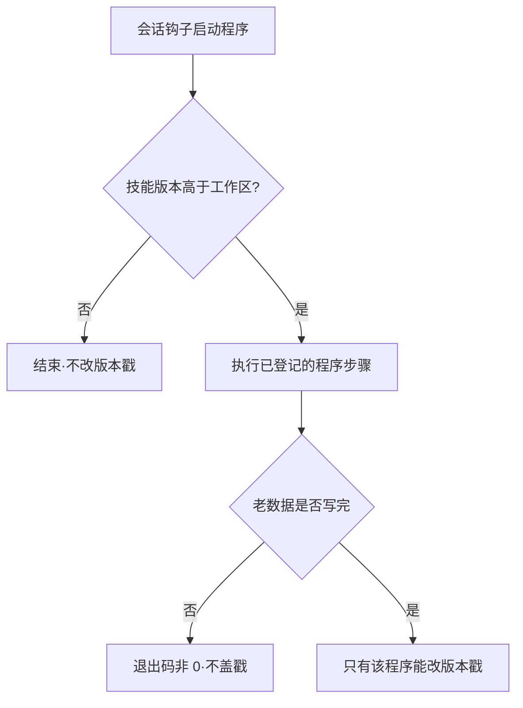
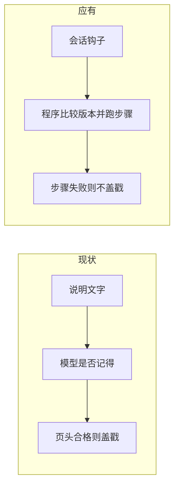

# Skill 升级需求：升级执行改由程序强制

> 一句话痛点：**3.30.2 已经升级过「必须处理老数据」，但触发和完成仍靠说明文字，模型可以不跑、页头合格就盖戳。这是那次升级的漏洞，要用程序强制补上。**

- **所属 Skill**：chrono-pm-project（主）；chrono-pm-portfolio（集级版本锁步）
- **执行中的 Skill 版本**：3.30.2
- **工作空间实际版本**：3.30.2 / schema 0.17.0
- **所属项目**：市监重构项目管理（联邦集工作区，涉三成员项目）
- **日期**：2026-09-22
- **提出人**：项目负责人（对话用户）
- **优先级**：高（AI 建议，不是发布决定）

版本两行一致。本条未并入。SG-20260920-002（升级必须处理老数据）用户已认定随 3.30.2 升级完成，不在那条上续写。

---

## 〇、开场

3.30.2 加了回填脚本，规定跑完且退出码为 0 才改版本戳。2026-09-22 升级工作空间时，三个成员的脚本把 178 页都印成合格并跳过，写出 0 页，退出码 0，版本戳盖成 3.30.2。166 页的已绑仍是「本源未见」。

规则写的是：发现技能版本更高，只提示，等用户确认，再由模型按说明去执行。没有程序会在会话开始时自己跑。

用户要求讨论：改成程序强制是否可行。可行。助手曾未经同意改过技能和钩子，已按用户要求撤回。本条只记需求。

---

## 〇·五、示例图

本条无单独产品界面图。上图就是目标：程序自己触发、自己判完成，说明文字不算执行。

---

## 一、问题描述

### 1.1 现象

| 维度 | 用户期望 | 技能实际 |
|---|---|---|
| 发现版本更高 | 程序主动升级 | 说明要求只提示，等模型想起 |
| 升级要求 | 程序强制做完老数据 | 写在说明和升级文件里 |
| 完成判据 | 已绑空着不算完成 | 页头合格就跳过，退出码 0 |
| 盖戳 | 只有程序能改 | 模型可以自己改版本文件 |

### 1.2 用户原话

> 「检测到skill版本要高于工作仓版本，要主动触发升级，可以写成py程序，不要简单的用语言文字描述，这样还是会产生执行问题」

> 「是不是纯语言文字描述导致的，能不能改成py强制执行」

> 「不应该记在原来需求上，原来需求已经升级完了，现在是新的要求，补原来的bug」

### 1.3 后果

1. 每次升级都写了要处理老数据，到正式工作区仍可能不触发、不执行。
2. 页头合格的空已绑会被当成成功，版本戳照盖。
3. 把修补记回已完成的旧需求，会把新漏洞和旧结论混在一份里。

---

## 二、为什么会这样

### 2.1 比喻

门上贴了「请随手锁门」。锁没装在门轴上，人忘了，门就开着。

### 2.2 数据流：现状 vs 应有

### 2.3 设计是否仍对

「低版本不得覆盖高版本工作区」仍然对。错的是把「技能更高时要不要升级、老数据算不算做完」留给说明和模型。

方案可行，但有边界：只在技能包里多一个程序、仍写「请记得运行」，和现在一样会漏。程序必须由会话钩子启动。会话开始时打印的字进不了模型，不能靠印一句话触发。钩子超时或崩溃会放行；一个回合被打回大约 8 次后仍会结束；项目级钩子未受信任则不跑。这些要写进实现，不能承诺绝对保证。

当前工作区已经和技能同为 3.30.2。只写「版本更高才触发」不会重做这次已经盖上的戳。要补这次的空已绑，须单独规定「版本相同但老数据未完成也要重跑」。

---

## 三、定位

### 3.1 一句话根因

> 3.30.2 的升级执行仍是说明加一个会把页头合格当成成功的脚本，没有由会话外程序强制触发和判完成。

### 3.2 分层

| 层级 | 结论 |
|---|---|
| 直接层 | 178 页被跳过，166 页已绑仍空，版本已是 3.30.2 |
| 机制层 | 规则禁止自动升级；回填脚本不看已绑是否有编号 |
| 系统层 | 完成与否靠模型读说明，版本文件模型也能改 |

### 3.3 已排除

| 嫌疑人 | 结论 | 为什么排除 |
|---|---|---|
| 还是上一条「必须处理老数据」 | 不是 | 用户明确：那条已经升级完，这是补漏洞的新要求 |
| 只再写一段更严的说明 | 不是 | 用户要求改成程序，说明文字仍会漏执行 |
| 换项目对话就能做 | 不是 | 三个成员同一套触发方式 |
| 技能里已经有会自己跑的程序 | 不是 | 回填脚本要人去调用；会话开始不会自己启动 |

---

## 四、证据链（按时间）

| 时间 | 发生了什么 | 写进了哪 | 技能做了/没做 |
|---|---|---|---|
| 2026-09-20 | 「升级必须处理老数据」另立需求 | SG-20260920-002 | 后于 3.30.2 交付回填脚本 |
| 2026-09-21 | 3.30.2：回填脚本，退出码非 0 不盖戳 | upgrade-to-3.30.2 | 合格只看页头和指纹 |
| 2026-09-22 | 三成员脚本退出码 0，写出 0 页，盖戳 | 集级升级日志 | 166 页已绑仍空 |
| 2026-09-22 | 用户要求改成程序强制，并先讨论 | 本文件 | 误改技能已撤回 |
| 2026-09-22 | 用户：不要记在旧需求上，旧的已升级完 | 本文件 | 旧条标为已并入 3.30.2 |

---

## 五、缺口全景（可选）

| 编号 | 缺口 | 落点 | 状态 |
|---|---|---|---|
| B1 | 版本更高时程序主动升级 | 新执行程序 + 会话钩子 | 未做 |
| B2 | 步骤失败不得盖戳，页头合格不算完成 | 该程序的退出条件 | 未做 |
| B3 | 版本文件只能由该程序改 | 工具拦截 | 未做 |
| B4 | 版本已相同但空已绑未补时是否重跑 | 须在实现里单独立项 | 未决 |

---

## 六、建议 Skill 补什么（可选）

只列缺口。禁止在此写完整升级方案。

1. 用程序比较技能版本和工作区版本。更高就跑已登记步骤。没有步骤或步骤失败，退出码不得为 0，不得改版本戳。
2. 由会话钩子启动该程序。只把程序放进包里、仍靠说明提醒，不算补上。
3. 已绑仍空且登记册没有这条边，步骤失败。不得编造登记册里没有的关系。页头合格、写出 0 页，不算通过。
4. 写明做不到绝对保证的情况：钩子超时、崩溃、未受信任，以及回合打回次数用尽。
5. 单独决定：工作区已经是 3.30.2 时，空已绑要不要在同号下重跑。不写这一条，本次已盖的戳不会被自动重做。

---

## 七、如何复现

1. 技能 3.30.2、工作区仍是 3.30.1 时打开工作区，不发「升级工作空间」。版本戳不会自己变。
2. 发「升级工作空间」。回填脚本把已有主题页印成合格，退出码 0。
3. 打开已绑为「本源未见」的页，内容不变，版本戳已经升高。

---

## 八、迭代记录

| 轮次 | 日期 | 触发（用户原话摘要） | 主文档变更 | 证据 |
|---|---|---|---|---|
| R1 | 2026-09-22 | 不应该记在原来需求上，原来需求已经升级完了；现在是新的要求，补原来的 bug | 首版。旧条 SG-20260920-002 标为已并入 3.30.2，本条专记执行器改程序强制 | 用户原话；3.30.2 回填脚本与当日盖戳 |
